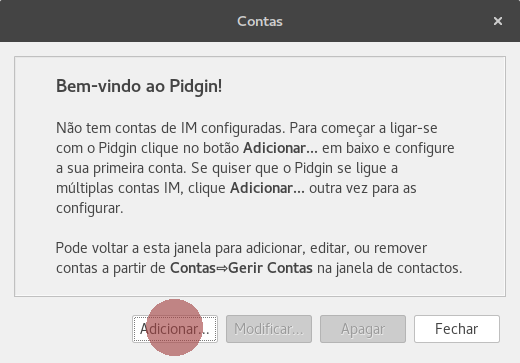
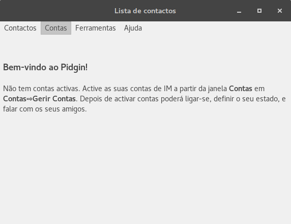
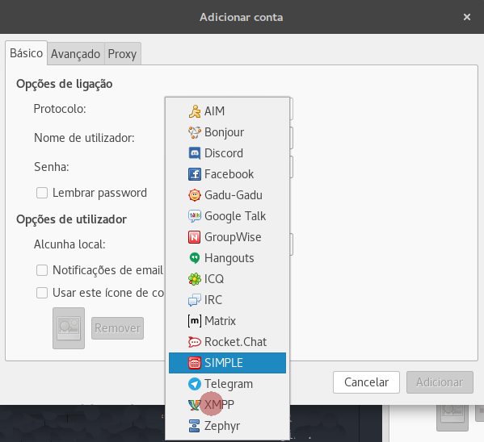
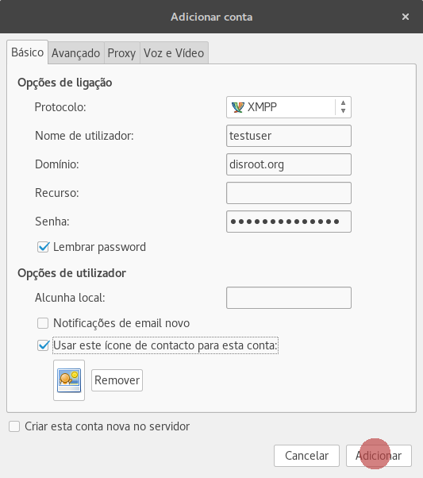
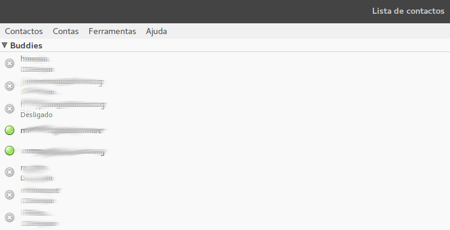

Pidgin é um aplicativo de mensagens multiplataforma (usado na maioria dos sistemas operacionais) e multiprotocolo. Serve a diferentes protocolos de mensagens como xmpp, Skype, AIM, TOX, Whatsapp e Facebook, entre outros, permitindo usar as mensagens em um mesmo aplicativo.

Para configurar o chat do disroot no Pidgin, siga estes passos básicos:

1. **Instale o Pigdin**.
Se você é usuário de Windows/MACOS, busque a versão apropriada no [wesite do pidgin](http://pidgin.im/download/).
Se você é usuário de GNU/Linux, busque o repositório adequado e plugins adicionais.

2. **Inicie o programa**.
Você receberá uma mensagem de saudação como esta:

Para continuar, você precisa **adicionar uma conta**.
Se esta não é a primeira vez que você usa o Pidgin, deve abrir o menu:

3. **Configure uma conta.**
O primeiro passo é escolher o protocolo xmpp ao percorrer a lista:

Em seguida, preencha a informação solicitada:

!Observação! Se você quer usar o avatar (opcional), deve selecionar a opção "Use this buddy icon for this account" e então busque em seu computador a imagem que deseja usar como avatar.

4. Pressione "**Adicionar**" e está pronto!
Você está pronto para propagar a mensagem: abandonem os aplicativos corporativos malignos e juntem-se à *Nave Espacial* da federação.

**Todos os seus contatos estarão sincronizados entre os diferentes aplicativos. Desta forma, você pode usar o chat do disroot em vários dispositivos ao mesmo tempo.**
