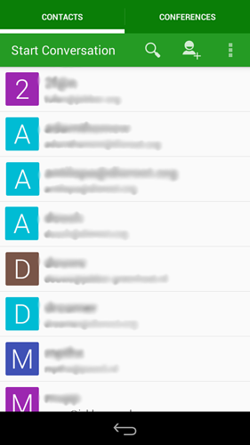

Conversations est un puissant client xmpp pour android qui prend en charge le chiffrement OTR et GPG et les conférences (chats multi-utilisateurs). Il est disponible sur F-Droid et d'autres applications commerciales.

Voici ce que vous devez faire pour faire marcher les choses.

1. **Obtenir l'application Conversations depuis l'app store.**

2. **Ajouter un compte**
 - Indiquez votre **adresse email Disroot** complète (**Jabber ID**)
 - **Mot de passe**
  

3. **Ajoutez un avatar** si vous aimez **ou sautez cette étape** si vous n'aimez pas ou utilisez déjà avatar sur un autre client.

4. **Vous avez fini!**
Maintenant, vous êtes prêt à convertir les gens de quitter les applications malveillantes des entreprises et de sauter sur le vaisseau de la fédération.

**Tous vos contacts sont synchronisés entre tous les clients, de sorte que vous pouvez utiliser le chat Disroot sur tous les périphériques en même temps.**
