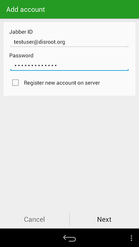

Conversations is powerful xmpp client for android that supports OTR and GPG encryption and conferences (multi-user chats). It is available on F-Droid and other commercial app stores.

Here is what you need to do to get things rolling.

1. **Get Conversations app from app store.**
2. **Add an account**
 - Put your full **disroot email address** (**Jabber ID**)
 - **Password**

3. **Add an avatar** if you like **or skip** if you don't like it or already use avatar on another client.
4. **You are done!**
Now you are ready to start preaching people to ditch corporate evil apps and jump on the federation starship.

**All your contacts are synced between all the clients, so you can use disroot chat on all the devices at the same time.**
