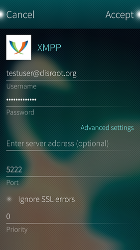

1 - **Abra as configurações** e deslize até **Accounts** (contas)

2 - Adicione uma nova conta **xmpp**.

3 - **Configure a conta**. Preencha os dados

* **Username:** *Seu nome de usuário disroot username@disroot.org* (você também pode especificar nome de usuário e domínio separados)
* **Password:** *Sua senha no disroot*
* **Server address:** (se você especificou apenas seu nome de usuário no disroot, aqui pode adicionar o domínio) *disroot.org*
* **Port:** 5222

4 - **Pressione aceitar e está pronto!** Você está pronto para propagar a mensagem: abandonem os aplicativos corporativos malignos e juntem-se à federação Starship.

SailshishOS combina todas as mensagens em um só aplicativo. **Você pode usar SMS, Skype e chat no mesmo lugar. Todos os seus contatos estarão sincronizados entre os aplicativos. Então, você pode usar o chat do disroot em vários dispositivos ao mesmo tempo.**
