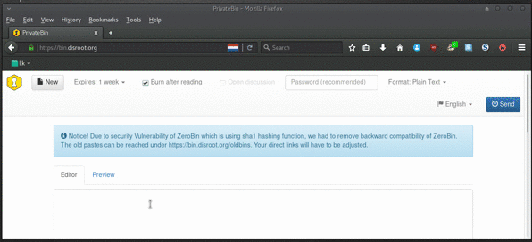

Disroot ofrece PrivateBin como servicio. Un *pastebin* en línea de código abierto minimalista y un panel de discusión de conocimiento cero. Lo que sifnifica qui ni el servidor ni sus administradores pueden descifrar el contenido de los *pastes*.

Estas son algunas de las cosas para lo que lo puedes usar:

* Compartir rápidamente el contenido de un archivo de texto con cualquier persona sin la necesidad de copiar o pegar gran cantidad de texto o enviar correos electrónicos con el contenido.
* Publicar información o documentos en línea para que otros puedan acceder a los mismos.
* Utilizarlo como un tablero de discusión desechable, usando su función de tablero de mensajes.
* Enviar información a alguien, a través de un enlace URL que debe ser «quemado después de leer».
* Enviar a alguien una copia de un código de software o fragmento de código, nota o información confidencial que no deseas que nadie más vea.

En este tutorial, te mostraremos cómo usarlo. Puedes acceder a PrivateBin desde [bin.disroot.org](https://bin.disroot.org)

Nota: PrivateBin no es una herramienta de edición de texto colaborativa, para eso dispones de [etherpad y ethercalc](https://disroot.org/pad/)

--------

# La interfaz

La interfaz es súper sencilla. Tienes una caja de texto donde escribir o pegar tu texto y, arriba, tienes los botones de opciones:

* Nuevo (Paste)
* Establecer el tiempo de vencimiento
* Quemar después de leer
* Abrir discusión
* Protección con contraseña del *paste*
* Formato (texto plano, marcado Markdown, código fuente, etc.)
* Idioma
* Enviar (crear el enlace para compartir)

----------

# Cómo pegar y compartir contenido

Simplemente escribe o pega tu texto en la caja y presiona el botón «enviar» . Después de hacerlo, un enlace URL aparecerá en el centro de la pantalla. Cópialo y compártelo o envíalo a quien quieras en la forma que desees: compartido a través de redes sociales, en un sitio web, vía correo electrónico, chat, etc.

Para crear un nuevo *paste*, simplemnete presiona el botón «nuevo»  

----------

# Leer únicamente una vez
Puedes determinar que tu contenido sea borrado después de ser abierto la primera vez a través de la opción **«Quemar después de leer»**  

Cuando el receptor del enlace URL abra la página, el contenido aparecerá con el siguiente mensaje:

Si la persona abre el enlace en una nueva pestaña o actualiza la página, el contenido ya no estará disponible.

Esta opción es ideal si tienes información que deseas enviar a una persona específica y no debe ser difundida ni hecha pública.

----------

# Establecer una fecha de caducidad para tu *paste*

Configurar una fecha de vencimiento para tu *paste* es muy fácil. Cuando estés creando tu *paste*, simplemente presiona el botón de vencimiento y selecciona en cuánto tiempo deseas que expire tu *paste*:

----------
# Tablero de discusión

PrivateBin dispone de un tablero de discusión que puede ser utilizado por cualquier persona que reciba el enlace URL del *paste*. Es muy fácil habilitar el tablero de discusión, simplemente selecciona «Abrir discusión»  cuando estés creando tu *paste*.

Cuando tú y las personas que reciban el enlace lo abran, verás los comentarios y podrás agregar el tuyo como en un típico foro o chat:

desde allí puedes escribir un mensaje y otros pueden responderlo.

**Nota:**
Esto no es un sistema de mensajería instantánea donde aparece una respuesta automáticamente. Para ver una respuesta, es posible que debas actualizar tu página.
Esto es un foro de discusión muy simple y básico que puedes usar para comunicarte con los demás de forma más privada. Ninguna persona, excepto las personas con las que compartiste el enlace (ni siquiera los administradores del sistema de Disroot) podrá leer tu discusión. Después del vencimiento establecido, toda la conversación se borrará sin dejar rastro de ella.

----------
# Usando PrivateBin como un tablero de discusión desechable

Como se mencionó anteriormente, PrivateBin dispone de un tablero de discusión. Si agregas a esto la opción «establecer fecha de caducidad» para eliminar tu *paste* después de un tiempo, entonces tienes el equivalente a un tablero de discusión desechable que puedes usar con otras personas para comunicarte.

Dado que PrivateBin funciona en una lógica de conocimiento cero, los *pastes* están encriptados para que el servidor y sus administradores no sepan su contenido, solo las personas que tienen el enlace URL.
Cuando se alcanza la fecha de caducidad, se destruye el *paste* junto con la conversación.

Para hacer esto, simplemente selecciona las opciones «abrir discusión»  y «Vencimiento» cuando crees un *paste*.

Establece la fecha de vencimiento en un tiempo realista para que el *paste* no se elimine en medio de la conversación.

----------

# Proteger paste con una contraseña
Es muy sencillo. Simplemente escribe una contraseña en el campo contraseña del *paste*. Cuando alguien abra el enlace con el *paste*, la persona será redirigida a introducir la contraseña para desbloquear el mismo.

