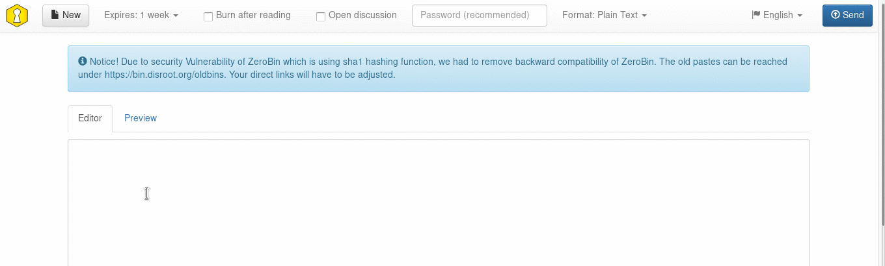
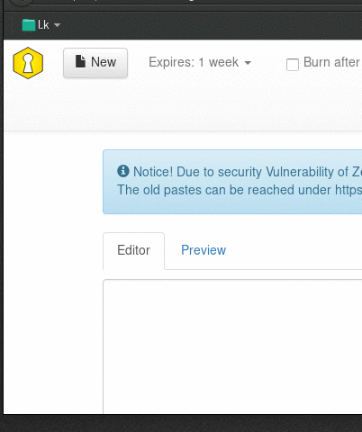

O Disroot forneçe como serviço o PrivateBin. Uma ferramente open-source minimalista de pastebin e fórum de discussão, que funciona na lógica de "conhecimento zero". O que significa que nem os administradores do serviço conseguem desencriptar o conteúdo do paste.

Estas são algumas das coisas que podes fazer com o PrivateBin:

* Partilhar rápidamente conteúdo de um texto, através de um link sem ter que fazer copy/paste de um pedaço grande de texto num email ou num chat
* Publicar informação/documentos online para que outros possam aceder a eles
* Usá-lo como um fórum descartável, atráves da sua funcionalidade de mensagens
* Enviar a alguém informação, via um link URL, que precisa de ser "destruida depois de lida"
* Enviar a alguém um uma cópia de um script ou de código de software, notas, ou infomração confidencial que tu não queres que sejam vistos por terceiros

Neste tutorial vamos explicar como usar o PrivateBin. Podes aceder ao PrivateBin em [bin.disroot.org](https://bin.disroot.org)

Nota: O PrivateBin não é uma ferramente colaborativa de edição de texto, para isso tens o [etherpad e o ethercalc](https://disroot.org/pad/)

De momento o PrivateBin não tem uma versão em língua portuguesa

--------
# O interface

O interface é super fácil. Tens a caixa de texto para escrever ou colar o teu texto e acima da caixa de texto tens os botões com as seguintes opções:

* New (Novo Paste)
* Set expiration time (definir data de expiração do paste)
* Burn after reading (destruir depois de ler)
* Open discussion (permitir discussão)
* Password protection of paste (proteger o paste com palavra-passe)
* Format (Formato): Plain Text (Texto simples), Markdown, Source code (código de software)
* Language (Linguagem português não está incluído)
* Send (enviar; criar o link para partilhar)

----------

# Como fazer um paste e partilhar conteúdo

Basta escrever ou colar o teu texto na caixa de texto e carregar no botão *"send"* (enviar)  . Depois aparecerá no centro do ecrã o link URL. Copia esse link e partilha-o com quem quiseres como quiseres: redes sociais, um site, via email, chat, etc.

Para criar um novo paste a seguir a isso carrega no botão *"new"* (novo)  

----------

# Lêr apenas uma vez
Podes definir que o teu paste será apagado depois de ter sido lido pela primeira vez selecionando a opção **"Burn after reading"**  

Quando a pessoa com quem partilhaste o paste quem enviaste o link carregar nele, o conteúdo do paste irá aprecer com a seguinte mensagem por cima: Apenas para ser visto por si. Não feche esta janela, esta mensagem não pode ser mostrada uma segunda vez

Se a pessoa que recebeu o link, o abrir numa nova janela do browser of recarregar a página, o conteúdo deixará de estar disponível.

Esta opção é boa caso tenha informação que não deve ser pública ou difundida para enviar a uma passoa em particular.

----------

# Definir a data de expiração do teu paste

Definir uma data de expiração (uma data depois da qual o teu paste é apagado) é bastante fácil. Basta carregar no botão *"expires"* e escolher em quanto tempo queres que o teu paste seja apagado:

----------
# Discussion board

PrivateBin features a Discussion board that can be used by anyone that receives the URL link of the paste. It's very easy to enable the Discussion Board, just select *"open discussion"*  when you are creating your paste.

When you and people that receive the link open it you will see comments and be able to add yours just like a typical forum/chat:

from there you can write a message and others can reply to it.

**Note:**
This is not a Instant Message system where a reply appears automatically. To see a reply you may need to refresh your page.
This is a very simple and basic discussion board that you can use to communicate in a more private way with others. Noone excpet people you shared the link with (not even system administrators of disroot) will be able to read your discussion. After set expiry, the entire conversation will be erased leaving no trace of it.

----------
# Using PrivateBin as a disposable discussion board

Like mentioned above PrivateBin features a discussion board. If you add to this the "set expiration date" option to delete your paste after some time, then you have the equivalent to a disposable discussion board that you can use with other people to communicate.

Since PrivateBin works in a logic of zero knowledge the pastes are encrypted so that the server and it's administrators don't know it's content, only the people the have the URL link.
When the expiration date is reached the paste along with the conversation will be destroyed.

To do this just select the options "open discussion"  and "Expires" when creating a paste.

Set the expiration date to a realistic time so that the paste isn't deleted in the middle of the conversation.

----------

# Protect Paste with a password
This is pretty easy. Just write a password in the password field in the paste. When someone opens the link with the paste, that person will be prompted to type the password to unlock the Paste.

