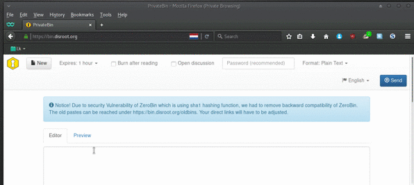

O Disroot forneçe como serviço o PrivateBin. Uma ferramente open-source minimalista de pastebin e fórum de discussão, que funciona na lógica de "conhecimento zero". O que significa que nem os administradores do serviço conseguem desencriptar o conteúdo do paste.

Estas são algumas das coisas que podes fazer com o PrivateBin:

* Partilhar rápidamente conteúdo de um texto, através de um link sem ter que fazer copy/paste de um pedaço grande de texto num email ou num chat
* Publicar informação/documentos online para que outros possam aceder a eles
* Usá-lo como um fórum descartável, atráves da sua funcionalidade de mensagens
* Enviar a alguém informação, via um link URL, que precisa de ser "destruida depois de lida"
* Enviar a alguém um uma cópia de um script ou de código de software, notas, ou infomração confidencial que tu não queres que sejam vistos por terceiros

Neste tutorial vamos explicar como usar o PrivateBin. Podes aceder ao PrivateBin em [bin.disroot.org](https://bin.disroot.org)

Nota: O PrivateBin não é uma ferramente colaborativa de edição de texto, para isso tens o [etherpad e o ethercalc](https://disroot.org/pad/)

De momento o PrivateBin não tem uma versão em língua portuguesa

--------
# O interface

O interface é super fácil. Tens a caixa de texto para escrever ou colar o teu texto e acima da caixa de texto tens os botões com as seguintes opções:

* New (Novo Paste)
* Set expiration time (definir data de expiração do paste)
* Burn after reading (destruir depois de ler)
* Open discussion (permitir discussão)
* Password protection of paste (proteger o paste com palavra-passe)
* Format (Formato): Plain Text (Texto simples), Markdown, Source code (código de software)
* Language (Linguagem português não está incluído)
* Send (enviar; criar o link para partilhar)

----------

# Como fazer um paste e partilhar conteúdo

Basta escrever ou colar o teu texto na caixa de texto e carregar no botão *"send"* (enviar)  . Depois aparecerá no centro do ecrã o link URL. Copia esse link e partilha-o com quem quiseres como quiseres: redes sociais, um site, via email, chat, etc.

Para criar um novo paste a seguir a isso carrega no botão *"new"* (novo)  

----------

# Lêr apenas uma vez
Podes definir que o teu paste será apagado depois de ter sido lido pela primeira vez selecionando a opção **"Burn after reading"**  

Quando a pessoa com quem partilhaste o paste quem enviaste o link carregar nele, o conteúdo do paste irá aprecer com a seguinte mensagem por cima: Apenas para ser visto por si. Não feche esta janela, esta mensagem não pode ser mostrada uma segunda vez

Se a pessoa que recebeu o link, o abrir numa nova janela do browser of recarregar a página, o conteúdo deixará de estar disponível.

Esta opção é boa caso tenha informação que não deve ser pública ou difundida para enviar a uma passoa em particular.

----------

# Definir a data de duração do teu paste

Definir uma data de duração (uma data depois da qual o teu paste é apagado) é bastante fácil. Basta carregar no botão *"expires"* e escolher em quanto tempo queres que o teu paste seja apagado:

----------
# Discussão/Comentários

Uma das funcionalidades do PrivateBin é a possibilidade de ter comentários nos pastes. Esta funcionalidade de comentários pode funcionar como um fórum, que pode ser usado por todas as pessoas que receberem o link URL do paste. É bastante simples ativar os comentários, basta selecionar a opção *"open discussion"*  quando estás a criar o teu paste.

Quando tu, ou as pessoas que receberem o link o abrirem, verão todos os comentários como num fórum/chat normal:

e a partir daí podem escrever mensagens e as outras pessoas podem responder às tuas mensagens.

**Nota:**
Isto não é um serviço de Mensagens Instantâneas onde as respostas de outras pessoas aparecem automáticamente. Para veres uma resposta pode ser necessário teres que recarregar a página.
Isto é um fórum/chat bastante simples e básico que podes usar para comunicar de um modo mais privado com outras pessoas. Apenas as pessoas com quem partilhou o link do paste poderão lêr a discissão/conversa (nem sequer os administradores do Disroot).  Depois de o paste expirar, toda a conversa será apagada sem deixar rasto.

----------
# Usar o PrivateBin como um Fórum descartável

Como referido em cima, o PrivateBin têm funcionalidades de comentários e resposta. Se a esta opção adicionares num paste a opção de data de duração ("Expires") para apagar o teu paste ao fim de algum tempo, então tens o equivalente a um Fórum descartável que podes usar para comunicar com outras pessoas.

Como o PrivateBin funciona numa lógica de "conhecimento zero", os pastes estão encriptados de modo a que os administradores do disroot e o servidor não consigam ver o conteúdo dos pastes, apenas as pessoas que tem o link URL.
Quando o paste chega á data de duração estabelecida, o paste será destruido juntamente com a conversa/discussão.

Para fazer isto seleciona a opção "open discussion"  e "Expires" quando estás a criar um paste.

Selecione o tempo de duração do paste para algo realista, de modo a que o paste não seja apagado a meio da conversa.

----------

# Proteger um Paste usando uma palavra-passe

Isto é bastante simples. Basta escrever uma  palavra-passe que queira no campo "password" quando está a criar um paste. Quando alguém abre o link, aparecerá o campo a pedir a palavra-passe para poder aceder ao paste.

