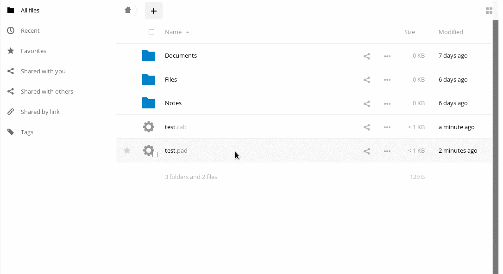

## Pad plugin for Disroot cloud instance
----

# Creating new pads
Creating new pad works the same as creating new file. Click on "+" icon and choose to create either pad (text editor) or calc (spreadsheet). Once you give it a name a new file with .pad/.calc extension will be created. You can move, share that file just like any other file you have on your cloud account.

# Opening new pad
To open the newly created pad, just click on it's name. The application will open up your pad using pad.disroot.org/calc.disroot.org within the cloud interface. You can now easily work on your document and once you're done, use the red icon on your right to close it. All changes are written the moment you start typing so there is no need to save the file before hand. Since the file lives in the web, you can come back to it any time you want.

# Sharing

Sharing pads with other disroot users is the same as sharing normal files. Click on "sharing" icon and select with whom you want to share the file with. Note: Using public link will not work as easy since these are not normal files.

In order to share with someone outside disroot cloud, you should share the actual link to the pad. You can do it by opening your pad in the browser and hovering above it's name. You will see the actual link to the pad, which you can then copy and send it to anyone you wish to share the pad with.

# Deleting pads
It is impossible to delete pads. Once created they stay online. In fact anyone who could guess the url could look it up. That's why disroot cloud's plugin creates links to your pads using random strings instead of the name you specify when creating the file. In that way the links to the pads are impossible to guess making them safe from anyone but you and users you share the pads with.
