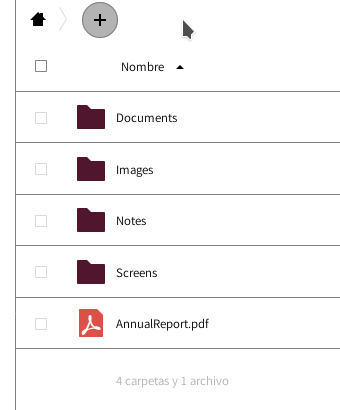
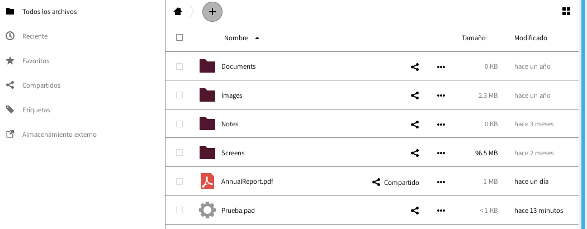

## Plugin para la nube de Disroot
----

La creación de nuevos pads funciona de la misma manera que al crear nuevos archivos en la nube. Haz click en el ícono "+" y selecciona "Pad" (para documentos de texto) o "Calc" (para planillas de cálculo). Una vez que le das un nombre, un nuevo archivo con extensión ".pad" o ".calc" será creado. Puedes mover o compartir ese archivo igual que cualquier otro que tengas en tu cuenta en la nube.

# Abriendo un nuevo pad
Para abrir un pad creado recientemente, solo haz click en su nombre. La aplicación abrirá tu documento utilizando "pad.disroot.org" o "calc.disroot.org" dentro de la interfaz de la nube. Ahora puedes trabajar fácilmente sobre tu archivo de texto. Una vez que hayas terminado, utiliza el ícono rojo a tu derecha para cerrarlo. Todos los cambios son guardados desde el momento en que comienzas a escribir así que no hay necesidad de salvarlo de antemano. Ya que el archivo "vive" en la web, puedes volver a él cuando lo desees.

# Compartiendo

Compartir pads con otros usuarios de Disroot es igual que compartir otro tipo de archivos. Haz click en el ícono de "compartir" y selecciona con quién quieres hacerlo. Notarás que utilizar un link público no funcionará tan fácilmente ya que estos no son archivos corrientes. Para hacerlo con alguien fuera de la nube de Disroot, deberías compartir el link actual al pad. Puedes hacerlo abriendo tu pad en el navegador y pasando el puntero encima de su nombre. Verás el link actual al pad, que luego puedes copiar y enviar a quien desees.

# Borrando pads
Es imposible borrar los pads. Una vez creados, permanecen en línea. De hecho, cualquiera que pudiera deducir la dirección URL, podría mirarlo. Es por ello que el plugin de la nube de Disroot crea links a tus pads utilizando cadenas de caracteres al azar en lugar del nombre que especificas cuando creas el archivo. De esa manera, los links a los pads son imposibles de deducir y se asegura que el acceso esté restringido para cualquiera excepto para ti y los usuarios con lo que compartes los pads.
