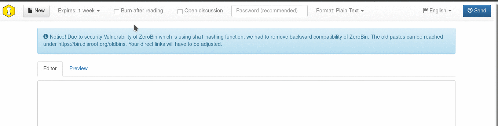
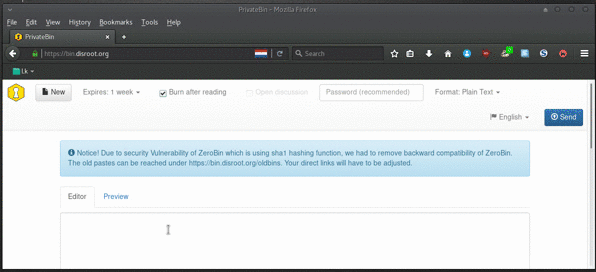

||
|:--:|
|PrivateBin is a minimalist, open-source online pastebin and discussion board with zero knowledge. Meaning nor server and it's administrators can decrypt the content of the paste.|
 

# The interface

The interface is super easy. You have the textbox to write or paste your text and above, you have your option buttons:

* New (Paste)
* Set expiration time
* Burn after reading
* Open discussion
* Password protection of paste
* Format (Plain Text, Markdown, Source code
* Language
* Send (create the link to share)

----------

# How to paste and share content

Just write or paste your text in the text box and press the "send" button  . After that a URL link will appear in the center of the screen. Copy it and share/send it to whomever you want however you want: shared in social networks, a website, via a email, chat, etc.

To create a new paste after that just press the "new" button  

----------

# Read only once
You can set your paste to be deleted after it's being opened for the first time by selecting the **"Burn after reading"** option 

When the recipient of the URL link opens the page, the content will appear with the following message:

If the person opens the link in a new tab or refreshes the page the content will no longer be available.

This option is good if you have information to send to a specific person and that should not be public or spread around.

----------

# Setting an expiration date to your paste

Setting an expiration date to your paste is very easy. When you are creating your paste, just press the expires button and select in how long you want your paste to expire:

----------
# Discussion board

PrivateBin features a Discussion board that can be used by anyone that receives the URL link of the paste. It's very easy to enable the Discussion Board, just select "open discussion"  when you are creating your paste.

When you and people that receive the link open it you will see comments and be able to add yours just like a typical forum/chat:

from there you can write a message and others can reply to it.

| **Note**|
|:--:|
|This is not an Instant Message system where a reply appears automatically. To see a reply you may need to refresh your page. This is a very simple and basic discussion board that you can use to communicate in a more private way with others. None except people you've shared the link with (not even system administrators of Disroot) will be able to read your discussion. After set expiry, the entire conversation will be erased leaving no trace of it.|

----------
# Using PrivateBin as a disposable discussion board

Like it was mentioned above, PrivateBin features a discussion board. If you add to this the "set expiration date" option to delete your paste after some time, then you have the equivalent to a disposable discussion board that you can use with other people to communicate.

Since PrivateBin works in a logic of zero knowledge the pastes are encrypted so that the server and it's administrators don't know it's content, only the people the have the URL link.
When the expiration date is reached the paste along with the conversation will be destroyed.

To do this just select the options "open discussion"  and "Expires" when creating a paste.

Set the expiration date to a realistic time so that the paste isn't deleted in the middle of the conversation.

----------

# Protect Paste with a password
This is pretty easy. Just write a password in the password field in the paste. When someone opens the link with the paste, that person will be prompted to type the password to unlock the Paste.

