# Cómo crear una encuesta

Crear una encuesta es muy sencillo, simplemente dirígete a [poll.disroot.org](https://poll.disroot.org/). Puedes elegir el idioma de tu encuesta en la esquina superior derecha y escoger si quieres una encuesta clásica o una encuesta para programar un evento o una cita.

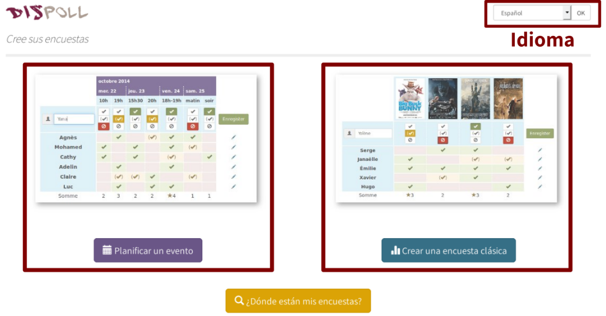

En principio, tienes dos opciones para elegir:

|**Planificar un evento**|**Encuesta clásica**|
|:--:|:--:|
|Como el nombre sugiere, es la forma más adecuada para programar reuniones o acciones, ya que permite establecer las propuestas con múltiples fechas y horas.|Es la forma más adecuada para hacer encuestas. *Si deseas realizar una encuesta sobre un evento que abarca varios días (sin opciones en la hora de inicio), la encuesta clásica también es la más adecuada.|

Una vez que elijas el tipo de encuesta que prefieres, el paso siguiente es común para ambos tipos.

|Paso número 1|
|:--:|
|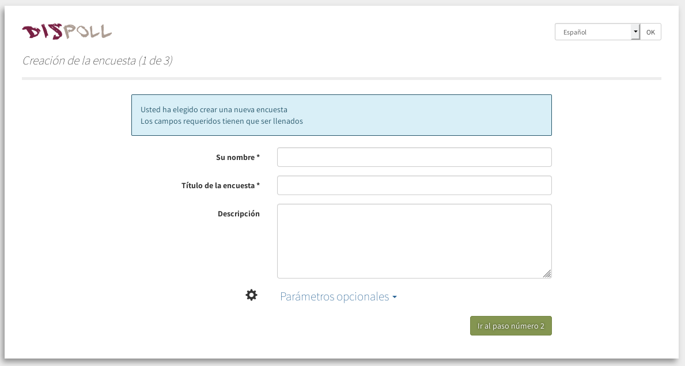|

Completa los siguientes datos:
* **Tu nombre**, que se mostrará públicamente como el creador de la encuesta; puedes elegir el nombre que quieras
* **Título de la encuesta**
* **Descripción**

|Parámetros opcionales|
|:--:|
|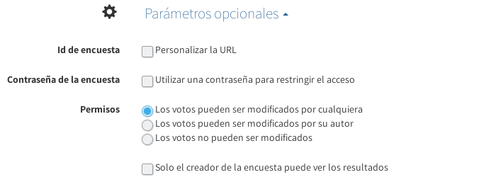|

Aquí tienes los siguientes ajustes:

* **Id de la encuesta**: puedes seleccionar *Personalizar la URL*, por ejemplo: polls.disroot.org/importante-decision)
* **Contraseña la encuesta**: puedes restringir el acceso a la encuesta a través de una contraseña
* **Permisos**:
    - Todos los votos pueden ser modificados por cualquiera
    - Los votos pueden ser modificados por su autor
    - Los votos no pueden ser modificados
    - Solo el creador de la encuesta puede ver los resultados

Una vez completados los datos y ajustadas las opciones, puedes continuar con el Paso 2, haciendo click en el botón verde en la parte inferior de la página.

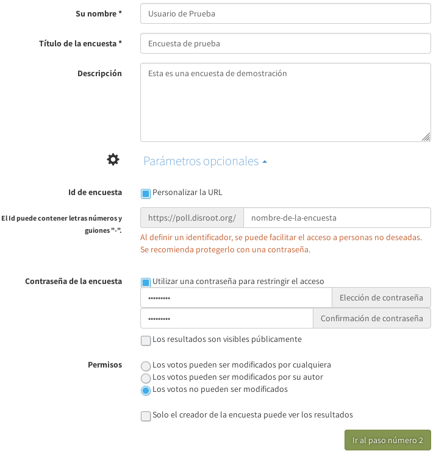

|Paso número 2|
|:--:|
|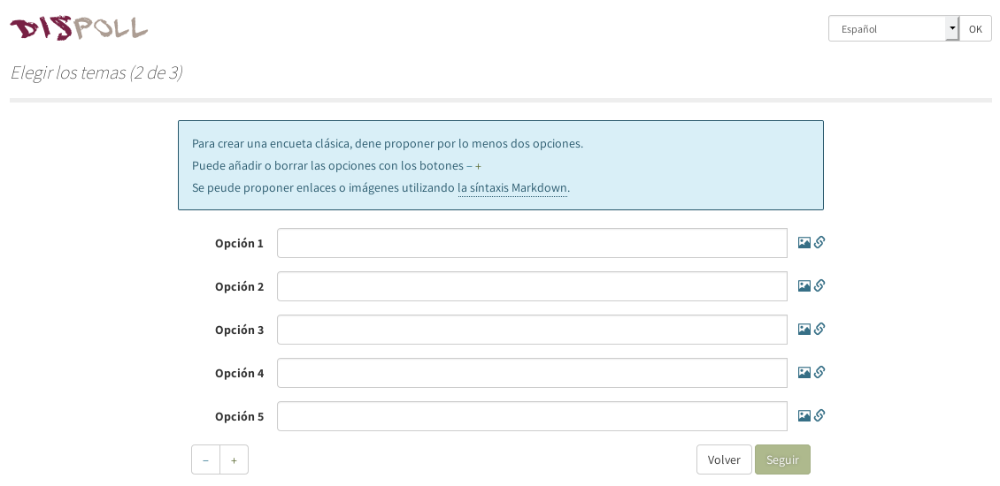|

En este paso debes establecer cuáles serán las opciones o temas a elegir, ya sea que se trate de una «Encuesta clásica» o de «Planificar un evento».

## Establecer elecciones para una «Encuesta clásica»
La cantidad de opciones mínima debe ser dos, claro. Puedes agregar o quitar opciones utilizando los botones  y completar con el texto que será mostrado. Cuando hayas terminado, presiona «Seguir».

|Paso número 3|
|:--:|
|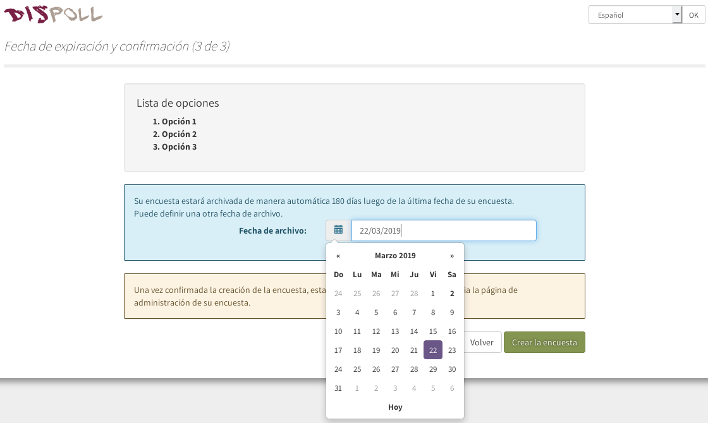|

En este último paso, debes seleccionar la fecha de vencimiento de la encuesta. Luego de hacerlo y confirmar presionando el botón "Crear la encuesta", accederás a la página de administración de la misma.

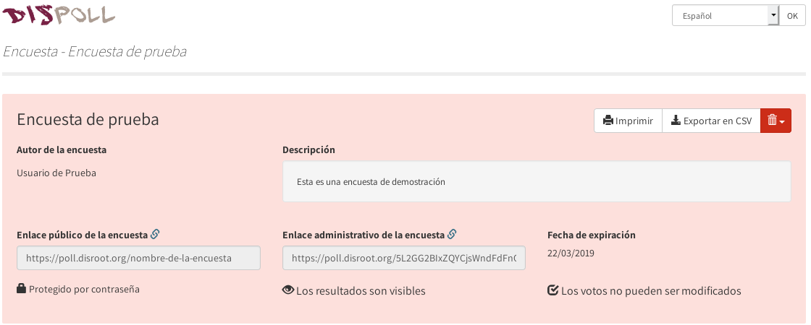

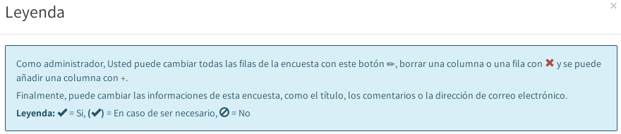

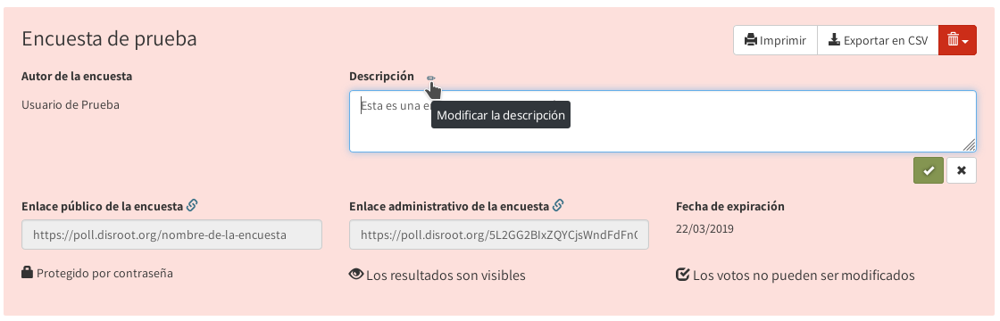

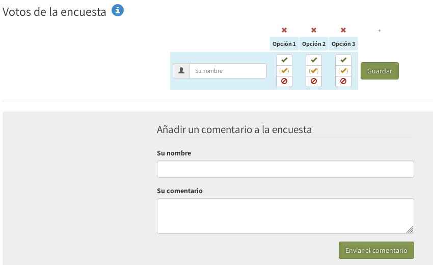

## Establecer elecciones para «Planificar un evento»
Puedes elegir la cantidad de opciones que desees utilizando los botones . Selecciona las fechas para cada elección y las horas. Una vez que hayas terminado, presiona «Seguir», selecciona la fecha de vencimiento de tu encuesta y, finalmente, click en «Crear encuesta».

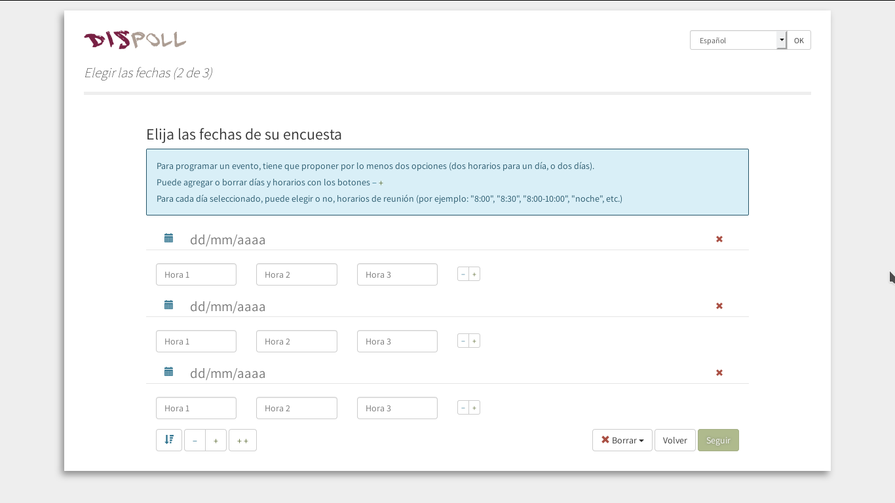

----------

# Compartir tu encuesta
Una vez que hayas creado su encuesta, verás en el lado izquierdo de la pantalla el enlace público a la encuesta. Simplemente cópialo y envíalo a las personas que desees que participen en la encuesta.

----------

# Administrar tu encuesta
Para administrar tu encuesta despues de ser creada, necesitarás el «Enlace de administración para la encuesta», el cual puede verse y copiarse en la parte central de la pantalla. **(no lo pierdas o no podrás entrar en el panel de administración)**

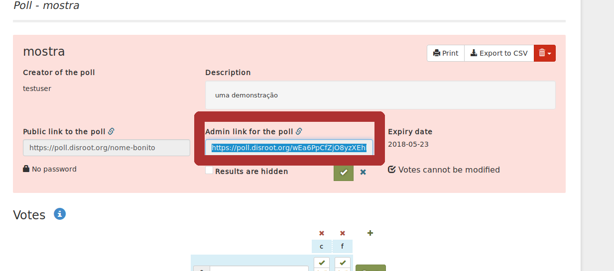

Con el enlace de administración, puedes volver a esta página siempre que lo desees y editar las opciones de la encuesta.

# Comprobar los resultados de la encuesta
Simplemente presionando en «Mostrar el gráfico de resultados» o exportándolos a un archivo .csv.

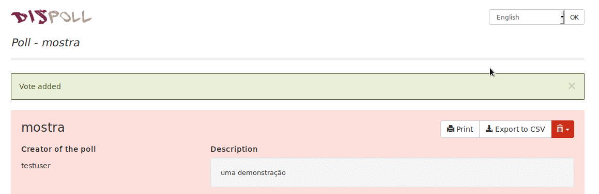

----------

# Participar en la encuesta
* Escribe tu nombre (o cualquier otro nombre que desees)
* Selecciona en cada elección una de las tres opciones; sí , si es necesario , y no 
* Y presiona guardar cuando termines

## Usando la sección de comentarios
Los participantes en la encuesta pueden usar la «sección de comentarios» en la parte inferior de la página de encuesta para enviarse mensajes entre ellos.

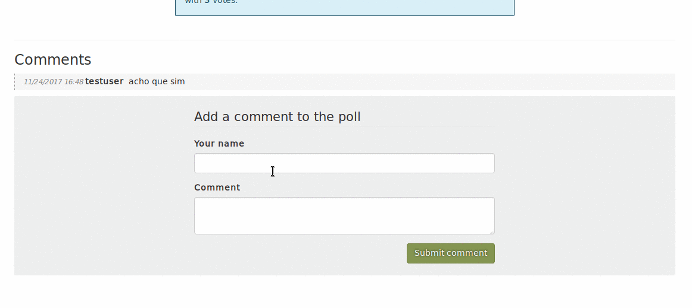

Los usuarios pueden ver los resultados de la encuesta (si esa opción fue habilitada por el creador de la encuesta) debajo de la lista de personas que votaron o presionando en «Mostrar el gráfico de resultados».
