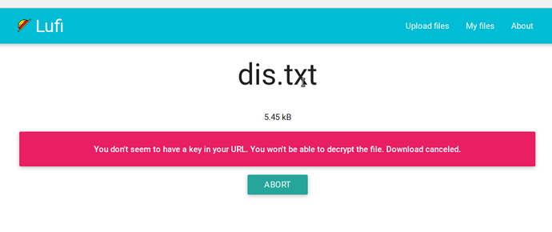
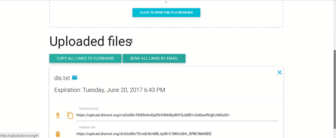
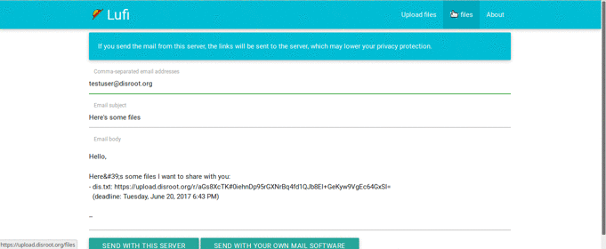

# ¿Cuán seguro es Lufi y cómo funciona?

Cuando usas Lufi para subir archivos, "¡todos tus archivos son cifrados por tu navegador! Esto significa que tus archivos nunca dejan tu computadora sin ser cifrados. El administrador de la instancia de Lufi que usas no podrá ver lo que está en tu archivo, tampoco lo hará tu administrador de red o tu proveedor de servicios de Internet (ISP)".

Cuando alguien descarga tu archivo, es descifrado localmente en el navegador de esa persona después de la descarga. Es decir, el administrador de la red o el ISP no podrán ver lo que hay en el archivo descargado.

Puedes leer más sobre esto [aquí](https://git.framasoft.org/luc/lufi).

Todo el proceso de cifrado y descifrado lo realizan automáticamente los navegadores, por lo que no es necesario encriptar los archivos manualmente o descifrarlos manualmente en la descarga.

La clave de cifrado (lo que permite que quienquiera que descargue el archivo pueda descifrarlo) es una parte del enlace que te presenta tu navegador después de haber subido un archivo.

Es un ancla (identificador de fragmento). Eso significa que esa parte (la clave de cifrado) solo se procesa en el lado del cliente (en tu computadora) y no llega al servidor de tu proveedor de Lufi, por lo que no pueden descifrar el archivo.

**Sólo las personas que tengan el enlace completo podrán descargar y descifrar el archivo.**

Por ejemplo, éste es un enlace a un archivo en upload.disroot.org:

[https://upload.disroot.org/r/FA7MHOOL#AgsmqnJEyUZAcybZmOGKljqYRtDhJKsvZC/Qt05N8dE=](https://upload.disroot.org/r/FA7MHOOL#AgsmqnJEyUZAcybZmOGKljqYRtDhJKsvZC/Qt05N8dE=)

Tiene dos componentes:

* A la izquierda del símbolo **#** en el enlace está la URL del archivo:
«https://upload.disroot.org/r/FA7MHOOL»

* Lo que queda a derecha del símbolo **#** en el enlace es la clave de cifrado del archivo:
«#AgsmqnJEyUZAcybZmOGKljqYRtDhJKsvZC/Qt05N8dE=»

Si intentas usar sólo [https://upload.disroot.org/r/FA7MHOOL](https://upload.disroot.org/r/FA7MHOOL),
sin la segunda parte, recibirás este mensaje:

----------

# La interfaz

La interfaz es bastante sencilla, cuando cargas un archivo tienes las siguientes opciones:

* Elije cuántos días permanecerá en línea. **El máximo es de 60 días, (para archivos más pequeños)**
* Elije si deseas que el archivo se elimine después de que se descargue por primera vez

En la parte central superior del panel puedes establecer las opciones mencionadas anteriormente. En la parte superior derecha, tienes el menú para ir a «Mis archivos» y administrar tus subidas. El centro es donde subes tus archivos.

----------

# Tamaño máximo de archivos

No hay límite de tamaño para los archivos que puedes subir. Pero la cantidad máxima de tiempo que un archivo permanece almacenado en Lufi varía de acuerdo con su tamaño. Después de que expire ese tiempo, el archivo se eliminará.

Los archivos más grandes se almacenarán por un tiempo más corto. «El plazo de vencimiento de tu archivo será el mínimo entre lo que elijas y las siguientes limitaciones»:

* entre 0 y 48MB, el archivo se mantendrá 60 días
* entre 48M y 96MB, el archivo se mantendrá 30 días
* entre 96MB y 954MB, el archivo se mantendrá 15 días
* para 954MB y más, el archivo se mantendrá 2 días

También puedes verificar esta información en cualquier momento que desees presionando el botón  en la interfaz principal de Lufi.

----------

# Cómo subir y descargar

Para subir un archivo, simplemente elije las opciones que desees (si lo eliminas después de la descarga o no, y cuántos días permanecerá en línea) y «haz clic para abrir el buscador de archivos» en el centro de la pantalla, navega hasta tu archivo y selecciónalo, o simplemente arrastra tu archivo al centro de la pantalla.

Una vez completada la subida, tu navegador te mostrará el enlace (URL y clave de encriptación) del archivo subido, cópialo en otro lugar.

También obtendrás el enlace de eliminación que te permitirá eliminar el archivo subido al servidor en cualquier momento que desees.

Para descargar el archivo, simplemente pon el enlace la barra de direcciones de tu navegador:

----------

# Cómo compartir un archivo

Bueno, esto también es muy sencillo, puedes:

* copiar el enlace manualmente a tu correo electrónico o un archivo de texto, o cualquier otra opción

* enviarlo directamente por correo electrónico desde Lufi

Para la última opción (si tienes un cliente de correo electrónico en tu máquina, por ejemplo, Thunderbird, Evolution, etc.), simplemente haz clic en el botón  después de que tu archivo se termine de subir correctamente. Escribe la dirección de correo electrónico y el texto, y presione . Tu cliente de correo electrónico te avisará de que el correo electrónico está listo para ser enviado.

**La opción**  **no debe usarse por cuestión de principios.**

El motivo es que si usas esta opción, el enlace se envía utilizando un correo electrónico de tu proveedor de Lufi, no tu correo electrónico personal. Lo que significa que los administradores de esa instancia de Lufi podrán ver el enlace completo y, por lo tanto, podrán descargarlo y descifrarlo si lo desean.

En este caso, Disroot es un proveedor consciente de tu privacidad, así que por cuestión de principios debes evitarlo.

----------

# Cómo gestionar o eliminar tus subidas

Puedes gestionar tus subidas presionando el botón  en el panel principal.

Allí verás todas tus subidas y podrás:

* Ver los enlaces de descarga de todas tus subidas
* Ver cuáles están configuradas para eliminarse después de la primera descarga
* Elegir cuáles subidas quieres eliminar del servidor

Esta lista de subidas se almacena localmente en tu navegador en un archivo .json. Lo cual deja un registro en tu navegador de los archivos que subiste. Por lo tanto, no podrás ver la lista de tus archivos subidos cuando uses un navegador diferente o una computadora diferente.

Si lo deseas, en este panel también puedes:

* Eliminar esta información del almacenamiento local de tu navegador (borrará la información de los archivos subidos y sus enlaces de tu navegador, pero no eliminará los archivos del servidor, y el enlace seguirá siendo válido)

* Exportar a tu computadora el archivo json con esta información

* Importar a tu almacenamiento local del navegador un archivo json con información sobre subidas y enlaces

Otra forma de eliminar un archivo del servidor en cualquier momento que desees es usar el enlace de eliminación, proporcionado cuando subes por primera vez el archivo. Cópialo y guárdalo en un archivo de texto para cuando quieras usarlo.
Para usarlo simplemente ponlo en la barra de dirrecciones de tu navegador y presione enter.

Si eliminas un archivo o la fecha de caducidad que se estableció para él, cualquiera que intente descargar el archivo verá un mensaje como este:

