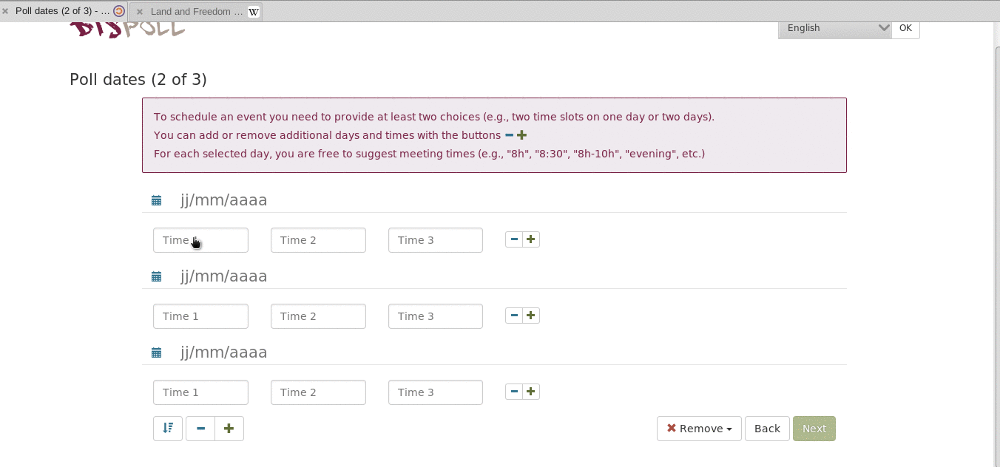

Las encuestas de Disroot son un servicio en línea para la planificación de citas y la toma de decisiones.
No se requiere registro. Puedes usarlo incluso si no tienes una cuenta en Disroot.

Este servicio es posible gracias a [Framadate](https://framadate.org/).

En este tutorial, te mostraremos cómo trabajar con las encuestas de Disroot.

----------

# Cómo crear una encuesta

Crear una encuesta es muy sencillo, simplemente dirígete a [poll.disroot.org](https://poll.disroot.org/). Puedes elegir el idioma de tu encuesta en la esquina superior derecha y escoger si quieres una encuesta estándar o una encuesta para programar un evento o una cita.

Las diferencias principales entre "Programar un evento" y "Crear una encuesta estándar" son:

* **Programar un evento**, como el nombre sugiere, es la forma más adecuada para programar reuniones o acciones, ya que permite establecer las propuestas con múltiples fechas y horas.

* **Encuesta estándar** es la forma más adecuada para hacer encuestas. *Si deseas realizar una encuesta sobre un evento que abarca varios días (sin opciones en la hora de inicio), la encuesta estándar también es la más adecuada.*

Una vez elijas el tipo de encuesta que prefieres, el primer paso para realizar una encuesta es común para ambos tipos, en la primera página que debes rellenar:

* Tu nombre (que se mostrará públicamente como el creador de la encuesta; elige el nombre que desees)
* Título de la encuesta
* Descripción

Y presionando el botón «Parámetros opcionales» 

Podrás escoger entre las siguientes opciones:

* Enlace de la encuesta (URL personalizada, por ejemplo: polls.disroot.org/importante-decision)
* Contraseña (para restringir el acceso a la encuesta)
* Todos los votantes pueden modificar cualquier voto
* Los votantes pueden modificar su voto ellos mismos
* Los votos no pueden ser modificados
* Sólo el encuestador puede ver los resultados de la encuesta

Luego continúa con el paso 2, presionando el botón verde en la parte inferior de la página.

En el paso 2, deberás establecer las elecciones tanto para tu «Encuesta estándar» como para tu encuesta para «Programar un evento».

## Establecer elecciones para una «Encuesta estándar»
Puedes elegir la cantidad de opciones que desees utilizando los botones + y -  y completando el texto que desees mostrar. Una vez que hayas terminado, presiona «siguiente», selecciona la fecha de vencimiento de tu encuesta y presiona "crear encuesta".

También puedes añadir imágenes y enlaces a las opciones que creaste, pero en el caso de las imágenes, necesitarán ser subidas antes a algún lugar de la web y deberás conocer el enlace a las mismas:

## Establecer elecciones para "Programar un evento"
Puedes elegir la cantidad de opciones que desees utilizando los botones + y -  Selecciona las fechas para cada elección y las horas. Una vez que hayas terminado, presiona «siguiente», selecciona la fecha de vencimiento de tu encuesta y presione «crear encuesta».

----------

# Compartir tu encuesta
Una vez que hayas creado su encuesta, verás en el lado izquierdo de la pantalla el enlace público a la encuesta. Simplemente cópialo y envíalo a las personas que desees que participen en la encuesta.

----------

# Administrar tu encuesta
Para administrar tu encuesta despues de ser creada, necesitarás el «Enlace de administración para la encuesta», el cual puede verse y copiarse en la parte central de la pantalla. **(no lo pierdas o no podrás entrar en el panel de administración)**

Con el enlace de administración, puedes volver a esta página siempre que lo desees y editar las opciones de la encuesta.

# Comprobar los resultados de la encuesta
Simplemente presionando en «Mostrar el gráfico de resultados» o exportándolos a un archivo .csv.

----------

# Participar en la encuesta
* Escribe tu nombre (o cualquier otro nombre que desees)
* Selecciona en cada elección una de las tres opciones; sí , si es necesario , y no 
* Y presiona guardar cuando termines

## Usando la sección de comentarios
Los participantes en la encuesta pueden usar la «sección de comentarios» en la parte inferior de la página de encuesta para enviarse mensajes entre ellos.

Los usuarios pueden ver los resultados de la encuesta (si esa opción fue habilitada por el creador de la encuesta) debajo de la lista de personas que votaron o presionando en «Mostrar el gráfico de resultados».
