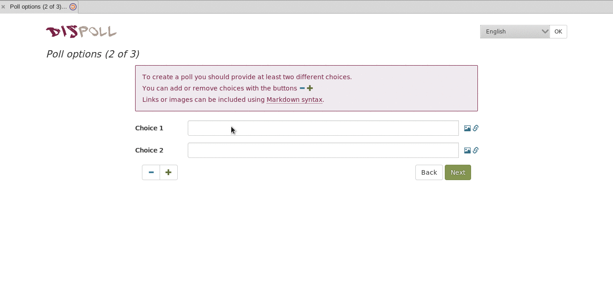
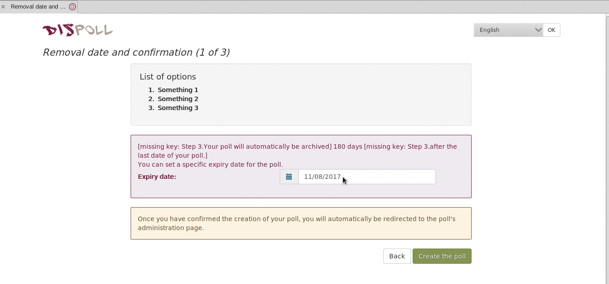
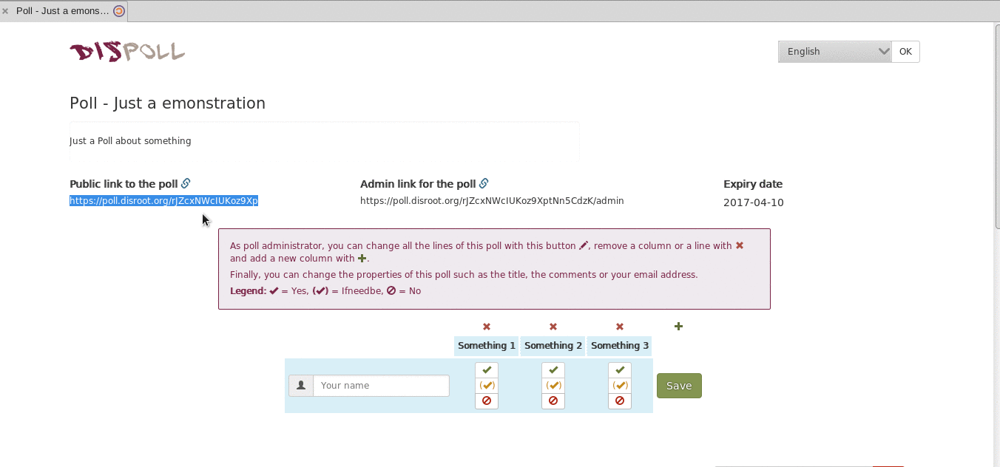

Disroot est un service en ligne de planification de rendez-vous et de prise de décision.
Aucune inscription n'est requise. Vous pouvez l'utiliser même si vous n'avez pas de compte Disroot.

Ce service est rendu possible grâce à [Framadate](https://framadate.org/).

Dans ce tutoriel, nous allons vous montrer comment travailler avec les sondages Disroot.

----------

# Comment créer un sondage

Créer un sondage est très facile, il suffit d'aller à [poll.disroot.org](https://poll.disroot.org/). Vous pouvez choisir la langue de votre sondage dans le coin supérieur droit, et choisir si vous voulez un sondage standard ou un sondage pour planifier un événement ou un rendez-vous.

Les principales différences entre "Programmer un événement" et "Faire un sondage standard" sont:

* **Programmer un événement**, comme son nom l'indique, est mieux adapté pour planifier des réunions, des actions, car il permet de définir les propositions avec plusieurs dates et heures.

* **Sondage standard** est mieux adapté aux questionnaires.
 Si vous voulez faire un sondage sur un événement qui s'étend sur plusieurs jours (sans aucune option sur l'heure de début), Sondage standard est également mieux adapté.*

Une fois que vous choisissez le type de sondage que vous préférez, la première étape dans la réalisation d'un sondage est commune aux deux.
Dans la première page vous devez remplir:

* Votre nom (qui sera affiché publiquement en tant que créateur du sondage, choisissez le nom de votre choix)
* Titre du sondage
* Description

Et en appuyant sur le bouton "Paramètres optionnels" 

Vous pouvez choisir les options suivantes:

* Lien du sondage (URL personnalisée, par exemple: polls.disroot.org/big-decision)
* Mot de passe (pour restreindre l'accès au sondage)
* Tous les électeurs peuvent modifier n'importe quel vote
* Les électeurs peuvent modifier eux-mêmes leur vote
* Les votes ne peuvent pas être modifiés
* Seul le créateur peut voir les résultats du sondage

Ensuite, passez à l'étape 2 en appuyant sur le bouton vert en bas de la page.

Traduit avec www.DeepL.com/Translator

A l'étape 2, vous devrez définir les choix dans votre sondage "Sondage standard" ou "Programmer un événement".

## Définir les choix dans Sondage Standard
Vous pouvez choisir le nombre de choix en utilisant les boutons + et -. , et remplir le texte que vous voulez. Une fois que vous avez terminé, appuyez sur le bouton suivant, sélectionnez la date d'expiration de votre sondage et appuyez sur "Créer un sondage".

Vous pouvez également ajouter des photos et des liens aux options que vous créez, mais dans le cas de photos, elles doivent être téléversés ailleurs et vous avez besoin d'un lien vers leur URL:

## Régler les choix dans "Programmer un événement".
Vous pouvez choisir le nombre de choix en utilisant les boutons + et -.   Sélectionnez les dates et les heures de chaque choix. Une fois que vous avez terminé, appuyez sur le bouton suivant, sélectionnez la date d'expiration de votre sondage et cliquez sur "Créer un sondage".

----------

# Partagez votre sondage

Une fois que votre sondage est créé, vous verrez dans la partie gauche de l'écran le lien public vers le sondage, il vous suffit de le copier et de l'envoyer aux personnes que vous souhaitez participer au sondage.

----------
# Administrer votre sondage
Pour administrer votre sondage après sa création, vous avez besoin du lien "Lien admin du sondage", que vous pouvez voir et copier dans la partie centrale de l'écran. ** (ne le perdez pas ou sinon vous ne pourrez pas entrer dans le panneau d'administration)**

Avec ce lien d'administration, vous pouvez revenir à cette page quand vous le souhaitez et modifier les options du sondage.

# Vérifier les résultats du sondage
Il vous suffit d'appuyer sur la touche "Afficher le graphique des résultats" ou de l'exporter dans un fichier. csv.

----------

# Participer au sondage

* Inscrivez votre nom (ou tout autre nom que vous voulez)
* Sélectionnez dans chaque choix l'une des trois options; oui , le cas échéant , et non 
* Et appuyez sur enregistrer à la fin

## Utiliser la section commentaire
Les utilisateurs du sondage peuvent utiliser la section "commentaire" en bas de la page du sondage pour s'envoyer des messages.

Les utilisateurs peuvent voir les résultats du sondage (si cette option a été activée par le créateur du sondage) sous la liste des personnes ayant voté, ou en appuyant sur Afficher le graphique des résultats.
