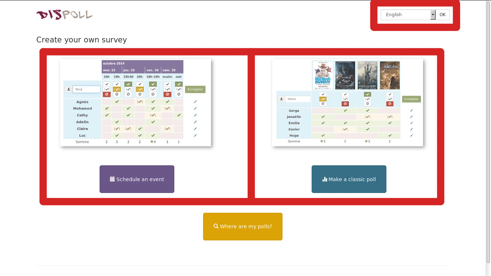
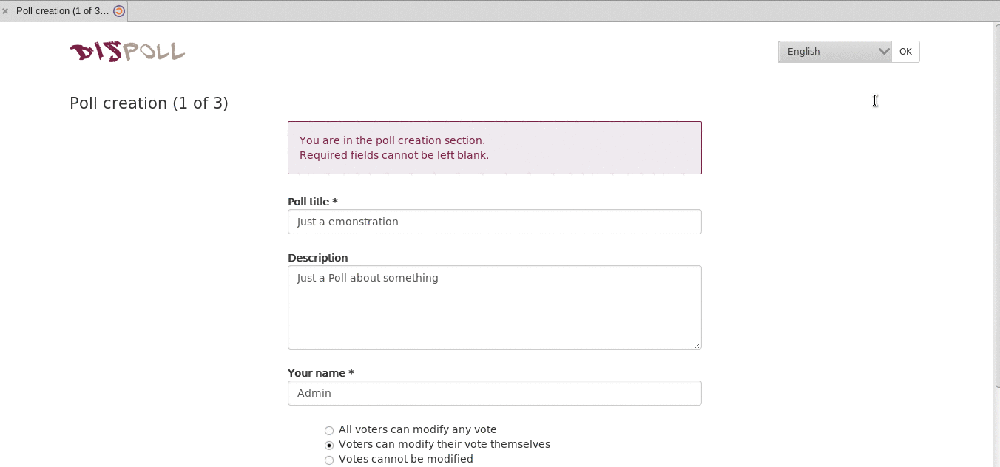
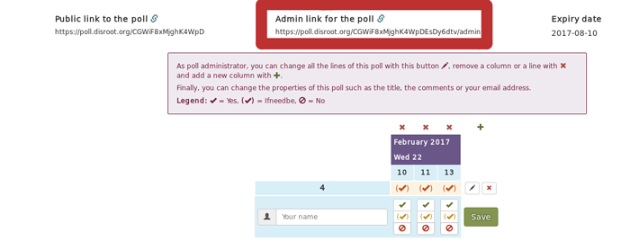
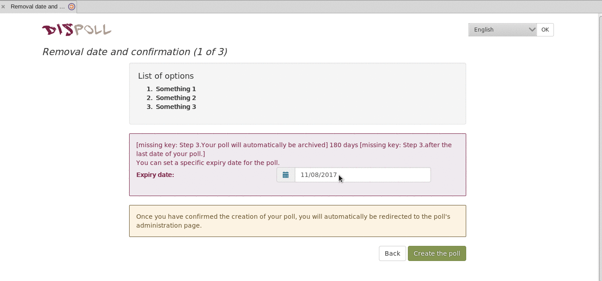
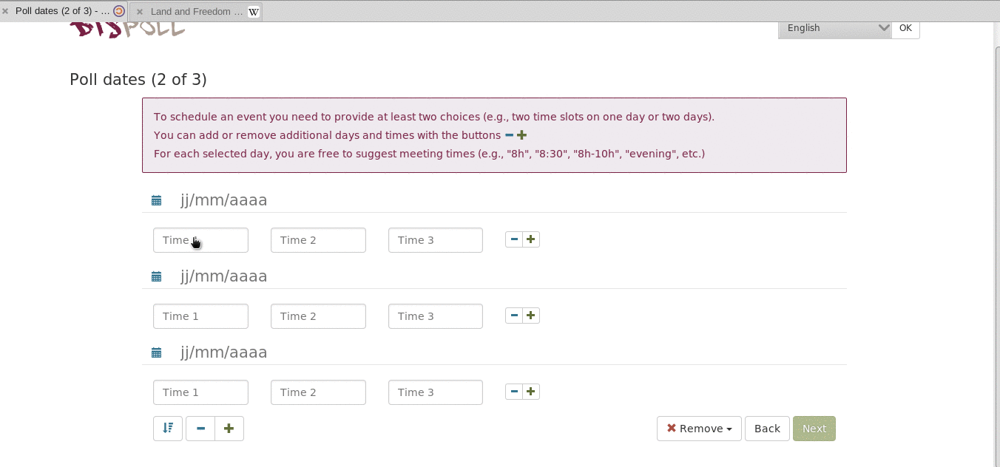
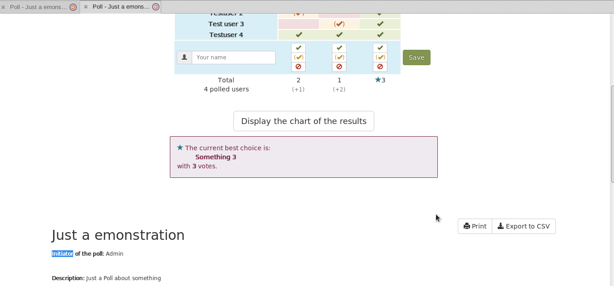
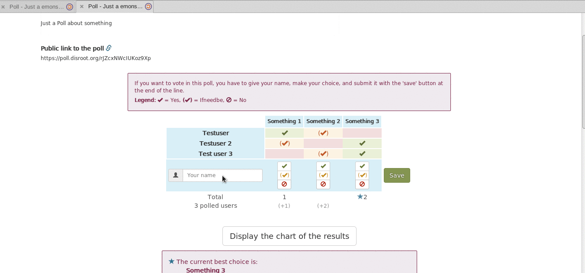

Disroot polls is an online service for appointment planning and decision making.
No registration is required. You can use it even if you don't have a disroot account.

This service is made possible thanks to [Framadate](https://framadate.org/).

In this tutorial we will show you how to work with disroot polls.

----------

# How to create a poll

Creating a poll is very easy, just go to [poll.disroot.org](https://poll.disroot.org/). You can choose the language of your poll in the upper right corner, and choose if you want a classic poll, or a poll to schedule an event/appointment.

The main differences between "Schedule an event" and "Make a classic poll" are:

* **Schedule an event**, like the name suggests is better suited to schedule meetings, actions, because it permits to set the proposals  with multiple dates and times.

* **Classic poll** is better suited do surveys. *If you want to do a poll about an event that spans over several days (with no options on starting hour), classic poll is also better suited.*

Once you choose which type off poll you prefer, the first step in making a poll is common to both, in the first page you need to fill:

* Poll title
* Description
* Your name (which will be publicly shown as the creator of the poll, choose whatever name you like)

And choose from the following options:

* All voters can modify any vote
* Voters can modify their vote themselves
* Votes cannot be modified
* Only the poll maker can see the poll results

After that continue to step 2, by pressing the green button on the bottom of the page.

In step 2 you will have to set the choices in either your "Classic poll" or your "Schedule an event" poll.

## Set choices in Classic poll
You can choose the number of choices you want by using the + and - buttons , and fill the text you want. Once you are done press next, select the expiration date of your poll, and press "create poll"

You can also add pictures and links to the options you create, but in the case of pictures they need to be uploaded elsewhere and you need URL link to them:

## Set choices in "Schedule an event"
You can choose the number of choices you want by using the + and - buttons  Select the dates in each choice and the times. Once you are done press next, select the expiration date of your poll and press "create poll".

----------

# Share your poll

Once your poll is created you will see in the left side of the screen the public link to the poll, just copy it and send it to people you want to participate in the poll.

----------
# Administer your poll
To administer your poll after it was created you need the "Admin link for the poll", which you can see and copy on the center part of the screen. **(don't loose it or else you wont be able to enter the admin panel)**

With this admin link you can return to this page whenever you want and edit the options of the poll.

# Check the results of the poll
Just press the "Display the chart of the results" or export it to a .csv file

----------

# Participate in the poll

* Write your name (or whatever name you want)
* Select in each choice one of three options; yes , If need be , and no 
* And press save at the end

## Using the comment section
Users of the poll can use the "comment section" in the bottom of the poll page to send messages to each other.

Users can see the results of the poll (if that option was enabled by the creator of the poll) beneath the list of people that voted, or by pressing the Display the Chart of the results.
---------------
