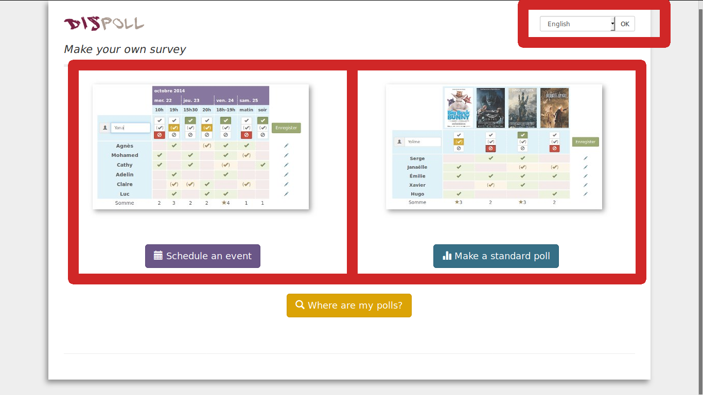
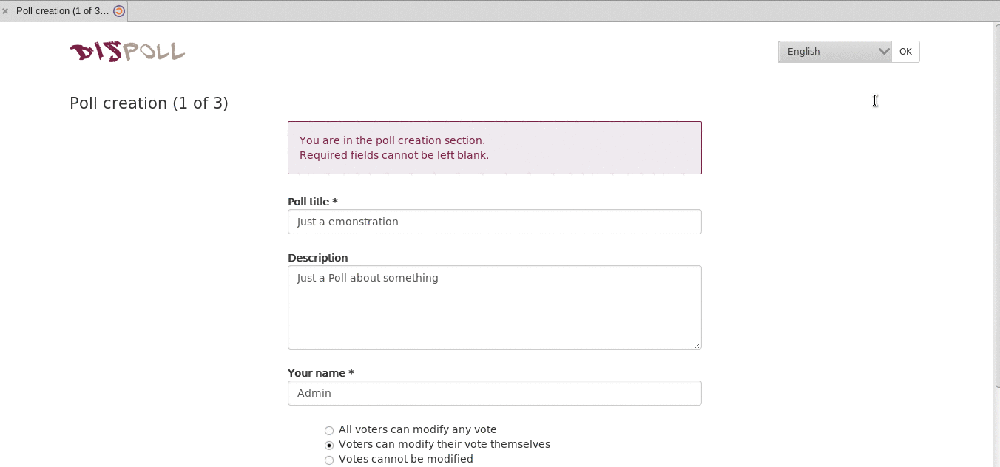
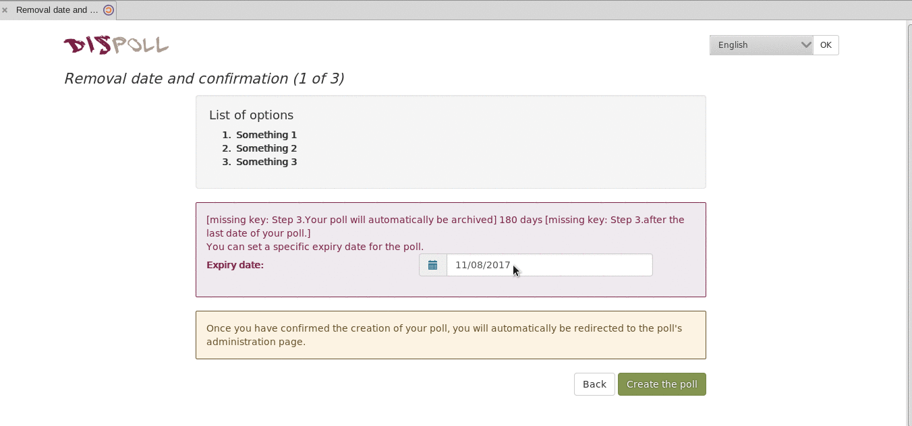
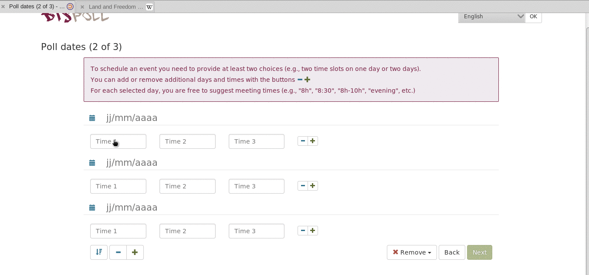
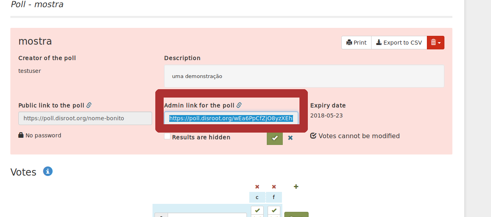
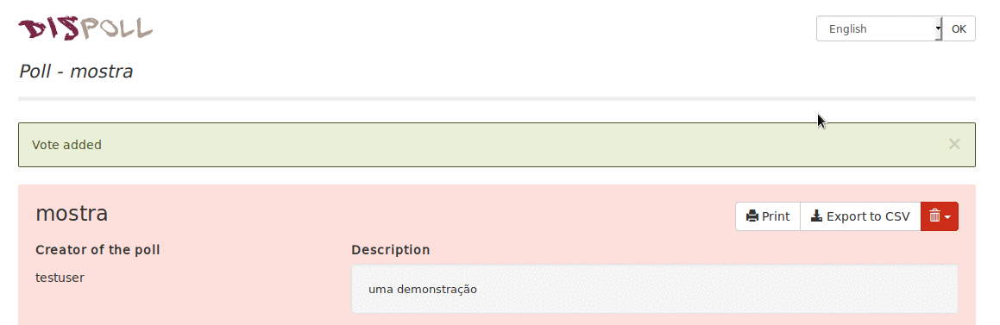

O Disroot poll é um serviço de votação online open-source para agendar e planear encontros/reuniões e tomar decisões online, alternativo a outros serviços como por exemplo a um doodle.
Não é necessário registo prévio. Pode usar este serviço mesmo que não tenha conta de utilizador no disroot.

Este serviço existe graças ao [Framadate](https://framadate.org/).

Neste tutorial vamos demonstrar como trabalhar com o disroot polls.

Nota: neste momento o software utilizado pelo disroot polls ainda não tem uma versão em língua portuguesa

# Como uma votação (poll)

Criar uma poll é bastante simples, basta visitar [poll.disroot.org](https://poll.disroot.org/). Pode escolher a língua da poll (neste caso ainda não há português) no canto superior direito, escolher se quer uma "standard poll" ou uma poll para agendar um evento/encontro "schedule an event".

As diferenças principais entre "Schedule an event" and "Make a standard poll" são:

* **Schedule an event**, como o nome sugere é mais adequado para agendar reuniões, ações, porque permite colocar várias propostas de data e hora.

* **Standard poll** é mais adequada para fazer questionários/sondagens. *Se quiser fazer uma poll acerca de um evento que tem vários dias de duração (sem opções acerca da hora de início), a standard poll também é mais adequada.*

Assim que escolha o tipo de poll que prefere, o primeiro passo é igual nas dias opções. Na primeira página precisará de preêncher:

* O seu nome (que será mostrado publicamente como sendo a pessoa que criou a poll, escolha o nome que quiser)
* Titulo da Poll
* Descrição

Carregando no botão "parâmetros opcionais"  

É possível escolher as seguintes opções:

* Poll link (URL personalizado, por exemplo: polls.disroot.org/decisao-importante)

* Password (restringir o acesso à poll usando uma palavra-passe)

* All voters can modify any vote (Todos os participantes podem modificar qualquer voto)

* Voters can modify their vote themselves (os participantes apenas podem mudar os seus votos)

* Votes cannot be modified (votos não podem ser modificados)

* Only the poll maker can see the poll results (apenas o criador da poll pode ver os resultados)

Nota: se escolher a opção password ser-lhe-á pedido nesta página que insira e confirme a password que quer usar na Poll.

Depois disso continue para o "step 2" (passo 2), carregando no botão verde no fundo da página.

No "step 2" terá que selecionar as opções tanto da sua "Standard poll" ou da sua "Schedule an event" poll.

## Selecionar as opções na sua Standard Poll

Pode selecionar o número de opções que quer na, usando os botões + e - , e colocar o texto que quiser. Assim que terminar carregue em "next". Depois selecione a data de duração da sua poll e depois carregue em "create poll"

Também é possível adicionar fotografias e links nas opções que criar. Mas no caso das imagens necessita de ter as imagens online noutro serviço (site, servidor) e o link URL da imagem:

## Seleccionar as opções em "Schedule an event"
Pode selecionar o número de opções que quer na, usando os botões + e - . Selecione as datas e a hora em cada opção. Assim que terminar carregue em "next". Depois selecione a data de duração da sua poll e depois carrege em "create poll"

# Partilhar a sua poll

Assim que a sua poll estiver criada verá, no lado esquerdo do ecrã, o link URL público da poll. Copie esse link e envie-o para as pessoas que quer que participem na poll.

# Gerir a sua poll
Para gerir a sua poll depois de criada precisa do *"Admin link for the poll"* (link de administrador da poll), que pode ver e copiar no centro do ecrã. **(não perca este link, senão não poderá aceder ao painel de administração da poll)**

Com este link, pode regressar a esta página de administração da poll sempre que quiser e editar as alterar as opções da poll.

# Verificar os resultados da poll
Basta carregar em "Display the chart of the results" ou exportar para um ficheiro .csv

# Participar na poll

* Escreva o seu nome (ou qualquer outro nome que queira)
* Em cada opção selecione uma das seguintes  três possibilidades; yes (sim) , If need be (se tiver que ser) , e no (não) 
* E no fim carregue em *"Save"*

## Usar a seção de comentários
Os participantes da poll podem usar a secção "Add a comment to the poll" no fundo da página para enviarem comentários uns aos outros.

Os participantes podem ver os resultados da poll (se essa opção tiver sido ativada pelo criador da poll) por baixo da lista de pessoas que votaram, ou carregando no botão *"Display the Chart of the results"*.
