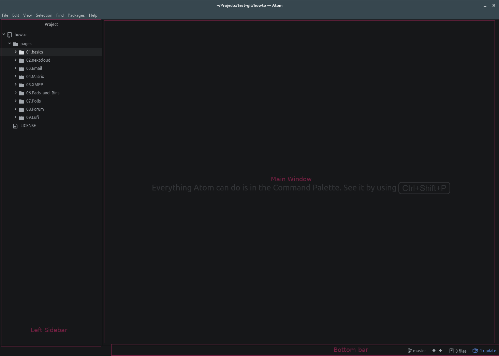

This article will try to explain the basics of using git to contribute to translations as well as submitting new tutorials.

In order to follow all the changes and work with multiple people at the same time, we have chosen to use **git** as our version control system. Git is very popular tool among developers and system administrators but it's features can be easily applicable everywhere where history of changes and ability to submit content and collaborate in a group is required.

In this tutorial we will not cover all the aspects of using git. It's very complex and powerfull tool with tons of in-depth tutorials and books written about it. What we are aiming at is providing a short and easy way to contribute to tutorials and translations.

# How to Create account on git instance
First of you need an account on the git instance used by disroot.org. Unfortunately git is not yet a federated service so you need to have a account. Thanks to our friends at **FOSS Community India** we host all our work on their gitlab instance.
To create an account just go over to https://git.fosscommunity.in and register. Additionally to registering new account you can choose to use one of the ID providers such as gitlab.com, github, twitter, gitbucket, google given you have already an account on one of those platforms.

# Installing Git
Since all the modifications will happen on your local machine, you need to [install git](https://gist.github.com/derhuerst/1b15ff4652a867391f03) to be able to send your changes as well as sync changes of others. Depending on your platform the ways to install git may vary so check the link above or refer to your platform specific documentation.

# Installing Atom editor
If you haven't yet, it's time to install [Atom](https://atom.io). Atom is a feature rich text editor with special git integration. If your Operating system is not automatically detected or listed when going to [Atoms](https://atom.io) website, check [Other platforms](https://github.com/atom/atom/releases/latest). For all Arch users, you can simply install it using `pacman -S atom` or other package manager of your choice.

# Cloning repository
Git is created with collaboration in it's core. First thing we need to do is get a copy of all files within the project (git repository) onto your local harddrive. All modifications are done on your local machine (you work offline). Only when you decide, the changes (new tutorial, translation) are finished you can decide to sent/sync (push) them back to the repository on the server.

The easiest way to clone the repository is opening your terminal, navigating to the directory you would like to clone the repository to, and run `git clone <url>` command, where *<url>* is basically the address of the repository you want to clone. In our case it would be:

`git clone https://git.fosscommunity.in/disroot/howto`

Once the repository is copied to your harddrive you will see a `howto` directory that consists all the file you could previously browse in your webbrowser when on our repository's url.

You can move that directory later to any place on your harddrive you wish.

# Request access to howto git repository
In order to be able to commit changes to disroots git repository, you need to request access. Once admins grant you the access, you can push your changes to the server (note that you can start working without access granted as all the changes happen on your local computer).

# Now the work can begin.
Now you can start Atom and `Open Folder` that you just cloned (*howto*). The interface of Atom is clean and easy to understand. The left sidebar is your project's navigation tree, the middle window is where you edit files and bottom bar indicates number of changed files, current branch, quick pull/push to git.

You can open and work on multiple files in tabs or as split screen side by side.
Unsaved files with local modifications are marked with a blue dot (depending on the theme you use of course)
To save the file changes use the *File* menu or *Ctrl+s* shortcut.

**But** before you start working on files you need to create your own: **branch**

# Git Branches
Branches are basically your own private workspaces. Each git project has it's own **master** branch. Master branch is the main, *production* copy of the project. This branch is automatically synced with the website, so any change made to that branch are instantly visible on the website. That is also why adding any changes to the **master** branch is restricted only to the owners of the project.
In order for you to start working is, create your own branch. This will basically make a clone of the **master** branch.

Switching between branches can also be done from that menu. Current working branch is visible on the bottom bar.

Once branch is created and changed, you can create new files, modify existing ones etc.

# Commiting your changes
Hokay, so you're working on your computer creating new tutorials or translating existing ones. Apart from saving changes to your laptop, you can/should also commit your changes. Commiting changes syncs the work you've done on your branch to the git server. If the branch does not exist on the server, it will be created and all your modifications and new  files will be uploaded to the server. In that case you can work on your files on multiple machines, or other people can take over, help working on your branch.

To commit your changes need to:
 - make sure all files are saved
 - stage all the files you've modified and want to commit to the server
 - Write a commit message - write short summary of what has been changed (not too long),
 - Hit commit button
 
 Once files are commited, it's time to push them to the server:
 - Open push/pull popup window
 - Press push

# Merge request
Once you think your work is finished and ready to be published on the website, its time to merge it to the **master branch**.

- First of course you need to make sure all the changes are commited.
- Login to https://git.fosscommunity.in
- if you pushed any changes to the server on your branch, in the top right you will see **"Create Merge Request"** button
- This will open Merge request form.
- Add title
- Add descripton
- make sure **source branch** is the one you want to merge from (one you worked on)
- make sure **target branch** is the one you want to merge to (usually master branch)

Once you created merge request, it will be reviewed by Disroot admins. Admins can then aprove your commit which means it will be merged with the master branch and therefor visible on the website or request you to correct something. Once all the corrections are made and Disroot *"overlords"* are satified, your merge request will be pulled to the master.

# Pulling changes from the server
If you want to keep the local **master** branch and your local branch up to date, you need to pull changes from the server. Each time someones gets his merge request pulled in to the master, everyone should also pull the changes to their local branches. Then you can easily see what's new and what has changed recently. On the master branch we keep a file called "CHANGELOG" where we note all significant changes to Howtos.
Pulling should be done on regular basis (specially before you start working on new branch).

 - Open push / pull popup window
 - Press **pull**

# Some vocabulary and explanation

**git repository** - Directory that consists all the files belonging to the project
