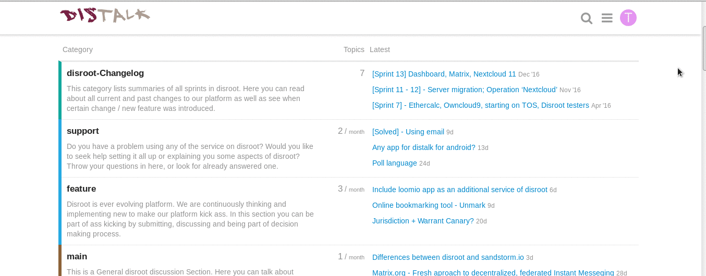
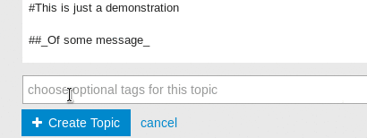

Le forum Discourse offre une interface utilisateur simple et intuitive. Même si vous utilisez Discourse principalement comme liste de diffusion, il est recommandé de voir l'interface web pour une expérience utilisateur supérieure. Voici quelques conseils pour commencer:

----------

# Connectez-vous d'abord
Vous pouvez vous connecter au forum avec votre compte Discourse ou votre compte Disroot, si vous en avez un.
Aller à https://forum.disroot.org/ et cliquez  dans le coin supérieur droit.
**Si vous avez un compte Disroot, assurez-vous de sélectionner Connexion avec un compte Disroot avant d'entrer vos identifiants.**

Si vous n'avez pas encore de compte, vous pouvez enregistrer un compte Disroot via https://user.disroot.org, ce qui vous donnera un accès supplémentaire au stockage cloud, à l'email, au xmpp et au tableau de projet. Vous pouvez également décider de créer un compte forum seulement - vous trouverez le bouton S'inscrire en haut à droite de la page du forum.

# Le menu
Les boutons d'icônes en haut à droite incluent la recherche et vos paramètres personnels:

Cliquez sur votre icône d'utilisateur (la première lettre de votre nom jusqu' à ce que vous changiez d'avatar) pour voir vos messages et notifications et pour entrer dans votre paramétrage personnel et voir votre page d'utilisateur.

Les petits nombres en haut de votre avatar indiquent combien de notifications (à droite) et de messages (à gauche) vous avez. Lorsque vous cliquez sur votre avatar, vous verrez tous les avis et messages non lus listés ci-dessous. Vous pouvez également accéder à tous vos messages via l'icône .

Cliquez sur votre avatar et ensuite sur le bouton  pour saisir vos paramètres personnels. Là, vous pouvez changer votre avatar, ajuster le niveau des notifications, vos catégories vues et bien plus encore.

# Navigation
Lorsque vous vous connectez pour la première fois au forum (ou cliquez sur l'icône  pour revenir à la page d'accueil à tout moment), vous trouverez une liste des catégories que vous suivez. Les catégories sont comme des sous-forums. Si vous êtes membre d'un forum privé, les catégories de ce groupe seront listées en premier et toutes les catégories publiques seront listées ci-dessous. Plus d'informations sur la façon de suivre et de cacher certaines catégories seront bientôt publiées dans un autre tutoriel.

~

La barre en haut vous permet de naviguer rapidement entre les derniers messages, nouveaux, non lus et la plupart des messages actifs. Vous pouvez également filtrer les catégories que vous souhaitez voir sous le bouton .
A l'extrême droite, vous trouvez un bouton d'onglet pour lancer un nouveau fil de discussion (thème).

Les derniers sujets sont également listés dans votre page d'accueil, à droite des catégories. N'importe quel titre de sujet que vous sélectionnez pour l'afficher vous amènera au prochain message non lu.

# Continuer à faire défiler

Une fois que vous êtes dans le fil du sujet, vous pouvez faire défiler vers le bas pour lire. Il n' y a pas de boutons ni de numéros de page - pour en savoir plus, continuez à faire défiler les pages!

Au fur et à mesure que de nouveaux messages entreront, ils apparaîtront automatiquement.

# Répondre aux messages

Pour répondre à l'ensemble du sujet, utilisez le bouton  en bas de la page.

Pour répondre à un message spécifique dans le fil, utilisez le bouton  sur ce poste.

Pour insérer une citation, sélectionnez le texte que vous souhaitez citer, puis appuyez sur n'importe quel bouton Répondre. Répétez pour plusieurs citations!

Pour aviser quelqu'un de votre réponse, mentionnez son nom. Tapez @ pour commencer à sélectionner un nom d'utilisateur.

Vous pouvez également aimer, partager, signaler ou ajouter un message à vos favoris.

# Créer un nouveau sujet
Vous pouvez créer un nouveau sujet dans une catégorie (Howtos, support, changelog, etc.) en naviguant dans la catégorie et en appuyant sur le bouton nouveau sujet , ou en appuyant simplement sur le bouton et dans le panneau de composition du sujet/message, sélectionnez la catégorie dans laquelle il se trouve. Les sujets doivent avoir un minimum de 8 lettres dans le sujet et 10 lettres dans le sujet, sinon le message ne sera pas envoyé.

# L'interface
L'interface est relativement simple.

Discourse supporte Markdown et HTML pour composer des messages, sur le côté gauche du panneau vous écrivez votre sujet, et sur le côté droit vous pouvez prévisualiser la façon dont le sujet sera présenté.

Mais vous n'avez pas besoin d'apprendre le Markdown ou le HTML pour écrire un sujet, vous pouvez simplement utiliser les options de formatage présentées dans la barre supérieure, citation de bloc **Gras**, **Mise en valeur**, **Liste à bulles**, **Liste numérotée**, **Titre**, **Règle horizontale**, **Emojis**. Les commandes comme CTRL+b ou CTRL+I fonctionnent également.

## Insertion d'images et de vidéos
Vous pouvez insérer des images dans votre sujet en les faisant glisser jusqu' à la partie du message où vous voulez qu'elles soient.

Pour insérer une vidéo, c'est le même processus.

## Transfert de fichiers vers votre sujet
Vous pouvez télécharger des fichiers en appuyant sur le bouton de téléchargement puis en naviguant jusqu' à ce que vous atteigniez et sélectionniez le fichier que vous voulez.

## Déplacement de fichiers, photos et vidéos d'un endroit à un autre dans le message
Les fichiers, images et vidéos seront présentés sur le côté gauche de l'écran (où se trouve tout le code) comme ceci:

**Fichiers**
> < a class="attachment" href="/uploads/default/original/1X/ffd8f38b235dbf199a919f0187ae63a183d22ada.odt">hello world.odt</a> (8.0 KB)

**Photos**
> < img src="/uploads/default/original/1X/019a9706a4676128e452b81f450851353f36175c.png" width="690" height="347">

**Vidéos**
>https ://forum.disroot.org/uploads/default/original/1X/59b17ec97a8daabcb96a787b4900f3d3221083da.mp4

Pour les déplacer, coupez simplement la ligne et collez-la où vous voulez. Dans le cas des images, vous pouvez également ajuster leur taille en changeant les valeurs de "hauteur" et "largeur" dans la ligne.

## Ajouter des étiquettes à votre sujet
L'ajout d'une étiquette facilite la recherche de sujets ou de fils de discussion sur un certain sujet. Les ajouter est un super facile.

Une fois que vous avez fini de composer votre sujet, cliquez simplement sur "Créer un sujet". 

# Comment couper le son ou regarder des catégories
Dans Discourse, il vous est possible de régler le flux des messages que vous recevez via le forum ou par email. Vous pouvez mettre en sourdine des catégories ou simplement une sous-catégorie qui ne vous intéresse pas ou définir des catégories à regarder, ce qui vous garantira de toujours recevoir des notifications et des courriels de chaque message dans une catégorie ou sous-catégorie qui vous intéresse.

Si vous mettez simplement une catégorie en sourdine, vous désactiverez toutes les sous-catégories, à moins que vous ne choisissiez une sous-catégorie spécifique à regarder. Si vous coupez le son d'une catégorie ou d'une sous-catégorie, vous pourrez toujours y accéder dans le tableau d'affichage, si vous voulez le consulter de temps en temps. Vous ne recevez tout simplement pas d' e-mails ou de notifications à ce sujet.

Les catégories et sous-catégories actuelles du Forum Disroot sont:

* disroot
 * disroot-Changelog
 * support
 * feature
 * main
 * FAQ
* Open Talks
* TOFU
* Engineering Yuvasamithi

La meilleure façon de regarder/modifier les catégories est dans vos préférences, à partir de là, vous pouvez définir toutes vos préférences d'un seul endroit.

Il vous suffit de faire défiler jusqu' à **Catégories**, vous verrez les champs **champs** pour **Sourdine** et **Regarder**, écrivez les catégories que vous voulez dans chacun et à la fin **enregistrez vos paramètres** pour qu'ils prennent effet.

L'autre méthode est de naviguer dans chaque catégorie ou sous-catégorie une par une et de le faire à partir de là, en appuyant sur le bouton qui se trouve à droite de "nouveau sujet". 

----------

 Vous trouverez d'autres conseils à l'adresse suivante [Message de bienvenu de Discourse](https://forum.disroot.org/t/welcome-to-discourse)
