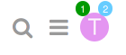
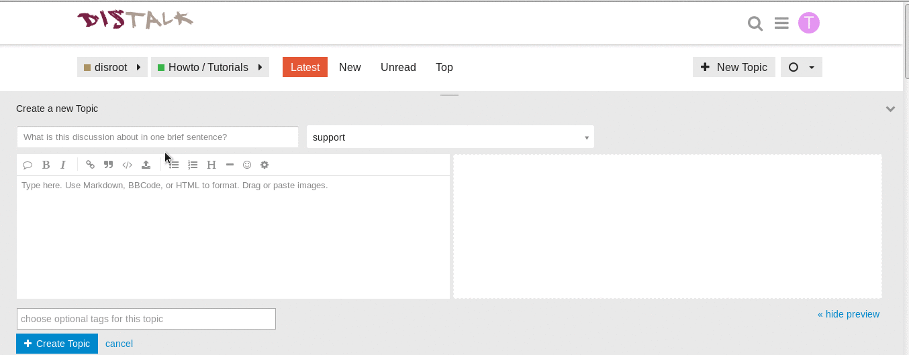

The Discourse forum provides a simple and intuitive user interface. Even if you are using Discourse primarily as a mailing list, it is recommended to check the web-interface for a superior user experience. Here are some tips to get you started:

----------

# Log in first
You can log in to the forum with your Discourse account or your All-in-one Disroot account, if you have one.
Go to https://forum.disroot.org/ and click  on the top right corner.
**If you have a Disroot account make sure to select Login with disrootID before entering your credentials.**

If you don't have an account yet, you can register a Disroot account via https://user.disroot.org, which will give you additionaly access to cloud storage, email, xmpp and project board. You can also decide to create a forum only account - you will find the Sign up button at the top right of the forum page.

# The menu
The icon buttons on the top right include the search and your personal settings:

Click on your user icon (the first letter of your name until you change your avatar) to see your messages and notifications and to enter your personal setting and see your user page.

The little numbers on top of your avatar mark how many notifications (on the right) and messages (left) you have. When you click on your avatar you will see all unread notification and messages listed below. You can also access all you messages via the  icon.

Click on your avatar and then on the  to enter your personal settings. There you can change you avatar, adjust the level of notifications, your viewed categories and much more.

# Navigation
When you first log in to the forum (or click  icon to get back to home page at any time), you will find a list of the categories you are following. Categories are like sub-forums. If you are a member of a private forum group, the categories of that group will be listed first and all public categories will be listed below. More on how to follow and hide certain categories will be posted soon in another tutorial.

~

The bar on top allows you to quickly navigate between latest, new, unread and most active posts. You can also filter which categories you wish to view under the  button.
On the far right you find a tab button for starting a new discussion thread (topic).

The latest topics are also listed in your home page, right of the categories. Any topic title you select to view will take you to the next unread post.

# Keep scrolling

Once you are in the topic thread you can scroll down to read through. There are no next page buttons or page numbers – to read more, just keep scrolling down!

As new posts come in, they will appear automatically.

# Replying to posts

To reply to the overall topic, use the  button at the very bottom of the page.

To reply to a specific post within the thread, use the  button on that post.

To insert a quote, select the text you wish to quote, then press any Reply button. Repeat for multiple quotes!

To notify someone about your reply, mention their name. Type @ to begin selecting a username.

You can also like, share, flag or bookmark a post.

# Creating a new topic
You can create a new topic in a category (Howtos, support, changelog, etc) by either navigating to the category and then pressing the new topic button , or by just pressing the button and in the compose topic/message panel select the category it goes to. Topics need to have a minimum of 8 letters in the subject and 10 letters in the topic, otherwise the message won't be sent.

# The interface
The interface is relatively simple.

Discourse supports Markdown and HTML to compose messages, on the left side of the panel you write your topic, and on the right side you can preview how the topic will be presented.

But you don't need to learn Markdown or HTML to write a topic, you can just use the formatting options presented in the top bar, Blockquote **Strong**, **Emphasis**, **Bulleted List**, **Numbered List**, **Heading**, **Horizontal Rule**, **Emojis**. Commands like CTRL+b or CTRL+I also work.

## Inserting pictures and videos
You can insert pictures into your topic by dragging them to the message to the part where you want them to be.

To insert a video it's the same process.

## Uploading files to your topic
You can upload files by pressing the upload button and then browsing until you reach and select the file you want.

## Moving files, pictures and videos from one place to another in the message
File, pictures, and videos will be presented on the left side of the screen (where all the code is) like this:

**Files**
> < a class="attachment" href="/uploads/default/original/1X/ffd8f38b235dbf199a919f0187ae63a183d22ada.odt">hello world.odt</a> (8.0 KB)

**Pictures**
> < img src="/uploads/default/original/1X/019a9706a4676128e452b81f450851353f36175c.png" width="690" height="347">

**Videos**
>https ://forum.disroot.org/uploads/default/original/1X/59b17ec97a8daabcb96a787b4900f3d3221083da.mp4

To move them just cut the line and paste it where you want it. Also in the case of pictures you can adjust their size by changing the values for "height" and "width" in the line.

## Adding tags to your topic
Adding a tag makes it easier for people looking for topics or threads about a certain subject. Adding them is supper easy.

Once your done with composing your topic just press "Create Topic" 

# Howto mute or watch categories
In Discourse it's possible for you regulate the stream of posts you receive via the forum board or via email. You can mute categories or just a sub-category you are not interested or set categories to watch which will guarantee you will always receive notifications and emails of every post in a category or sub-category you are interested in.  

If you just mute a category you will be muting all sub-categories, unless you select a specific sub-category to watch. If you mute a category or sub-category you will still be able to access it in the message board, if you want to check it from time to time. You simply just don't receive any emails or notifications about it.

The current categories and sub-categories in the Disroot Forum are:

* disroot
 * disroot-Changelog
 * support
 * feature
 * main
 * FAQ
 * Howto/Tutorials
* Open Talks
* TOFU
* Engineering Yuvasamithi

The best way to watch/mute categories is in your preferences, from there you can set all your mute and watch preferences from one single place.

Just scroll down to **Categories** , you will see the **fields** for **Mute** and **Watched**, write the categories you want in each and in the end **save your settings** for them to take effect.

The other method is to navigate to each category or sub-category one by one and do it from there, by pressing the button that is to right of "new topic" 

----------

 You can find more tips at [Discourse's welcome message](https://forum.disroot.org/t/welcome-to-discourse)
