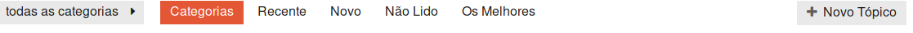
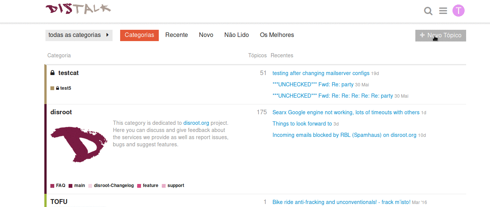
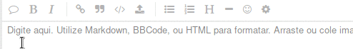
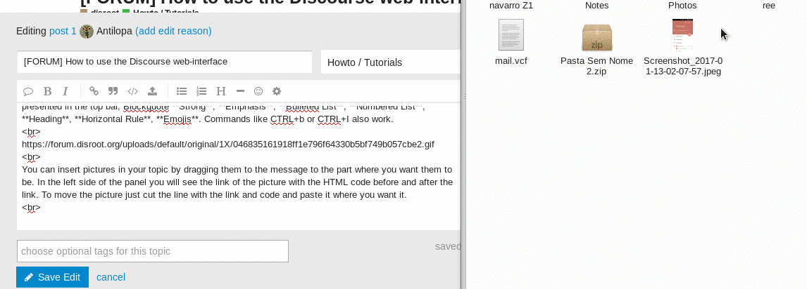
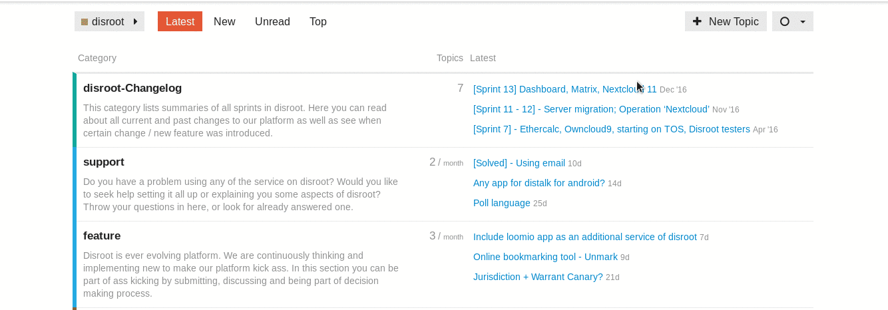

O Discourse tem um interface de utilizador simples e intuítivo. Mesmo que você esteja a usar o Discourse principalmente como uma mailing list, recomendamos que que dê uma vista de olhos no Discourse para ter uma experiênica de utilizador melhor. Aqui seguem algumas dicas para começar a usar o Discourse:

----------

# Fazer Login
Pode fazer login no fórum com uma conta de utilizador apenas para o Discourse, ou com a sua conta Disroot "tudo em um", caso tenha uma.
Vá a https://forum.disroot.org/ e carregue em   NO canto superior direito.
**Caso tenha uma conta de utilizador no Disroot, certifique-se que seleciona a opção "Login with disroot account" antes de inserir a sua password e nome de utilizador.**

Caso ainda não tenha uma conta de utilizador no Disroot, pode criar uma visitando https://user.disroot.org, o que lhe dará acesso adicional a: cloud storage, email, xmpp gestor de projetos. Também pode decidir criar uma conta apenas para o fórum, encontrará o botão "Sign up" no canto superior direito da página.

# O menu de utlizador
Os botões no canto superior direito incluem, pesquisa e as suas definições pessoais de utilizador:

Carregue no teu icone de utlizador o botão com a primeira letra do seu nome de utilizador, (assim que tiver uma foto de utilzador a etra será substituida por essa foto) para poder ver as suas mensagens e notificações e entrar nas definições da sua conta e área de utilizador.

Os números pequenos no topo do seu avatar indicam o número de notificações (à direita) e mensagens (left) que tem. Quando clica no seu avatar verá todas as suas mensagens e notificações listadas em baixo. Também pode ver as suas mensagens através do botão .

Para entrar nas definições pessoais carregue no seu avatar e depois no icone . Aqui pode mudar o seu avatar, ajustar o sistema de notificações, as categorias vistas e acompanhadas e muito mais.

Nestas defenições pessoais pode também alterar a língua do interface para Português ou outras línguas.

# Navegação
Quando faz log in no fórum (ou quando carrega em  para regressar à página principal do fórum), irá encontrar uma lista das categorias que está a acompanhar. Categorias são como sub-fóruns. Se é membro de um grupo privado, no fórum, as categorias desse grupo serão listadas no topo da página e as restantes categorias públicas serão listadas em baixo. Mais informações sobre como seguir ou esconder certas categorias serão colocadas em breve noutro tutorial.

A barra no topo permite navegar rápidamente entre: Recente, Novo, Não Lido, Os MelhoresThe bar on top allows you to quickly navigate between latest, new, unread and most active posts. Também pode filtrar as categorias que quer ver usando o botão  .
No fim desta barra de top encontra o butão para criar uma nova thread de discussão (Novo Tópico).

Os tópicos mais recentes também aparecem listados na sua página principal, à direita do botão C
"Categorias". Quando carrega nun tópico será encaminhado para o último post não lido desse tópico.

# "Continua para baixo"

Assim que estiver na thread de um tópico pode simplesmente continuar a ler a thread toda numa única página. Não há botões de "página seguinte", ou "página número X" - para continuar a ler basta continuar mover para baixo!

Á medida que novos posts chegam eles irão aparecer automáticamente na thread.

# Responder aos posts

Para enviar uma reposta no tópico use o butão  no fim da página.

Para responder a um post específico dentro da thread use o butão  que existe nesse post especifico.

Para inserir uma citação (de algo escrito num post anterior), selecione o texto que quer citar e depois carregue no botão "responder". Repetir este processo no caso de várias citações numa resposta!

Para ter a certeza que que alguém em particular recebe uma notificação acerca da sua resposta, cite o nome de utilizador dessa pessoa. Use uma @ antes para comecar a selecionar o nome de utilizador da pessoa em causa
To notify someone about your reply, mention their name. Ex: `@umutilizadorqualquer`

Também pode assinalar um like, partilhar, assinalar, guardar nos um post bookmark.

Também pode convidar outro utilizador a participar numa determinada thread, carregando no botão  no final da página.

# Criar um novo tópico
Pode criar um tópico dentro de uma categoria (support, changelog, etc) ou indo até à respectiva categoria e carregar no botão   ou simplesmente carregar no botão novo tópico e quando estiver a compor a mensagem, escolher a categoria na qual quer que a mensagem seja postada.

# O interface
O interface é relativamente simples.

O Discourse tem suporte para Markdown e HTML para compôr as mensagens. Do lado esquerdo do painel escreve o seu tópico e no lado direito do painel pode pré-visualizar como o seu tópico será apresentado.

Mas não é necessário aprender Markdown ou HTML para escrever um tópico. Pode simplesmente usar as opções de formatação de texto apresentadas na barra superior: 
**Citação**, **Bold**, **Itálico**, **Lista de Items**, **Lista Númerada**, **Títulos**, **Linha horizontal**, **Emojis**. Atalhos como CTRL+b ou CTRL+I 
funcionam.

## Inserting pictures and videos
You can insert pictures into your topic by dragging them to the message to the part where you want them to be.

To insert a video it's the same process.

## Uploading files to your topic
You can upload files by pressing the upload button and then browsing until you reach and select the file you want.

## Moving files, pictures and videos from one place to another in the message
File, pictures, and videos will be presented on the left side of the screen (where all the code is) like this:

**Files**
> < a class="attachment" href="/uploads/default/original/1X/ffd8f38b235dbf199a919f0187ae63a183d22ada.odt">hello world.odt</a> (8.0 KB)

**Pictures**
> < img src="/uploads/default/original/1X/019a9706a4676128e452b81f450851353f36175c.png" width="690" height="347">

**Videos**
>https ://forum.disroot.org/uploads/default/original/1X/59b17ec97a8daabcb96a787b4900f3d3221083da.mp4

To move them just cut the line and paste it where you want it. Also in the case of pictures you can adjust their size by changing the values for "height" and "width" in the line.

## Adding tags to your topic
Adding a tag makes it easier for people looking for topics or threads about a certain subject. Adding them is supper easy.

Once your done with composing your topic just press "Create Topic" 

# Howto mute or watch categories
In Discourse it's possible for you regulate the stream of posts you receive via the forum board or via email. You can mute categories or just a sub-category you are not interested or set categories to watch which will guarantee you will always receive notifications and emails of every post in a category or sub-category you are interested in.

If you just mute a category you will be muting all sub-categories, unless you select a specific sub-category to watch. If you mute a category or sub-category you will still be able to access it in the message board, if you want to check it from time to time. You simply just don't receive any emails or notifications about it.

The current categories and sub-categories in the Disroot Forum are:

* disroot
 * disroot-Changelog
 * support
 * feature
 * main
 * FAQ
 * Howto/Tutorials
* Open Talks
* TOFU
* Engineering Yuvasamithi

The best way to watch/mute categories is in your preferences, from there you can set all your mute and watch preferences from one single place.

Just scroll down to **Categories** , you will see the **fields** for **Mute** and **Watched**, write the categories you want in each and in the end **save your settings** for them to take effect.

The other method is to navigate to each category or sub-category one by one and do it from there, by pressing the button that is to right of "new topic" 

----------

 You can find more tips at [Discourse's welcome message](https://forum.disroot.org/t/welcome-to-discourse)
