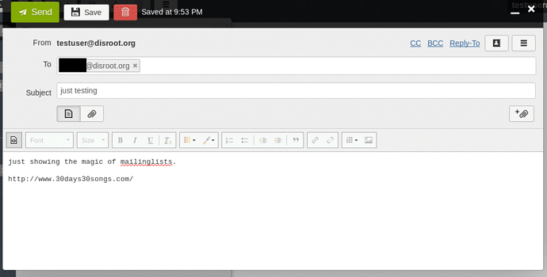
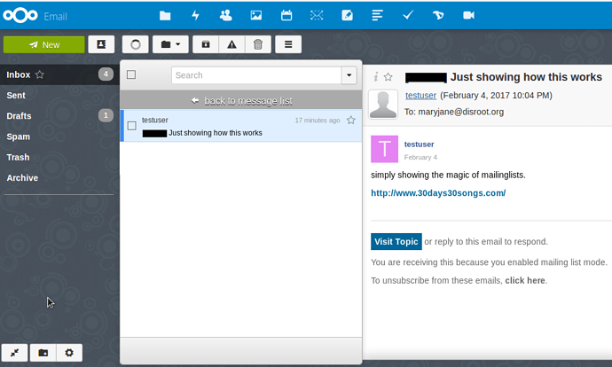

Neste tutorial iremos explicar como o Discourse pode ser utilizado como uma mailinglist para Coletivos/Associações/Projetos.

O Disroot, alberga principalmente grupos privados no Fórum. Se está interessado num entre em contacto connosco.

**NOTA:** Para ser membro de um grupo (público, ou privado) não é necessário ter uma conta Disroot. Pode criar uma conta apenas para o fórum.

----------
# Como funcionam as mailinglists no Discourse

O software utilizado pelo Disroot, o Discourse é um software de fórum com funcionalidades de mailinglist. Tem, aquilo que para efeitos deste tutorial iremos chamar **Grupos**. E esses grupos podem ter, ou não,  **Categorias** dentro deles (como se fossem assuntos ou tópicos principais dentro de um grupo).
Por exemplo, o grupo Disroot tem várias categorias dedicadas a tópicos diferentes para organizar discussões e trocar mensagens entre utilizadores:

Cada um destes grupos ou categorias pode ter um alias de email, que funciona como se fosse o endereço da mailinglist, que pode ser usado para criar um tópico por email (webmail or cliente de email) num respectivo grupo ou categoria.

Os membros desse grupo recebem a mensagem tanto no fórum como nos seus emails.

E podem responder à mensagem tanto através do fórum como por email, como preferirem.

Isto permite criar um sistema que pode ser usado tanto por fãs de fóruns como por fãs de malinglists.

Você pode ter um grupo com apenas uma categoria e um alias de email atribuído. Ou se for um coletivo grande, com grupos de trabalho, pode ter um grupo com várias categorias, cada um com um alias de email diferente e a funcionar como uma mailinglist autónoma. Algo deste género:

> * **Grupo** (Coletivo/Projecto/Associação)
>  * **Principal/Geral/Assembleia**
>alias de email: **assembleia_grupo@disroot.org**

>  * **Categoria1**
>alias de email: **Categoria1_grupo@disroot.org**
>  * **Categoria2**
>alias de email: **Categoria2_grupo@disroot.org**

>  * **Categoria3**
>alias de email: **Categoria3_grupo@disroot.org**

O sistema descrito em cima tem duas vantagens principais:

1. Se é membro de um coletivo/associação/projeto com grupos de trabalho, pode dividir a discussão dos grupos de trabalho ou tópicos pelas diferentes categorias em vez de ter tudo à mistura numa única mailinglist.

2. Tendo em conta que é possível para os utilizadores do fórum (no geral) e neste caso em particular, os membros do grupo, selecionar as categorias cujas mensagens que querem receber no seu email. Os membros do grupo, podem na prática filtrar as categorias que não tem interesse receber mensagens de email em vez de levarem com um grande fluxo de mensagens na sua caixa de entrada do email.

Estas definições podem ser alteradas a qualquer momento e os membros de um grupo/mailinglist podem sempre ter acesso às mensagens de todos os grupos/categorias no interface web do fórum, incluíndo aquelas que selecionaram não receber por email.
Se quiser pode ler mais sobre como selecionar "Vigiar" e "Silenciar" categorias no fórum [aqui](https://howto.disroot.org/pt/forum/basic-usage).

O nome do grupo e as respectivas categorias e os alias de email correspondentes podem ser o que você quiser (a não ser que já estejam a ser usados).

----------
# Grupos/Mailinglist privados

Grupos/Mailinglists privadas funcionam como foi descrito em cima, mas tal como o nome indica são privadas e apenas podem ser vistas e acedidas pelos membros do grupo. Apenas pode enviar um email para esse grupo se for membro.

No interface web do fórum os grupos privados apenas podem ser acedidos pelos seus membros e aparecem representados por um cadeado . Quando faz log in no fórum, os grupos privados a que pertence aparecem sempre no topo.

Pessoas que não são membros dos grupos privados nem conseguem ver que o grupo existe.

Agora vês:

Agora não:

## Adicionar participantes a um grupo privado

Há duas maneiras de adicionar participantes a um grupo privado:

1. Quem administra o grupo pode adicionar participante individualmente. Mas isto tem dois inconvenientes, os participantes são adicionados um a um, segundo é necessário configurar as definições de cada participante individualmente (ex: silenciar mensagens de grupos públicos no fórum do Disroot, para que os membros do grupo privado não recebam mensagens de grupos públicos que não queiram.

2. Os administradores do Disroot podem enviar convites em larga escala de uma única vez com as pré-definições já todas feitas de modo a que os membros do grupo privado não recebam emails de grupos públicos do fórum (ex: Changelog, Support, etc.)

----------
# Grupos/Mailinglist públicos

Grupos públicos funcionam como descrito em cima. A principal diferença é que:

São públicos, qualquer utilizador do fórum pode ver os tópicos e discussões e fazer um post via o interface web do fórum (ou por email se o grupo tiver um alias de email atribuído). Também podem ser vistos por pessoas na Internet, que não são utilizadores do fórum e podem aparecer em resultados de motores de busca como por exemplo o google.

----------
# O caso dos grupos públicos do Disroot

As categorias públicas do Disroot no fórum (ex: FAQ, Features, Changelog, Main, Open Talks, etc.) não tem alias de email atribuídos por isso não é possível criar um tópico via email nestes grupos e nas suas respetivas categorias.

Apenas pode responder via email quando recebe o post na sua caixa de correio.

----------
