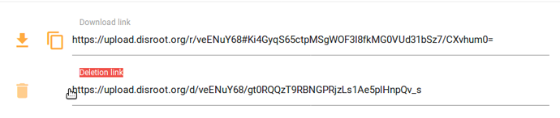

O disroot fornece o Lufi, um software online, open source para fazer o upload e partilhar ficheiros com outras pessoas de um modo seguro e privado, como uma alternativa a serviços como o wetransfer.

O Lufi funciona numa lógica de "conhecimento zero".

O que quer dizer que os ficheiros são encriptados antes de saírem do seu computador, de modo a que o seu fornecedor de Internet e os "administradores do disroot" não consigam ver os conteúdos do(s) ficheiro(s). Os administradores apenas conseguem ver o nome do(s) ficheiro(s), o tamanho, o mimetype (o tipo de ficheiro que é: vídeo, texto, etc.).

**Não é necessário realizar o registo no serviço para fazer o upload de ficheiros**

Entre outras coisas pode usar o Lufi para:

   - Armazenar (temporariamente) ficheiros online, descarregá-los, partilhá-los com outras pessoas
   - Enviar a alguém ficheiros que são apagados do servidor após a primeira descarga

Neste tutorial iremos demosntrar-lhe como utilizar o Lufi. Pode aceder ao Uploads/Lufi em [upload.disroot.org](https://upload.disroot.org)

Notas:

- O Lufi não é um serviço de cloud (os ficheiros apenas são armazenados online por um determinado período de tempo, após o qual são apagados). Para serviços de cloud tem a sua [cloud](http://https//:cloud.disroot.org) fornecida pelo disroot.
- É diferente do PrivateBin. Um Bin apenas pode partilhar texto, enquanto que o Lufi pode ser usado para partilhar e descarregar qualquer tipo de ficheiro.

----------

# Quão seguro é o Lufi e como funciona

Quando utiliza o Lufi para fazer o upload de ficheiros, "Todos os ficheiros são encriptados pelo seu browser! Isso significa que os ficheiro nunca saem do seu computador desencriptados. O administrador da instância do Lufi que está a utilizar não será capaz de ver o que está no seu ficheiro, nem o seu administrador de rede, nem o seu fornecedor de Internet."

Quando alguém descarrega o seu ficheiro, ele é desencriptado localmente no browser dessa pessoa depois do download. Significa que, nem o seu administrador de rede, nem o seu fornecedor de Internet são capazes de ver o que está no ficheiro descarregado.

Você pode ler mais acerca do assunto [aqui](https://git.framasoft.org/luc/lufi).

Todo o processo de encriptação/desencriptação é feito automáticamente pelso browsers, então não há necessidade de encriptar manualmente os ficheiros antes, ou de desencriptar nanualmente de pois de descarregar.

A chave de encriptação (a coisa que permite a quem descarregar o ficheiro, desencriptá-lo) é uma parte do link que é apresentado pelo browser depois de você fazer o upload de um ficheiro.

É uma ancora (Cf. Fragment Identifier). Isto significa que a esta parte (a chave de encriptação) é apenas processada no lado do cliente (o seu computador) e não chega ao servidor do fornecedor da sua instância do Lufi, de modo que elxs não conseguem desencriptar o ficheiro.

**Apenas pessoas que tenham acesso ao link completo serão capazes de descarregar e desencriptar o ficheiro.**

Por exemplo este é um link para um ficheiro em upload.disroot.org:

[https://upload.disroot.org/r/FA7MHOOL#AgsmqnJEyUZAcybZmOGKljqYRtDhJKsvZC/Qt05N8dE=](https://upload.disroot.org/r/FA7MHOOL#AgsmqnJEyUZAcybZmOGKljqYRtDhJKsvZC/Qt05N8dE=)

Tem dois componentes:

* À esquerda do simbolo **#** está o URL para o ficeiro:
"https://upload.disroot.org/r/FA7MHOOL"

* À direita do símbolo **#** está a chave de encriptação do ficheiro:
"#AgsmqnJEyUZAcybZmOGKljqYRtDhJKsvZC/Qt05N8dE="

Se tentar usar apenas, [https://upload.disroot.org/r/FA7MHOOL](https://upload.disroot.org/r/FA7MHOOL)
Sem a segunda parte, receberá esta mensagem:

----------
# O Interface

O interface é bastante simples, quando faz o upload de um ficheiro tem as seguintes opções:

* Escolher quantos dias (o ficheiro) fica online. **O máximo é 60 dias, (para ficheiros mais pequenos)**
* Escolher se quer que o ficheiro seja apagado (do servidor) depois de ter sido descarregado pela primeira vez.

Ao centro em cima no painel pode selecionar as opções acima mencionadas. No canto superior direito tem o menu para ir a "My files" e gerir os seus uploads. No centro é onde faz o upload dos seus ficheiros.

----------

## Tamanho máximo dos ficheiros

Não há limite máximo para o tamanho dos ficheiros que você pode fazer o upload. Mas o perído de tempo que um ficheiro permanece armazenado no lufi varia de acordo com o tamanho do ficheiro. Após esse tempo expirar, o ficheiro é apagado.

Ficheiros maiores serão armazenados por um período de tempo menor. "O retardar da expiração do seu documento será o mínimo entre aquilo que escolher e as seguintes limitações":

* entre 0 e 48M, o ficheiro será mantido por 60 dias.
* entr 48M e 96M, o ficheiro será mantido por 30 dias.
* entre 96M e 954M, o ficheiro será mantido por 15 dias.
* for 954M ou maior, o ficheiro será mantido por 2 dias.

Pode verificar esta informação sempre que quiser carregando no botão  no interface principal do Lufi.

----------

###Como carregar ou descarregar um ficheiro

Para carregar um ficheiro escolha as opções que quer (se o ficheiro é apagado após a primeira descarga ou não e quantos dias permanece online) e carregue em "click to open the file browser" no centro do ecrã, navegue até ao seu ficheiro e selecione-o, ou então arraste o ficheiro para o centro do ecrã.

Depois do upload estar completo ser-lhe-á fornecido pelo seu browser o link (URL e chave de encriptação) do ficheiro carregado, copie-o para um síto qualquer.

Também lhe será fornecido o link para apagar o ficheiro, que lhe permite apagar o ficheiro carregado a qualquer altura que queira.

Para descarregar o ficheiro basta colocar o link no seu browser:

----------

###Como partilhar um ficheiro

Bem isto é bastante simples, você pode:

* copiar o link manualmente para o seu email, ou um ficheiro de texto, ou qualquer outra opção

* enviar diretamente por email a partir do Lufi

Para esta última opção (se tiver um cliente de email na sua máquina ex: Thunderbird, Evolution, etc.), basta carregar no botão  após o seu ficheiro ser carregado com sucesso. Escreva o endereço de email e o texto e carrege em  . O seu cliente de email irá aparecer com o email pronto a enviar.

**A opção**  **não deve ser usada por uma questão de princípio.**

A rasão é, se você utilizar esta opção, o link será enviado utilizando um email do fornecedor do Lufi e não o seu email pessoal. O que quer dizer que os administradores dessa instância do Lufi conseguem ver o link completo e assim descarregar e desencriptar o ficheiro se quiserem.

Neste caso concreto o disroot é um fornecedor respeitador da privacidade, mas por uma questão de princípio, você deve evitar esta opção.

----------

##Como gerir/apagar os seus uploads

Você pode gerir os seus uploads carregando em  no painel principal.

Aí pode ver todos os seus uploads e pode:

* Ver os links para descarregar todos os seus uploads
* Ver quais programados para serem apagados após a primeira descarga
* Escolher que uploads você quer apagar do servidor

 A lista dos uploads é guardada localmente no seu browser num ficheiro .json. O que deixa um registo no seu browser dos ficheiros que fez um upload. Deste modo, não é possível ver a lista dos ficheiros dos quais fez upload quando estiver a utilizar um browser diferente ou um computador diferente.

Se você quiser, neste painel também pode:

* Purgar esta informação da memória do seu browser (isto irá apagar a informação dos ficheiros dos quais fez upload e os seus respetivos links do seu browser, mas não irá apagar os ficheiros do servidor e os links permanecem válidos)

* Exportar para o seu computador o ficheiro json que contém estas informações

* Importar para a memória do seu browser um ficheiro json com as informações acerca de uploads e os respetivos links

Outra maneira de apagar um ficheiro do servidor em qualquer altura que queira é usar o link para apagar o ficheiro que lhe foi fornecido quando o ficheiro foi carregado. Copie esse link e guarde-o num ficheiro de texto para quando o quiser utilizar.
Para o usar basta colocar o link no browser e carregar em Enter.

Se apagar um ficheiro ou a data de expiração do ficheiro tiver passado, qualquer pessoa que tente descarregar o ficheiro receberá uma mensagem deste género:

