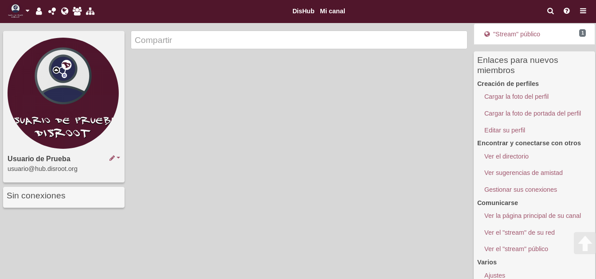
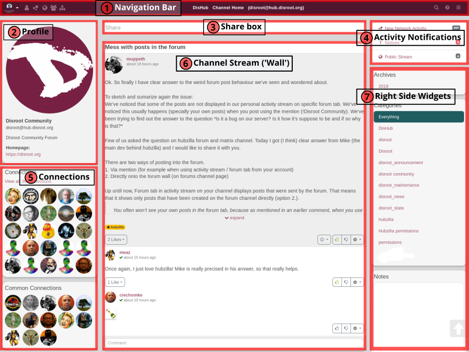
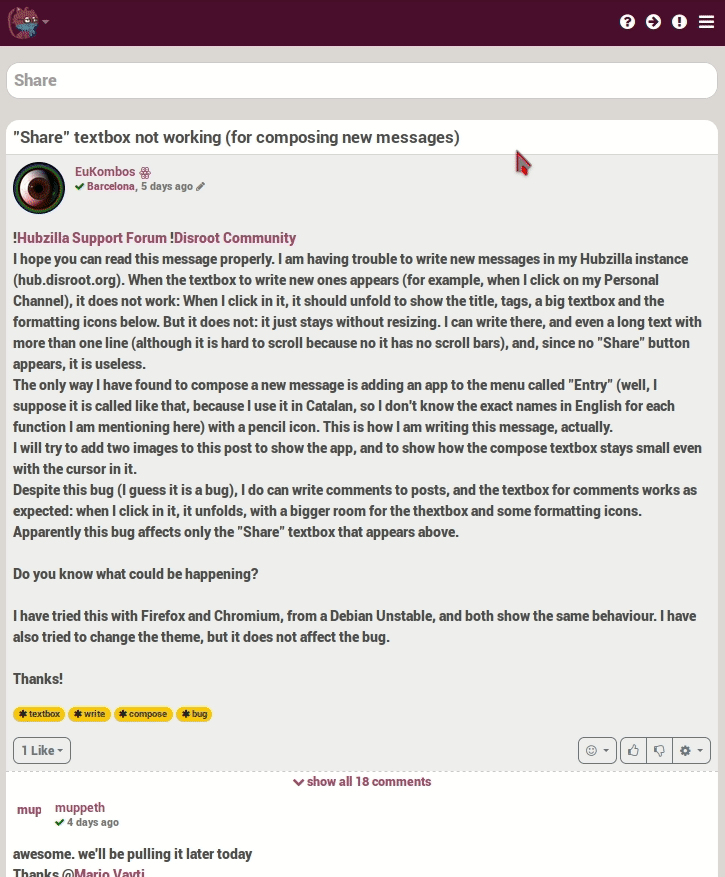
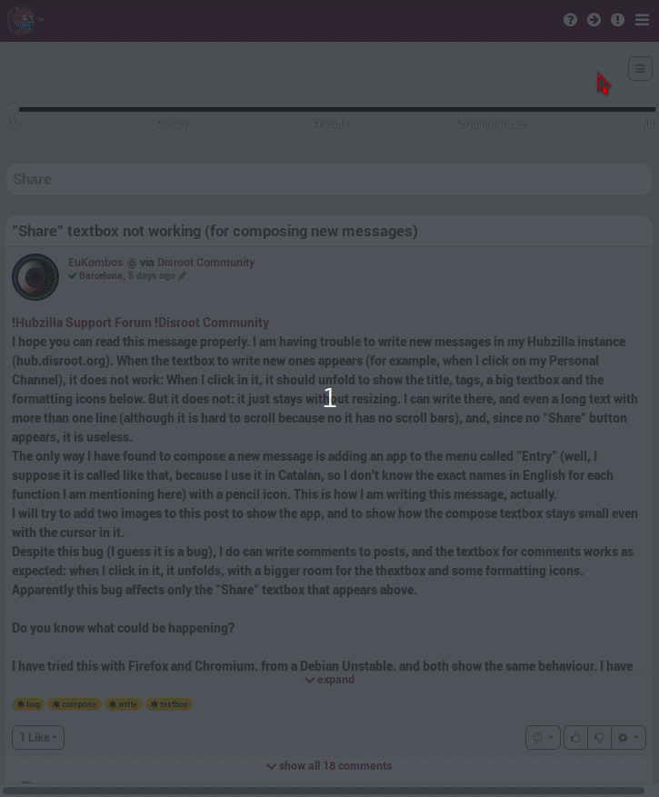
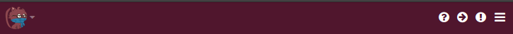
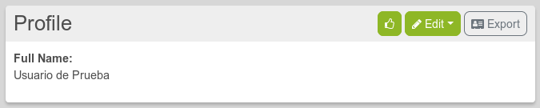
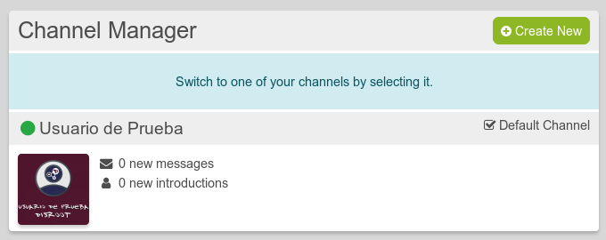
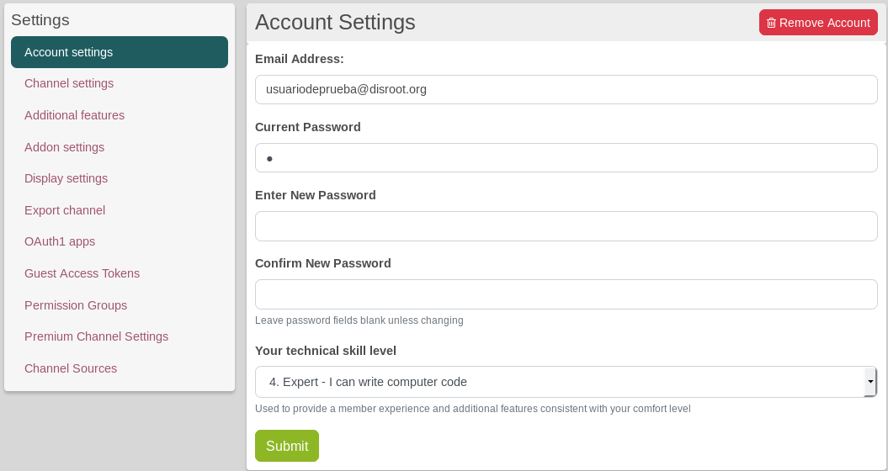
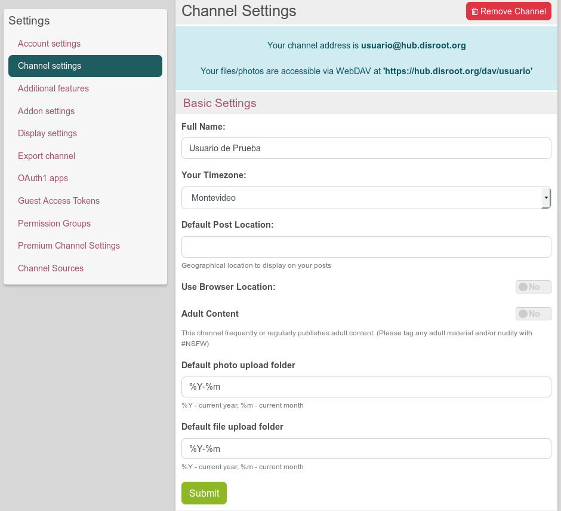

## User Interface Overview
After logging in, filled out your profile and created a channel, this is, almost for sure, how your channel will look like:

Yes, it doesn’t look much pretty, huh? But, don’t get into a daze, by the end of this overview, you should be able to make your channel looks more like this...

… (or even better) and know where are the most important tools and features, what are they for and what the possibilities of each one of them. And that would be just the beginning.

Let’s start by knowing the spaces our new home first. Later you could decorated whatever you want.
For the purpose of this tutorial we will name the parts, or blocks, of the User Interface (UI) in order to identify them later.

 
**NOTE: On the mobile version, the sidebars are hidden.**
If you want to show the left sidebar you have to click on the arrow icon 
 
The right bar is limited to activity notifications only. If you want to see the notifications click on the exclamation point icon. 
 

01. **Navigation bar**: From here you access to your personal settings, the menu, the network and public streams, apps, the directory, wikis, the chat, etc. It is very customizable, and it functions like a shortcut and launch applications bar.
02. **Profile section**: Here there’s some basic information about your channel, like your name and hub address. You can add more info if you want.
03. **Share box**: The place where you write and share your thoughts, things you like, your photos, compose articles, etc. By clicking on it the post compositor opens. It’s a very well-suited editor to compose and edit your post or shares.
04. **Activity Notifications**: It informs you about what is happening in the network stream, in the public stream and if you received a connection request, a mail, if someone commented a post you’ve created or a post that you’ve been following. We’ll see about it later.
05. **Connections**: Here you can see some of your connections (those you interact the most) and the common connections you may have with other users while visiting a channel.
06. **Channel stream**: It works like the “wall” of most social networks, it’s the place where you see your posts, the comments on them (if they’re enable), the posts you’ve re-shared, and those from the people you’ve give permissions to write on it, the posts of your connections.
07. **Right side widgets**: This space can be used not only as a widget section, but almost anything you want to have accessible (information, apps, notes, sites, shortcuts, etc, as we’ll see later) can be setted to appear in this place.

Let’s take a closer look at the parts.

## 01. Navigation bar

On mobile pinned apps are hidden and only accessible through the hamburger menu on the right 

 **Profile**: By clicking on it, you access to view and edit your profile, your channel manager, the general settings and to log out.

### View profile
A profile is a collection of information about yourself so you can have different profiles depending on the data you want to share with different users or groups. For example: your public or default profile (which is always available to the general public and can’t be hidden) is GNU/Linux and FOSS related. You set the permissions and establish connections with those who may share those interests. But if you have your group of friends that don’t care about that much, and you don’t want to bore them with it, you can create a new profile with a new set of permissions called “friends”, that allow its members access only to another kind of information.

Clicking on **“View profile”** you’ll see your public profile with the information you has submited, such as your name and tags. You can edit this public profile by clicking on the Edit option at the right of the profile title bar. Same happens if you click on the pencil icon below your profile picture.

**View Profile:** Clicking on “View profile” you’ll see your public profile with the information you has submited, such as your name and tags. You can edit this public profile by clicking on the Edit option at the right of the profile title bar.
(See Profiles Settings for more information about configuration)

**Edit Profiles:** Here you can see your default and created profiles if there any or create new ones.
(See Profiles Settings for more information about creating and managing profiles)

**Channel Manager:** From here you can manage your channels and create new ones.
Note: Channels are different from profiles. A profile is a collection of information about yourself so you can have different profiles depending on the data you want to share with different users or groups. For example: your public or default profile (which is always available to the general public and can’t be hidden) is GNU/Linux and FOSS related. You set the permissions and establish connections with those who may share those interests. But if you have your group of friends that don’t care about that much, and you don’t want to bore them with it, you can create a new profile with a new set of permissions called “friends”, that allow its members access only to another kind of information.
A channel, on the other hand, it’s the space on the web that contains collections of content stored in one place, that’s the stream (will see that later). What kind of content? Well, that’s exactly the point of it. You can create different channels for different kinds of content and specifies whose of your contacts or public can see it. In other words, a profile is information about you and a channel is the space where specific information it’s gathered and showed up.

**Settings:** By clicking on it, you will access to the Account, Channel, Features settings and other configurations.

[To know more about profiles and the available options...](../channels/profiles)

### Channel Manager
Channels are different from profiles. A channel is the space on the web that contains collections of content stored in one place, that’s the stream (will see that later). What kind of content? Well, that’s exactly the point of it. You can create different channels for different kinds of content and specifies whose of your contacts or public can see it. In other words, a profile is information about you and a channel is the space where specific information it’s gathered and showed up.

Click on the **Channel Manager** to access its options.

From here you can create and switch between channels. The process to create a channel it’s the same as when you create your first one.

#### Settings
Clicking on the **Settings** option you access to a wide range of settings categorized by its functionality. We will see each one of them.

!!! The settings options are on the left sidebar. So if you want to show the options on mobile you have to clikc on the arrow icon in the nav bar. 

##### Account settings
In the **Account settings** you can change your email address, your password and set Your **technical skill level**. Every level sets different user features according to what you expect or want to do. By default, DisHub skill level is **4. Expert**, in orden to provide most of the features available.

There are five levels. From level 1 on, each one of them progressively enables Additional features.
0. Beginner/Basic
1. Novice - not skilled but willing to learn
2. Intermediate - somewhat comfortable
3. Advanced - very comfortable
4. Expert - I can write computer code
5. Wizard - I probably know more than you do

##### Channel settings:

This is one of the most important settings. Here you have four settings options:
1. **Basic settings**:

