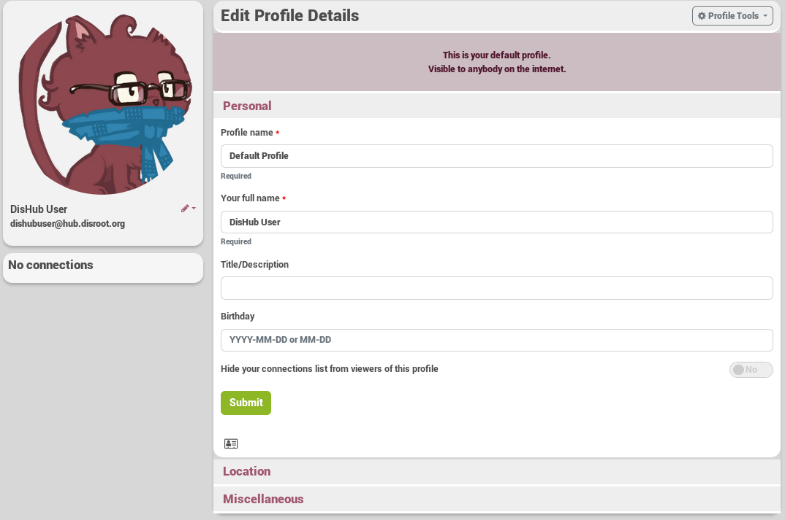
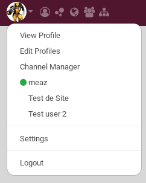

## What is a profile?
You have surely registered with some other internet services, such as forums or online communities. For all of them you provided some information about yourself, such as date of birth, country, age and the likes. Think of your profile as **the basic information about yourself you tell other people**.

Here is an example of a profile with not much on it :)

And the same one, but seen from a directory research on "meaz" !

Unlike other services Hubzilla offers you the **advantage of creating many more profiles**. That means you can decide to use different profiles to show different "sides of yourself" to different audiences. For example, your default public profile might say "Hello, I'm Fred, and I like laughing". You may show your close friends a profile that adds "and I also enjoy dwarf tossing".

You always have a profile known as your "default" or "public" profile. This profile is always available to the general public and cannot be hidden (there may be rare exceptions on privately run or disconnected sites). You may, and probably should restrict the information you make available on your public profile.

## How to create my first profile?
After setting your Role, name (real or not) and your nickname, you will be redirected on the profile page of your new channel (or something else if your site admin decided otherwise).

Click on **Default Profile** if you want to customize your profile.  

From there you are free to complete information about yourself. There are at least two information that are required. There are in the **Personnal tab**:
- **Profile name (required)**: it is the name you want to give to the profile. It helps when you have multiple profiles. For example you could call it "Public Profile", "Family Profile", etc.
- **Your full name (required)**: it is the name that will be shown to everyone.

You can change the profile picture (cavatar). From the **Profile Tools** dropdown menu, select **Change profile photo**.

**Or simply click on your avatar!**

Upload your photo and size as necessary using the image editor.

When you press **Done Editing** you will be redirected back to the profile editor (You might need to clear your browser cache if you have trouble seeing the new photo).

Returning to your channel home page you will see that a post notifying others of your new profile pic has been automatically posted.

You can also customize the cover photo. From the **Profile Tools** dropdown menu, select **Change cover photo**.

If you'd like to meet people that share some general interests with you, please take a moment and add some **Keywords** to your profile, such as "music, linux, photography" or whatever. You can add as many keywords as you like.
To do so click on the **Miscellaneous** tab and add the keywords in **Keywords used in directory listings**.

## How to see my profile?
Click on your avatar in the nav bar and select **View Profile**.

## How to edit my profile?
You can edit your profile at anytime by clicking on the **pencil icon** next to your avatar image and then choosing the name of the profile you want to edit.

A better way (because you have more options) is to click on your **avatar** in the nav bar and select **Edit Profiles**.

## Have more "Things" on profile
### What is it?
You can add more stuff that was is available on your profile. It is called things. You can for example add what you like, what you want, etc. It allows viewers of your profile to "like" the added items.

### How to add "things" on my profile?
Go on the **Edit Profile Details"** : click on your **avatar** in the nav bar and select **Edit Profiles**. Choose the profile you want to edit.

Click on the **Profile tool** and choose **Add profile thing** and complete it the way you want!

**Note**: the option **Post an activity** is activate per default. That means that it will create a post in your channel explaining what you like, want, etc.

As stated and as you can also see in this post, only the viewers of this profile can see the post (see the lock on the post, next to the avatar)

### How to modify or delete "things" on my profile?
Go on your **profile** and click on the "thing" you want to remove.

Click on the pencil to edit, on the trash can to remove it!

## Clone /  Export / Import  / Delete a profile
###  What is it?
Hubzilla gives you the possibility to:
- Create a **clone of an existing profile** if you only wish to change a few items but don't wish to enter all the information again.
- Backup a profile by choosing **Export profile to file**. It will create a .json file that you can save on your computer and import later if needed.
- Import a profile by choosing  **Import profile from file**. You can import a .json file that you previously saved oon your computer.
- **Delete*** a profile you don't use/want anymore.

### How to Clone / Export / Import / Delete a profile?

The **Profile tools** box that you can find on the **Edit Profile Details** offers to you those additional options. SO you just need to click on what you want to do!

## How to add a profile?
Go on the **Edit Profile Details"** page: click on your **avatar** in the nav bar and select **Edit Profiles**. Just click on **Create New**.

**Note**: Multiple profiles are enabled and locked in the enabled state by default for DisHub. On other hub, Multiple profiles is a member preference that need to be enabled by going to Settings > Additional Features.

## The visibility of a profile
### What is it?
Your default profile is public by default and you can't change it. That means that anyone can see the information you added on it when they come on your channel.

However, as explained before, you may create additionnal profiles to give more or less information about you to your connections.

The "visibility" of a profile is the setting that organized who is going to see this profile.

### How to change the visibility of my profile?
Click on the **Profile tools** from the **Edit Profile Details** and choose **Edit visibility**.

**Important: this only available for the profiles that are not your default profile.**

On the bottom, you have the list of your connections. Simply click on specific connections to add them to or remove them from the group of people who can see this profile.

Once a profile has been selected, when the person views your profile, they will see the private profile you have assigned. If they are not authenticated, they will see your public profile.

If you do not wish to be found be people unless you give them your channel address, you may leave your profile unpublished.

## How to assign one of my profiles to new connections?
If you want to change which profile is assigned by default to new connections, go to **Channel Settings**, then **Miscellaneous Settings**. The **Profile to assign new connections** drop-down menu lets you choose between your profiles.

