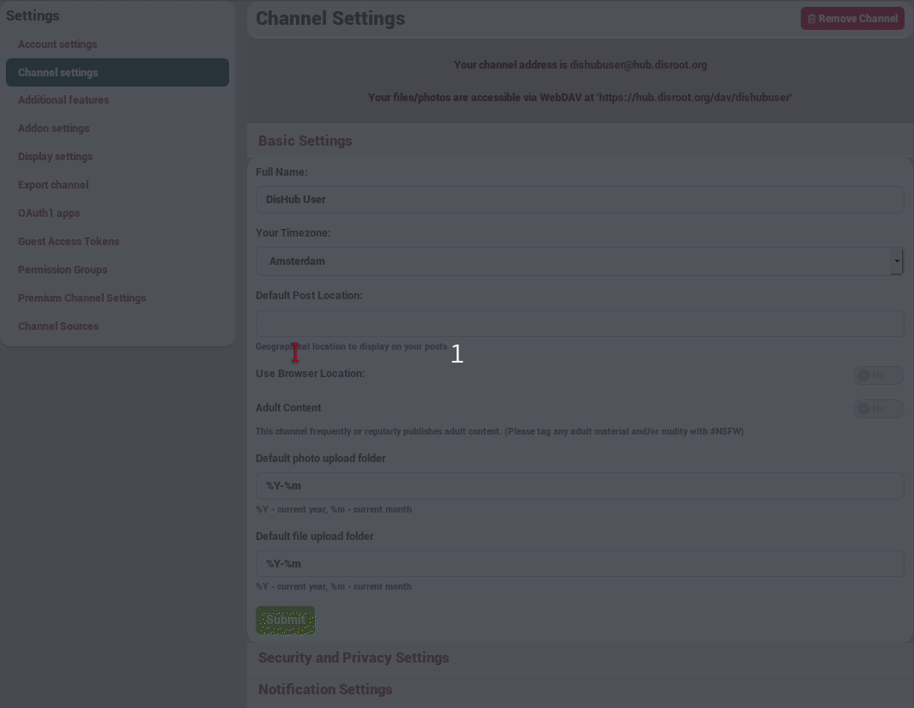

## What does block a channel do?

Well, lets say you don't want any contact with somebody, for example beacouse this somebody spams you or beacouse their comments just disturb you. You can simply block that contact.  

There are two way of blocking:
* Block a channel
 * This means that the channel will not be able to read any of your items, and he will also not be able to write to your channel. Good to know is that it doesn't matter with what permission you post someting, that channel will still be unable to see your activies.  
* Block completely a channel
 * It's like blocking a channel but it also make that you won't even see that channel. It's like the channel doesn't exist anymore. Exept if that channel post something for example on a forum an you are also connectet to that forum. You won't see his posts on your channel but you will see them if you are visiting the forum page.

## So how do i block a channel?  

### Block a channel
To block a channel you visit [your connection page](https://hub.disroot.org/connections), from here you select the **edit** button of the channel you want to block. Then **Connections tools** and from the dropdown menu **block**.

You can undo the block in the same way you blocked a channel.

  

### Completely block a channel
If you want to completely block a channel you have to do it from a post or comment frrom within your channel.
For example frome your activity page or public stream.  
Here you click on the avatar of the channel you want to block an select **Completely Block**.
  

If you want to undo the completely block, you are not able anymore to see it anymore. So you need to use the superblock addon.  
#### Here is how you do this.
You go on your [settings page](https://hub.disroot.org/settings).  
And from her you select **Addon settings** and then click on **Superblock settings**. Now you click on the trash bin icon of the channel you want to unblock.

