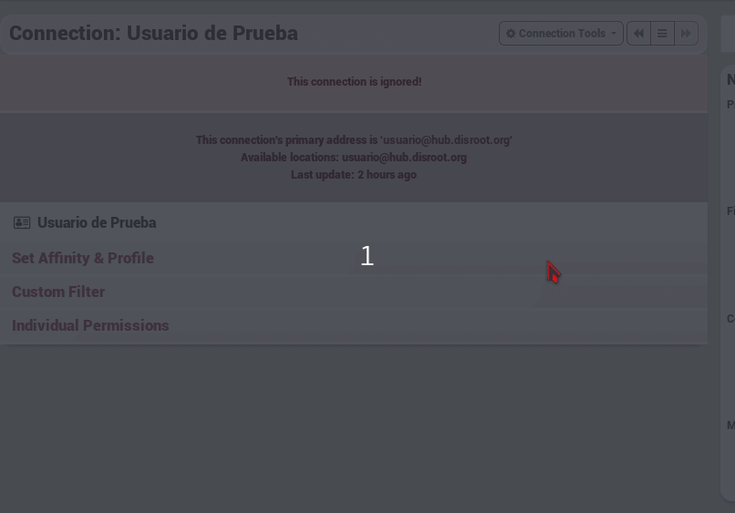

## What does ignore a channel do?

the channel can see your posts if it has permission and if the post itself is also open for that channel, but you will ignore him. So everyting the channel posts will not be seen by you.

 ## So How do i ignore a channel?
To ignore a channel you visit [your connection page](https://hub.disroot.org/connections), from here you select the **edit** button of the channel you want to ignore. Then **Connections tools** and from the dropdown menu **Ignore**.

!!! You can undo the ignore in the same way you Ignored a channel.

