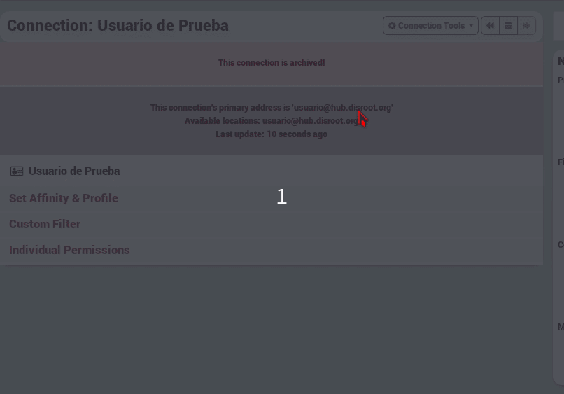

## What does Archive a channel do?

if a channel can't be reached for 30 days, it is automatically marked as archived. This keeps all the data but stops polling the channel for new information and removes it from autocomplete. If later you learn the channel has come back online, you may manually unarchive it.

## So how do i unarchive a channel?

