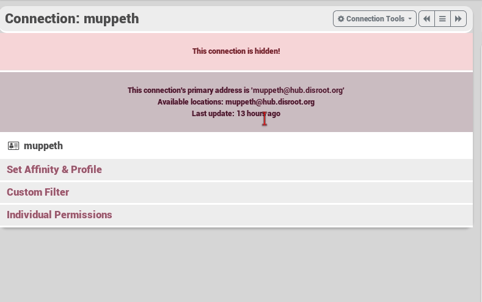

## What does hide a channel do?

If you don't want to show you are connected to a channel, you can choose to hide this connection to others. No one can see you're connected. But beware they may still show up to your other connections, for example if you get a comment on a post from that channel.

## So how do i hide a channel?

To hide a channel you visit [your connection page](https://hub.disroot.org/connections), from here you select the **edit** button of the channel you want to unarchive. Then **Connections tools** and from the dropdown menu **hide**.

!!! You can unhide in the same way you've hidden the channel.

