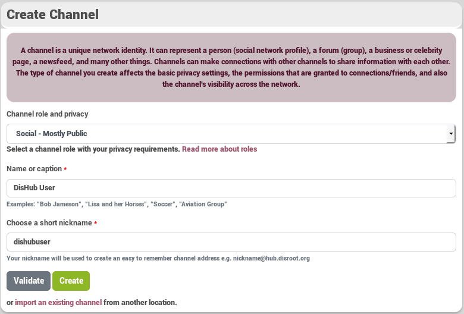
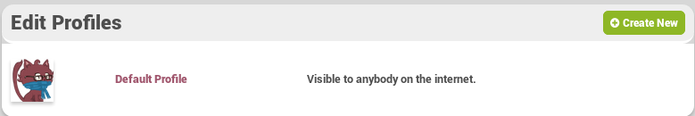
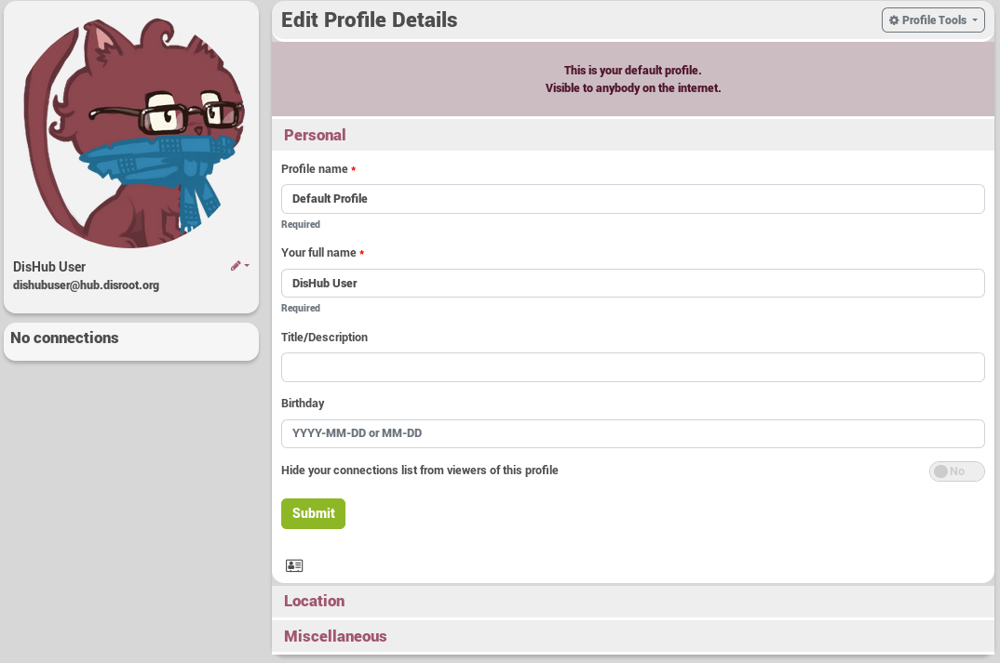
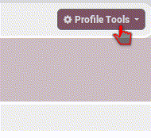
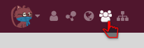
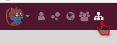
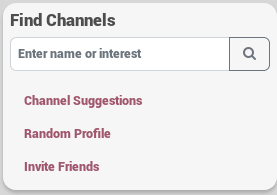

###How do i create a channel?

When you log in for the first time after registering, you must create a channel.  
  
After setting your name(real  or not) and your nickname, you will be redirected on your profile page of your new channel  
You can clik on your profile if you want to customize your profile.  
  
From here you are free to complete information about yourself, and change the profile picture (cavatar) and customize the cover photo  
   
 
----------

###How do i connect to a channel?
Making connections between channels to share things is what social communications are all about. Making a connection is simple.  
There are severals way to connect to a channel:  
* If you now the exact channel's home page like channel_name@hub.server (for example, disroot@hub.disroot.org)  
        * You go to your [connection page](https://hub.disroot.org/connections) by clikking on the connection icon on the navbar   
and and give the channel address in the search bar to connect 

* If you do not already know how to reach a channel's home page, you might try a directory search by opening the Directory link on the top navbar.  
And use the search bar for names or interests 
