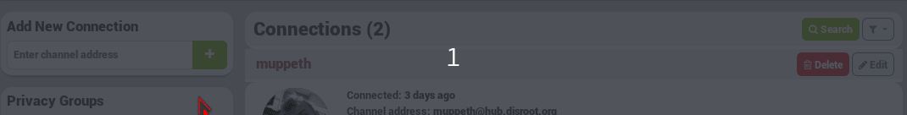

## What is a connection?
Making connections between channels to share things is what social communications are all about.

Connections in Hubzilla can take on a great many different meanings. **A connection is more accurately defined as a set of permissions that you have granted to somebody else**. In traditional social network applications, all connections are granted the same permissions; or at most there two levels (friends and 'followers'). In Hubzilla, a range of separate permissions may be set/adjusted depending on the situation and relationship you have with the other channel. You can allow somebody to view your posts but not your photos. You can also deny them permission to comment on your posts or send private mail to you.

[For more information about permissions....](../permissions/)

## How to connect to a channel?
There are severals way to connect to a channel:

### You know the Hubzilla channel's address
If you already know somebody's channel address ("webbie") you can connect with them directly. A webbie looks just like an email address (for instance disroot@hub.disroot.org) but refers to somebody in the open social web. In order to connect they must be using a compatible network protocol. By default, this software supports the 'zot' protocol, however additional protocols may be provided through plugins/addons.

Go to your **Connections page** by clicking on the connection icon on the navbar

From there, write down the channel address you want to connect to in the **search bar**, and then click on the **+** to connect

Depending on the settings of the channel you are connecting to, you may need to wait for them to approve your connection, but no further action is needed on your part. Once you've initiated the connection, you will be taken to the connection editor. This allows you to assign specific permissions for this channel if you wish to make any changes.

### You don't know the Hubzilla channel's address or you want to search an idea of channel
The directory is available on every Hubzilla website which means searching from your own site will bring in results from the entire network. You can search by name, interest, location, and keyword.

Go to the directory search page by clicking on the **Directory icon** on the top navbar.

Use the **search bar** for names or interests and click on **+ Connect** with the desired channel. 

### You see a channel that you want to connect to
You can also connect to a channel when you see it, for example in a post or comment.

To do so, click on the **profile picture** of that channel and then choose **Connect**.
 

### You want to connect with channels on other networks
The process for connecting to channels on other networks (such as GNU-Social, Mastodon, and Diaspora) is similar - type their "webbie" into the **Add New Connections** box on the **Connections page**. Before you do this however, please visit your **Settings** page, **Addon Settings** and ensure that the relevant protocol (Diaspora, GNU-Social/OStatus, or ActivityPub) is provided on your hub and activated for your channel.

These networks/protocols do not support account migration and location independence so if you move location or clone your channel elsewhere, communications with these connections may fail. For this reason these protocols are not activated by default, but only through your consent. Activating these protocols involves an important decision between communicating with friends on these networks or providing fail-safe account resilience if your server fails.    

Some communications offer more than one protocol. If you wish to connect with somebody on Mastodon (for instance) they can use either the 'ostatus' or the 'activitypub' protocol for communication. Generally the 'activitypub' protocol will provide a better experience than 'ostatus', but Hubzilla will often choose the first protocol it discovers and this may not be the one you want.

You may connect with somebody over a specific protocol by prepending the protocol name in square brackets to their "webbie". For example

- [activitypub]https://foo.bar/foobar
- [ostatus]foobar@foo.bar
- [diaspora]foobar@foo.bar
- [zot]foobar@foo.bar
- [rss]https://foo.bar/foobar

### You want to connect with RSS feeds
DisHub allows connecting to RSS feeds. The process for connecting to an RSS feed is the same, execpt type (or paste) the URL of the feed into the **Add New Connection** box.

Feeds are processed every hour.

DisHub admins may impose limits on how many feeds you may add, which is not the case at this time.

## Block/Ignore/Archive/Hide channels WIP
When someone adds you as a connection, you receive a connection message (except in two channel roles: Forum - Mostly public and Feed - Mostly public).

Here's their meaning:

**Approve**: you accept this connection. It appears in your contact list. The default permissions set by your channel role to your connections applies.

**Ignore**: the channel can see your stream if it has permission (according to your channel role) and if the post you write is also accesssible for that channel (for example if you make it public). But you won't see anything that this channel will post in your network stream, and it won't be allowed to write on your channel (wall or @mention).

This connection is not approved, as you can see on the message you get when you click on ignore:

Here is what the other connection will see when going to the individual connection permissions:

The permissions may changed according to your channel role. But you can see that this channel got some permissions. YOU CAN'T CHANGE THEM, unless you change the channel status, from Ignore to Approve.

You appear in the ignored connection channel's connection list, but with a one-way sign

This channel doesn't appear in your connections list on your profile, but appears in the connections page. That means that you can change its status any time you want.

**Delete**: you don't accept this connection, but you don't block it either. That means that this channel has the same permissions as any other channel that you don't have a connection with, the same rights as the general public.

Here is what the other connection will see when going to the individual connection permissions:

The permissions may changed according to your channel role. But you can see that this channel got some permissions. YOU CAN'T CHANGE THEM, unless you create a connection with this channel.

You appear in the deleted connection channel's connection list, but with a one-way sign.

This channel doesn't appear in your connections list on your profile, nor in the connections page. That means that if you want to set a connection with a channel that you previously deleted, you have to create it again on your side, like creating a new connection. The only difference will be that this channel won't have the approval message as the connection is already set on its side.

## Premium Channels
Some channels are designated **Premium Channels** and may require some action on your part before a connection can be established. The Connect button for these channels will take you to a page which lists in detail what terms the channel owner has set. If the terms are accepted, the connection will then proceed normally. In some cases, such as with celebrities and world-reknowned publishers, this may involve payment. If you do not agree to the terms, the connection will not proceed, or it may proceed but with reduced permissions allowed on your interactions with that channel.

Here is an example of such a message:

