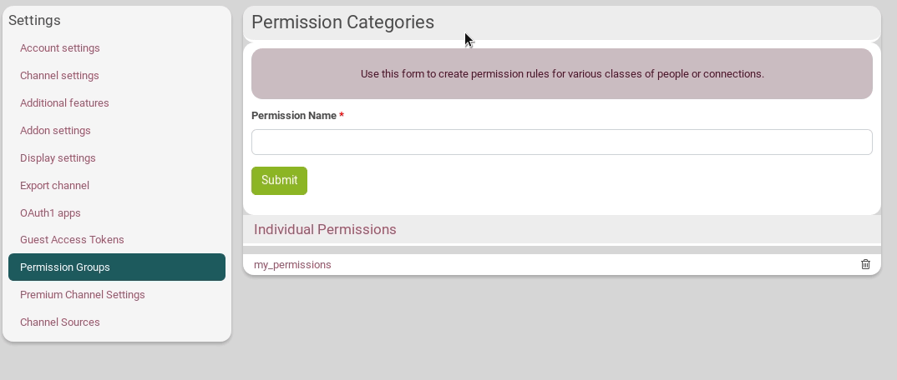

Permissions in Hubzilla are more complete than you may be used to. This allows us to define more fine graded relationships than the black and white "this person is my friend, so they can do everything" or "this person is not my friend, so they can't do anything" permissions you may find elsewhere. You can give almost type of permission (view a photo, write on your channel, comment a post, etc.) to anything (file, post, wiki, etc.) to almost any person or groups of person that you wish (those you specifically allow, anyone connected, etc.)

## Default Channel Permission Limits
### What is it?
There are a set of default permission limits that apply to all items shared by a channel. This determines the first "limit" on who can access an itemof your channel: a post, a wiki, a photo, etc.

### What kind of permissions can be set?

- **Can view my channel stream and posts.**

This permision determines who can view your channel "stream" : your non-private posts that appear on the *channel page*  when you're logged in.

- **Can send me their channel stream and posts.**

This permission determines whose posts you will view. It's like follwing someone on Mastodon.

- **Can view my default channel profile.**

This permission determines who can view your default channel's profile (you can have more than one profile, but there is only one default profile). This refers to the *"about"* tab.

- **Can view my connections.**

This permission determines who can view the list of your contacts. These are the connections displayed in the *"connections"* section .

- **Can view my file storage and photos.**

This permission determines who can view your public files stored in your cloud and your photo albums. Individual photographs may still be posted to a more private audience.

- **Can upload/modify my file storage and photos**

This determines who can post pictures in your albums or upload files to your public file storage, or 'cloud'. This is very useful for forum-like channels where connections may not be connected to each other.

- **Can view my channel webpages.**

This permission determines who can view your webpages.

- **Can view my wiki pages.**

This permission determines who can view your wiki.

- **Can create/edit my channel webpages.**

This determines who can edit your webpages. This is useful for sites with multiple editors.

- **Can write to my wiki pages.**

This determines who can edit your wifi. This is useful for wikis with multiple editors.

- **Can post on my channel (wall) page.**

This permission determines who can write to your wall when clicking through to your channel.

- **Can comment on or like my posts.**

This permission determines who can comment on or like posts you create. Normally, you would want this to match your *"can view my public stream and posts"* permission

- **Can send me private mail messages.**

This determines who can send you private messages (zotmail).

- **Can like/dislike profiles and profile things.**

This determines who can like/dislike items on your profile.

- **Can forward to all my channel connections via @+ mentions in posts.**

Using @- mentions will reproduce a copy of your post on the profile specified, as though you posted on the channel wall. This determines if people can post to your channel in this way.

- **Can chat with me.**

This determines who can join the public chat rooms created by your channel.

- **Can source my public posts in derived channels.**

This determines who can share your post onto other channels.

- **Can administer my channel.**

This determines who can have full control of your channel. This should normally be set to *"nobody except myself"*.

**Note:**
Plugins/addons may provide special permission settings, so you may be offered additional permission settings beyond what is described here.

If you have set any of these permissions to *"only those I specifically allow"*, you may specify individual permissions on the connnection edit screen.

### What are the scopes of permissions that can be set with those limits?

- **Nobody Except Yourself**

Only you will be allowed access.

- **Only those you specifically allow**

By default, people you are not connected to, and all new contacts will have this permission denied. You will be able to make exceptions for individual channels on the connection edit screen.

- **Approved connections**

Only channels you have accepted/approved as connections will have this permission approved. This is the way most legacy platforms handle permissions.

- **Any connections**

Any channel that creates a connection with you, approved or not, will have this permission approved.

- **Anybody on this website**

Anybody with a channel on the same hub/website as you will have permission approved. Anybody who is registered at a different hub will have this permission denied.

- **Anybody in this network**

Anybody in Hubzilla will have this permission approved. Even complete strangers. However, anybody not logged in/authenticated will have this permission denied.

- **Anybody authenticated**

This is similar to *"anybody in this network"* except that it can include anybody who can authenticate by any means - and therefore may include visitors from other networks.

- **Anybody on the internet**

Completely public. This permission will be approved for anybody at all.

**Note**: Some scopes may not be available for some permissions.

The limit applies to any published thing you create which you didn't set specific permission to (see Access Control List below). For example if you publish a photo and didn't select a specific audience with permission to view it, we apply the limit you set. If all your photos are visible to everybody on the internet and you reduce the limit only to friends, all of your photos will now be visible only to friends.

### Where can those permissions be set?
There are two places: in the **Channel settings** or in the **Connections settings**. See below for more information.

----------

## Channel permission roles
### What is it?
These permission limits (see previous section) can come in pre-configured sets to help you set them quickly. It is called **Channel permission roles**.
When you create a new channel, you will be asked to select a permission *role* based on how you envision using this channel. These create an entire family of permissions and privacy settings that are appropriate for that role. **Typical roles are "Social - mostly public", "Social - mostly private", "Forum - public"** and many others. These bring a level of simplicity to managing permissions. Just choose a role and appropriate permissions are automatically applied. For example, if you choose the "Social - Public" role, then your default permission limits set your posts to be public. So channel permission roles are primarily a way to reduce the complexity of setting all the default permission limits.

Advanced configurations (**'Custom/Expert mode'**) are available to let you adjust each of these parameters to your needs, but we've found that most people prefer to "set it and forget it".

### How to select a channel role?
Go to your **settings** page, click on the **Channel settings** tab then on **Security and Privacy Settings**. From there, you can see a drop-down menu under **Channel role and privacy**. You can choose between:
- Social:
 - Federation
 - Mostly public
 - Restricted
 - Private
- Forum:
 - Mostly public
 - Restricted
 - Private
- Feed:
 - Public
 - Restricted
- Special:
 - Celebrity/Soapbox
 - Group Repository
- Custom/Expert Mode

### What are the differences between these roles?

We highly recommend that you use the **"Social - Mostly Public"** settings when you create your first channel, as it allows others to communicate with you and help you out if you have difficulty. You will find that these settings allow you as much privacy as you desire - when you desire it; but also allow you to communicate in public if you choose to. You are free to use much more private settings once you have learned your way around.

[See this channel roles permissions table](channel_roles2.html)

#### Social
##### Federation
This is the most public setting. This role is not generally recommended unless you need to interact regularly with members of other federated social networks. But it is the best choise if you want to connect as good as it can with all the networks. **It's also the only setting that permits that everybody is able to comment on your public post from the public activity page**. The permission policies are similar to Twitter and mostly compatible with Diaspora and Mastodon.  
Privacy is a lower priority than ease of access and connecting with others.

What does it do?:
- You are listed in the directory.
- By default posts and published items are public, but you can over-ride this and restrict it.
- Anybody in the network can comment on your public posts, send you private mail and chat with you.
- Your online presence and connections are visible to others.
- Anyone can see your other connections.

##### Mostly Public
As a typical social networking profile, this is probably what most people want. The permission policies are similar to Facebook. But if you really want to public post it's still better to choose for *"Social - Federation"*

What does it do?:
- You are listed in the directory.
- By default posts and published items are public, but you can choose to restrict it.
- Only your connections can comment on your public posts, send you private mail and chat with you.
- Your online presence and connections are visible to others.   
- Anyone can see your other connections.

##### Restricted
In this role privacy is more important than the previous ones. This is what you want if you just prefer connect with others but still be able that others find you. You are still able to make public posts but interaction with others will be more difficult, as it requires that channel has to be connected with you.

What does it do?
- You are listed in the directory.
- By default all posts and published items are sent to your 'Friends' privacy group and not made public. New friends are added to this privacy group. you're still able to make posts more public if you want.
- Only your 'my "friends" privacy goup' can comment on your public posts, send you private mail and chat with you.
- Your online presence (for chat) and your connections (friends) are visible to your profile viewers.   
- Anyone can see your other connections.

##### Private
Privacy is the most important for this role. You will have to handle more with permissions when you want more interactions with other channels. If others want to connect with you, they will need your full address (username@hub.disroot.org). So, if public activity is not your priority and only want to connect with people you know, than this is what you are searching for.

What does it do?
- You are listed in the directory.
- By default all posts and published items are sent to your 'Friends' privacy group and not made public. New friends are added to this privacy group. you're still able to make posts more public if you want.
- Only your 'my "friends" privacy goup' can comment on your public posts, send you private mail and chat with you.
- Your online presence (for chat) and your connections (friends) is hidden.   
- Only your connections can see your other connections.

#### Forum
You can compare Hubzilla Forums as groups in Facebook. You can choose different privacy settings for that.

##### Mostly Public
This setting is for typical forum. Anyone can see channel posts. So as the name says, use it for public forum.

What does it do?
- The channel is visible in the directory.
- By default posts and published items are public.
- Members may post by !mention or wall-to-wall post anc comment.
- Posting photos and other published items is blocked.
- Members are added automatically.

##### Restricted
The most important difference with the mostly public setting is that only connactions are allowed to see the formu stream and posts.

What does it?
- The channel is visible in the directory.
- By default all posts and published items are sent to the channel's 'Friends' privacy group. New friends are added to this privacy group.
- Members may post by !mention or wall-to-wall post, but posts and replies may also be seen by other receipients of the top-level post who are not members.
- Members must be manually added by the forum owner.

##### Private
Here the most important difference with the restricted setting is that mentions are disabled, and only your connections can see your other connections.

What does it?
- The channel is NOT listed in the directory.
- By default all posts and published items are sent to your 'Friends' privacy group. New friends are added to this privacy group. The owner can over-ride this and create a public post or public item if desired. Members cannot.
- Your online presence is hidden. Members must be manually added by the forum owner.
- Posting by !mention is disabled. Posts can only be made via wall-to-wall posts, and sent to members of the 'Friends' privacy group. They are not publicly visible.   

#### Feed
##### Public
Similiar to Social - Mostly Public, but tailored for RSS feed sources. Items may be freely republished and sourced. Online presence is meaningless, therefore hidden. New connections are automatically approved.  

##### Restricted
Not listed in directory. Online presence is meaningless, therefore hidden. Feed is published only to members of the 'Friends' privacy group. New connections are automatically added to this privacy group. Members must be manually approved by the channel owner.

#### Special
##### Celebrity/Soapbox
Listed in directory. Communications are by default public. Online presence is hidden. No commenting or feedback of any form is allowed, though connections have the ability to "like" your profile.

##### Group Repository
A public forum which allows members to post files/photos/webpages.

#### Custom/Expert Mode
Set all the privacy and permissions manually to suit your specific needs.

----------

## Connection Permissions Limits
### What is it?
When you have chosen a channel permission role, any connection made to your channel is set according to this role. However, you can change those default permissions limits. These allow you to customize the permission limits for individual connections, and set some permissions for one channel, and some others for another one. For example, you can grant or deny permission to individual channels to send you their posts such that they will automatically appear in your "network stream".

### How to set different permissions limits for a connection?
If you want to change it, go on the **connection page** by clicking on the connection icon 

On the connection that you want to modify, click on *Edit*

Then, click on **Individual Permissions**. The list of the permissions you "give" to that connection can be seen under "My settings". Just check / uncheck the permissions there. Don't forget to click on *Submit* when you're done.

**Note:** You can see what permissions you "received" from the other channel under "Their settings".

### Permission categories / Permission roles for connections
#### What is it?
It is a set of permissions that you want to store in order to be able to use it quickly.

For example, there is a predefined *"follower"* permission category that denies the ability of a connection to send you their posts. You could choose this permission category as the one which is applied to new connections by default if you are the kind of person that does not want to clutter your network stream with the posts of all your connections and instead prefers to visit the channel pages of your connections individually to read their content.

#### What are the already-existing permission categories?
- **Default**: the permissions set automatically according to your channel role. But you can change your default settings if you want. See below.

- **Follower**:

- **Contributor**:

- **Publisher**:

You can always edit these settings directly in this connection's settings by checking / unchecking the permissions, within the flexibility allowed by your channel permission role.

#### How to create my own category?
Go to your **channel settings**, then click on **Permission groups** (this should be changed by "Permission Category" in next Hubzilla release).
Just choose a name for your category, then click on **Individual Permissions** and set your permissions by checking / unchecking what you want. Don't forget to click on *Submit*.

You can also use the **+ Add permission role** button directly from the connection Individual Permissions setting 

#### How to change or delete my categories?
You can change a category you created by simply clicking on its name, the on **Individual Permissions**.  Don't forget to click on *Submit*.

To delete it, just click on the trash icon next to its name.

#### How to use a personnal category of permissions with a connection?
Go on the **connection page** by clicking on the connection icon 

On the connection that you want to modify, click on *Edit*

Then, click on **Individual Permissions**. You have a drop-down menu that lets you choose the category you want and automatically apply the settings of this category to the connection.

#### How to make one of my category the default one?
If you want all your new connections to be set with a default set of permissions that you want, first create this set of permissions ("category"). Then, go on your **channel settings**, in the **Security and Privacy Settings** tab. In the **Default Permissions Group** parameter, just choose your category.

----------

## Access Control List or ACL
### What is it?
Access Control List is the preferred method of managing privacy in most cases, rather than using permission limits. It is a set of additional permission that you may want to set for very specific items. Unlike permission limits, if you change the ACL on a single photo (for example), it doesn't affect any of your other photos.

An ACL is attached to everything you publish.

**Important: permission limits are more important than ACL. For example, Hubzilla checks "can someone see your files/photos" before it checks "can someone see *this* photo". And if the first check fails you'll never get to the second.

If your permission limits for Peter grant Peter permission to view your photos, but you set an ACL on a photo that excludes Peter, then Peter can't see that photo.

If the connection with Peter doesn't allow him to see your pictures, even if you use ACL to give him this permission, it won't work.

Hubzilla will take the most restrictive approach.**

### How to use it?
When you open the ACL (usually by clicking on a lock icon  next to *Submit*) this open a popup with a list of possible scope of permissions.

You have different choices:
1. **Public**: anyone can see / modify
2. **Friends**: only connections that are in your Friends privacy group can see / modify
3. **Only me**
4. **Custom selection**: you can choose on a per-connection basis who can see or modify.
5. **Guest Access Token**: This allows you to share a file, folder, photo, album, or channel with a specific person or group of people. They don't need to be Hubzilla members. You can set an expiration for the Access Token.
[See here for more information...](#tokens)

**Note**: This list can be slightly different, depending of where you use the ACL.

If you choose **Friends** or **Custom selection**, you then have a list of your conenection.

Just click on **Show** o **Don't show** for each connection to which to want to show or not show.

----------

## Guest Access Tokens
### What is it?
Guest access tokens (sometimes called "Zot access tokens") allow you to share a file, folder, photo, channel, etc., with a specific person or group of people **who are not Hubzilla members**.

These tokens allow you to share individual items by sending a link that includes the token in the URL; alternatively, people can actually log in using the token credentials, after which they can seamlessly view whatever content has been shared with that token.

[More details can be found here...](https://hub.disroot.org/help/en/feature/access_tokens)

### How to create a guest access token?
To create and manage guest tokens, go to **Settings** page and open the **Guest Access Tokens** tab.

Enter a **Login Name**. You can change the **Login Password** if don't want the one automatically attributed (**warning: it is the access token, it will be included in the URL you will later share**). You can set an **expiration date** in the form of "YYYY-MM-DD" but that's optionnal. When you're done, click on *Submit*

### Set or change permissions
Additional permissions may be granted to the guest token by expanding the **Individual Permissions** options when you create the guest access token. Check or uncheck the permissions you want to grant, then click on *Submit*.

Some can't be changed: they are inherited from the chanel role you chose.

Existing tokens are listed below the dialog and can be edited by selecting them. The form is automatically filled in. Click on the **Individual Permissions** options and check or uncheck the permissions you want to grant/ungrant.

You can also change its login name, password and expiration date.

### How to delete it?
You can delete an existing token by pressing the trash icon next to its name at the bottom of the page.

### How to use a guest access token?
Any tokens you have created are added to the Access Control List selector and may be used anywhere that **Access Control Lists** are provided.

Imagine you want a visitor (named "test") to be able to write to your wiki pages.
1. You set this permission in the **Guest Access Tokens** tab as previously explained. 
2. You go on your wiki. Fill in the needed information in order to create a wiki. Click on the lock icon to open the Access Control List.
3. Choose **Custom selection** and click on *Show* for the "test" user. You can now close the Access Control List.
4. Your visitor can now login to your channel, go to wifi page and edit the created wifi.

Alternatively, you may share a **direct link** to the wiki (for this example, but that can be with files, photos, etc.) by **adding a parameter "?f=&zat=abc123" (or "&zat=abc123" which is the same but with less compatibility) to the URL**, where the string "abc123" is the access token or password for the temporary login. In our wiki example that could be something like: https://hub.disroot.org/wiki/meaz&zat=tertonti

No further negotiation is required, and the wiki is presented. You can see an example at the bottom of the **Guest Access Tokens** page:

