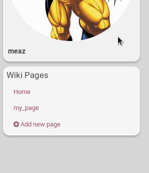

## What is a wiki?
A wiki is a type of website that lets anyone who can access the wiki to create and change its pages.

The wiki is stored only on your channel's hub and must be accessed in traditional way using a static URL:  it is not "delivered" not "federated".

## How to access a channel's wiki?
You can access a channel's wiki by going on this channel, then clicking on the hamburger menu and on the "Wiki" app logo.

If you don't see the wiki logo app, the this channel hasn't enable the wiki feature.

Then, you need to open the wiki you want to access by simply clicking on its name.

If you don't see any wiki, then this channel may have viewing restrictions or simply hasn't created any wiki yet.

## Enable wiki creation
### 1st step: enable the wiki feature
If you want to be able to use the wiki feature, you have to enable it first. To do so, go to your channel **Settings**, click on the **Additionnal features** tab.

To see be able to enable the wiki feature, you need to set your skill to at least **"2. Intermediate..."**. (You can see any other level superior to 2)

You will see the wiki feature in the **General Features** tab. Just click on **On** to enable it and *Submit*.

Now your wiki is accessible at this address: https://hub.disroot.org/wiki/your_channel_name

If you don't want to use this feature anymore, just do the opposite!

You can disable this feature by doing the opposite.

### 2nd step: enable the wiki app? (optional)
As explained just above, you wiki is accessible at this address: https://hub.disroot.org/wiki/your_channel_name

However, you may want other people (or even yourself!) to be able to access your wiki easier. It can be done by enabling the wiki app. Like this, people visiting your channel will be able to go to your wiki by clicking the hamburger menu and selecting "wiki".

To do so, click on the **hamburger menu** and select **Add apps**. Go down to the wiki app and enabale it by **clicking on its star**. You will now be able to see it in the hamburger menu (sometimes, you need to refresh the page so that the app appears in the menu).

If you don't want to use this app anymore, just do the opposite!

## Create a wiki and its content
### Create a wiki
You can go to your wiki page either by going to its direct address: https://hub.disroot.org/wiki/your_channel_name or by using the hamburger menu.

To create a wiki, simply click on **Create New** and fill in the information requested.

There are a few options:
- **Wiki name**
- **Content type**: Hubzilla supports several markup languages for advanced formatting of content. You can choose  between *Markdown*, *BBcode* or *Text*. [If you want to know about the special BBcode for Hubzilla...](https://hub.disroot.org/help/en/member/bbcode#Hubzilla_specific_codes)
- **Lock content type**: when activated, this option will lock the way you can write wiki page to either *Markdown*, *BBcode* or *Text*. 
On this image, you can see that "my_wiki" isn't locked to any type of content, whereas "my_wiki2" can be written to markdown only and "my_wiki3" only in plain text.
- **Create a status post for this wiki**: if you activate this option, then a post will be created on your wall saying that a wiki has been created.

If there are some permissions set (see the following paragraph), there is lock icon next to your username. If you click on it, you'll see the channels that  can see this post annd that you allowed to see your wiki.

- There is also a **lock icon** next to *Submit* . It allows you to decide who can see your wiki. It opens the ACL: Access Control List. [To have more information about permissions...](../permissions)

If you want to change your wiki's name, go on your wiki list page. Click on the pencil icon, change the name of the wiki and *Submit*.

If you want to change who can see it, click on the lock icon .

### Create pages
To create a wiki page, go on your wiki list page, and on the left, there is the "Wiki Pages" panel.

Click on **+ Add new page**. Choose a **page name**. You can click on **Options** to choose a **page content type** if you want. Click on *Submit*.

### Create content in pages
When you edit a page to add content, there are three tabs: **Edit**, **View**, **History**.

In the **Edit page**, you write you text. Prior to saving page edits, you may enter a custom message to be displayed in the Page History viewer along with the revision. When you're done, click on **Save**.

In the **View page**, you see what those that will be allowed to visit your wiki will see.

In the **History page**, you have a list of the changes made on the page. You have the author name, the sort description of the change, and its date. You can compare what has been changed between the actual version and an older on by clicking on **Compare**.
The **Revert** button will load the selected revision but will not automatically save the page.

**Work in Progress: problem with REVERT.**

## Wiki accessibility
### Who can see my wiki?
There are three of ways of managing who can see your wiki, three levels of permissions.

#### Channel role
Depending on the channel role you chose, your wiki may be viewable by either anyone or the members of your Privacy group only.

If you want anyone to be able to see your wiki pages, you have to make sure that you choose a role accordingly. [See the permissions page to know more...](05.Permissions)

#### Connection permission
You can edit your connection permissions if you want to give/remove a specific permission the right to see your wiki.

To get there, click on the **connections icon**, , then click on **Edit** next to the connection you want to change permission with. Click on **Individual Permissions**. Check the **Can view my wiki pages** box to give that permission, and click on *Submit*.

**Note**: if you choose a channel role that allows anyone to view your wiki, you can't change any permission in the channel permission settings. It is possible only if you chose a channel role that allows only members of your privacy group to see your wiki. Like this, you can give the right to see your wiki to connections that are not members of this group (but you also need to use the ACL, see the following section)

#### Access Control List on wiki creation
When you create a wiki, you can restrain who can see it. There is a **lock icon** . It allows you to decide who can see your wiki. It opens the ACL: Access Control List:

**Note**: if you choose a channel role that allows only Privacy group members to view your wiki, then, when you create a wiki, the visibility is per default only to this group ("Public" otherwise). But you can override that and make it visible to "Your default audience" or to connections that you previously allowed to view your wiki (see previous section).

[To have more information about permissions...](../04.Permissions)

### Who can edit my wiki?
#### Connection permission
There is only place where you can set who can edit your wiki: it is in the individual Connection page. To get there, click on the **connections icon**, , then click on **Edit** next to the connection you want to change permission with. Click on **Individual Permissions**. Check/Uncheck the **Can write to my wiki pages** box to give/remove that permission, and click on *Submit*.

## How to share a wiki page?
You can share a wiki page in a post on hubzilla. To do so, go on the wiki page you want to share, click on the top-right share icon. It brings you to the post edition page. You can complete like any other posts that you would write.

Obviously, if your wiki as some restriction on viewing permissions, the viewers of your post may not be able to access the wiki page.

## How to download a wiki?
You can download a wiki with all its files on your computer by going on the wiki page and clicking on the save icon . It will create a .zip file.

## How to delete?
### Delete a whole wiki
Go our the your wiki page. You see the list of all your wikis. Simply click on the trash can.

### Delete a page
On the "Wiki Pages" panel, if you move you mouse over the pages names, you'll see a trash can appearing. Click on it to remove the page.

