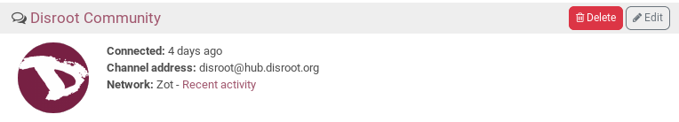
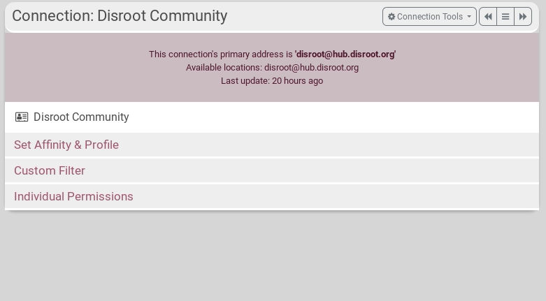
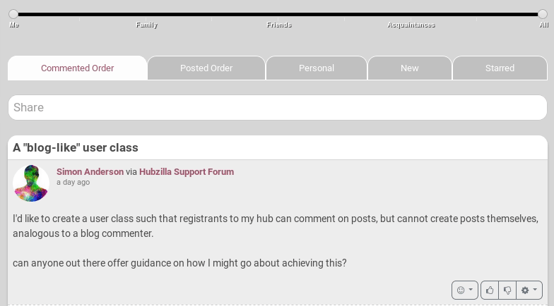
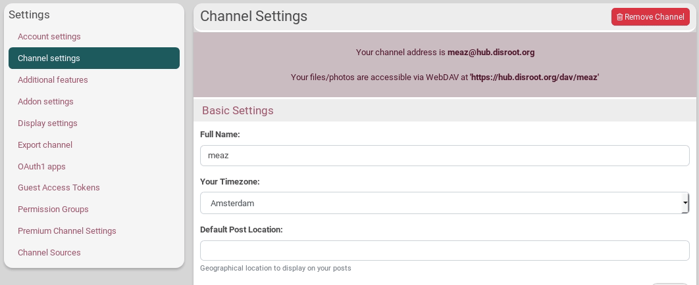
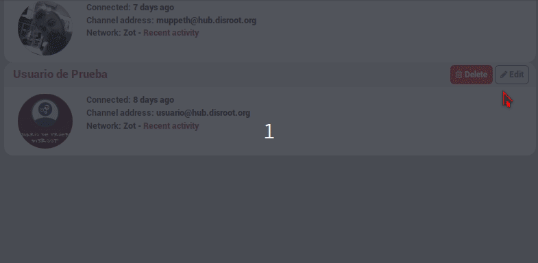

## Affinity
### What is it?
When you create a connection, you set an affinity with it: that means you decide the degree of friendship or acquaintance you want to have with this channel.

### How to set the affinity level of my connections?
**By default, this is set to *All*.** If you want to change it, go on the **connection page** by clicking on the connection icon 

On connection that you want to modify, click on *Edit*

Then, click on **Set Affinity & Profile**.

The slider appears : select the degree of friendship you want to set with the connnection. Think of this as a measure of how much you like or dislike it and how much you want to see this connection's posts.

Even if you see *Me, Family, Friends*, you can set the slider anywhere between 1 (for people you like) and 99 (for people you don't care for). Don't forget to *Submit*.

**Warning: affinity has no relation to permissions.**

### What is it used for? The Affinity slider
Once you've assigned a value to your connection, you can use the **affinity tool** on the **network page**  to **filter content** based on the affinity level you set.

Moving the slider from *Me* to *All* allows you to filter what you see on the network page: posts will only be shown from people who fall between this range.

For example, setting the affinity tool slider to *friends* will allow you to see only the posts from your connections with an affinity set to *friend*.

### How to enable the affinity slider?
Go to the **Settings** and to the **Additional features** tab. Click on **Network and Stream Filtering**.
Set **Affinity Tool** to on. Don't forget to *Submit*.

----------

## Custom Filter per connection
You can filter exactly what you want to appear or not in your activity stream. You do this by editing the connection and select the **Custom Filter** tab. In here you can set filters on what you want to appear and/or filters on what you don't want to appear  
  

For example you can filter:
* **Words**: you can add one word per line
* **Tags**: by adding hash and subject **#example**, for example **#Disroot**
* **Patterns**: if you want to filter posts that contain specific words in one post. So if you don't want to see posts talking bad about Gnu/Linux, you set the words in between slashes, for example **/Linux bad/**  
* **Languages**: if you have a connection that posts in multiple languages you can filter to show the language(s) you understand or to block language(s) you don't understand. For example **lang=nl** for in-Dutch posts only

!!! Setting filters means that from now on the activity stream will be filtered. Already streamed posts will still be there and also future comments on those posts will be streamed.
