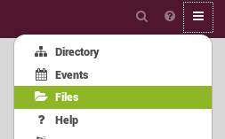
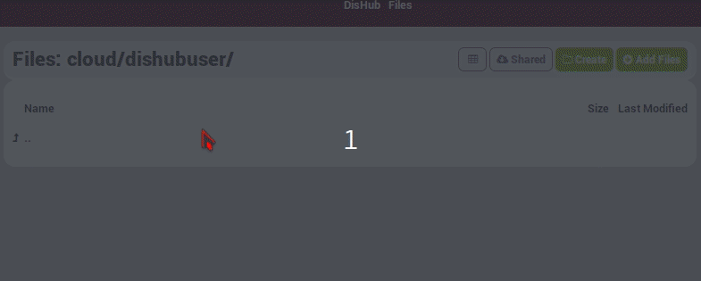
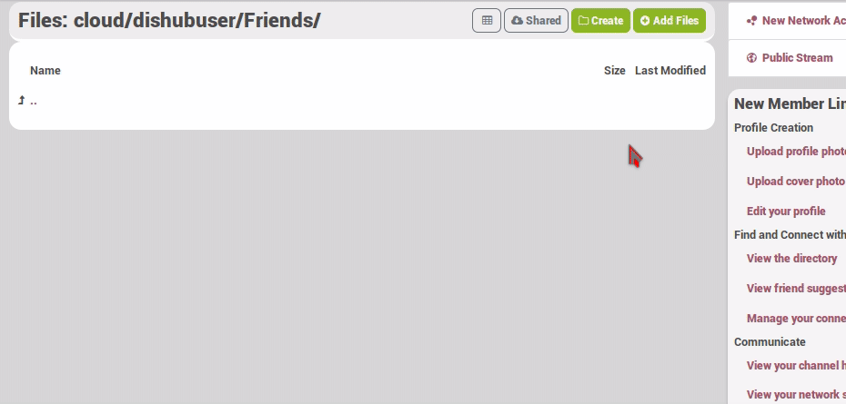

In Hubzilla you have the ability of cloud storage. You can store files privately, share folders with friends or only specific files. You can allow others for only read or even give permission of creating files and folders.  
There are several way to upload or access files.

---

### File attachments

This is the fastest way to upload and share a file in a post.  
To do that you can see the [Composing](../../posts/composing) part in the posts section of this how to (see "Adding something to the post").

---

### Add and access files

You can access your cloud page by clicking **Files** in the hamburger menu.
  

---

#### Create a folder

You can create directories and sub directories. For every folder you make, you can give different [permissions](../../permissions).
Creating a folder is easy. You only have to click on the **Create** button, give the folder a name, choose permissions and submit.  
In this example you see creating a folder named Friens whit he permission for my friends.  

---

#### Adding Files

Like for the folders you can choose [permissions](../../permissions) for the filse you the files you upload.  
In this example the file dishub_logo.png will be uploaded in the Friends folder. The permissions for the file are set to only be seen by me. It means that even if my Friends have permission to this folder this file will be hidden for them.  

