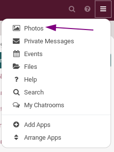
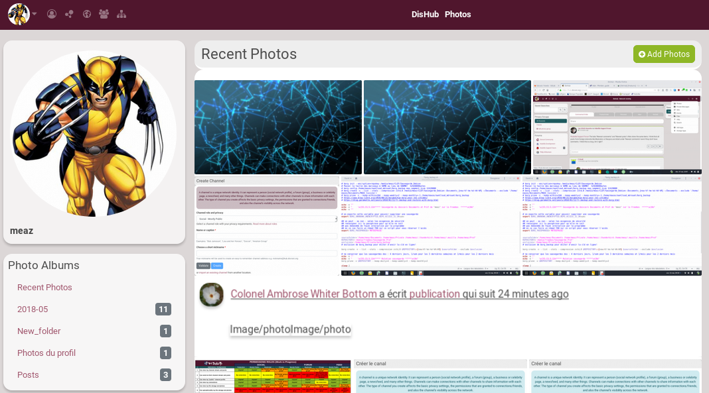
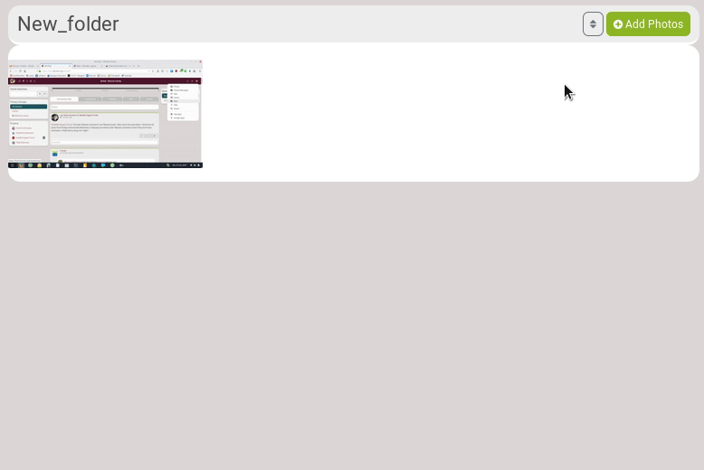
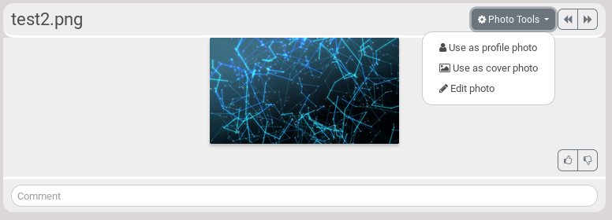
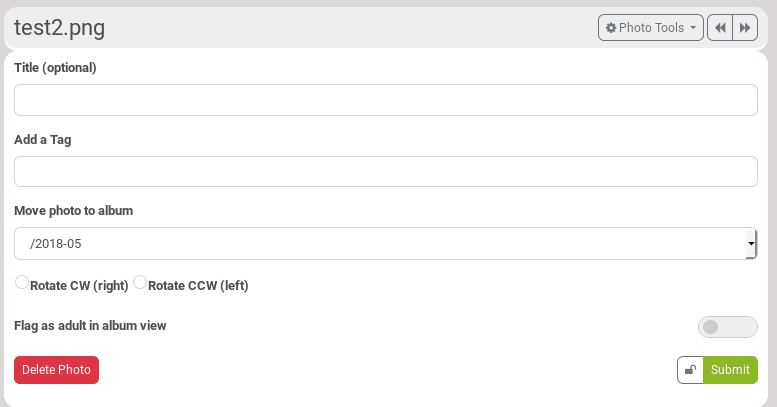
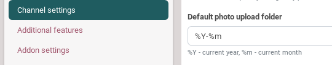

# What is it used for?
Photo album is a tool that allows to create albums of pictures that you want to share with others.

# How to see a photo album?
Click on the hamburger menu, and choose **Photos**.

Then, the default page is this one:

- On the main page, you see your most **Recent Photos**.
- On the bottom left, you can see **Photo Albums**: it is list of your albums.
- In this **Photo Albums** list, you can see that there are three folders that are automatically created:
  - **Recent Photos**
  - **2018-05**: when you add a photo in a post, it is automatically added in a folder that is created using the year and month at the time of the post.
  - **Profile photos**: when you add a photo into your profile, it is automatically added in this folder.

# How to add photos?

Click on the album you want to add photo into and click on **Add Photos**.

There are a few options:
- **Enter an album name**: it is automatically the name of the folder you're into. But you can change it and choose to create a new folder.
- **Title (optional)**: photo's name
- **Create a status post for this upload**: that means that a post will be created on your channel with this photo.
  - **Description (optional)**: it will be added into the post that goes with your photo.
- **Locker**: to set the permissions, meaning who will be able to see your photo.

Click on **Upload** to choose a photo.

# How to edit a photo?
If you click on a photo, you then have access to the **Photo tools**.

There are a few options:
- Use as a profile photo
- Use as cover photo
- Edit photo

Click on **Edit photo**.

You can change its name (**Title**), add a tag in order to find it easier, move it to another album, rotate it, etc.

It is also there that you can **Delete** it.

# How to create an album?
Aa explained above, when you add a photo, you can choose in what folder you want to save it into. But in **Enter an album name**, if you choose the name of a folder that doesn't exist, it will be created.

# How to change the default folder name for posts?

Go in your **Channel settings**. There, you can change **Default photo upload folder** to whatever you want. Don't forget to save.
