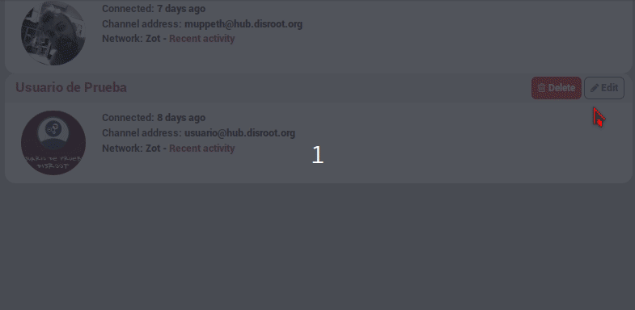

You can filter exactly what you want or wat you don't want in your activity stream. You do this by editing the connection and select the **Custom Filter** tab. In here you can set filters you want to appear and/or filters you don't want to appear  
  

For example you can filter:
* Words
 * you can add one word per line
* Tags
 * by adding hash and subject **#example**
 * For example **#Disroot**
* Patterns
 * If you want to filter posts that contain specific words in one post. So if you don't want to see posts talking gad about Gnu/Linux, you set the words in between slashes.
 * for example **/Linux bad/**  
* Languages
 * If you have a connection that posts in multiple languages you can filter to show the language(s) you understand or to block language(s) you don't understand.
 * For example **lang=nl** for Dutch

!!! Setting filters means that from now on the activity stream will be filtered. Already streamed posts will still be there and also future comments on those posts will be streamed.
