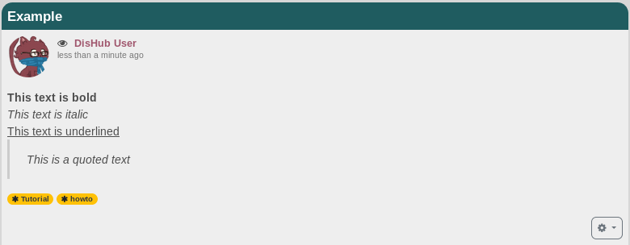
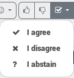

### Basic composing.  

If you want to share something you klick on the share bar, and this is what you will see.
  

The fisrt thing you probably want to do is setting a title. It's not obligatory, so it's up to you if you want to set one or not.
The same thing is for the categories part. Here you can add one oor more categoies. Comma separated.  
For example **How to, hubzilla** .  
Now the first basic options you have when composing your post are Bold, Italic, Underline, Quote and Code.
  
And here is the result
  

So when composing you want for example to write som text in bold, you klick on the bold button and put the text you want in between the **[b]** tags. And its the same thing for all the other options like you can see on the example above.

#### Code button
This one needs some explaiation.  
If you have trouble with for example **bbcode**, and want to ask someone advise or maybe you want to give advise on how to write something, then you can best use the code tag if you want to show the code without it being rendered. Without this tag only the rendered version will be shown.
Here is an example
  

---

### Adding something to the post

With the next three buttons you can easely attach a file, insert a weblink or embed an image from your photo album.  
  
They are pretty self explanatory, so don't need further explaination.  
Except of  
!!! If you want to embed an image without having to upload it first on one of your albums you can use the attach button and select an image from your device.

---

### Options

You can find the options on the next group of buttons.  
  
#### The options are:
* Set your location.
 * Here you are able to share your location with others
* Set expiration date.
  * It means that the post will autodestruct on date.
* Set publish date.
 * If you want a post to be published in a future date.
* Encript text.
 * This let's you encript text. Therefore you need to set a passphrase an make shure the ones that you want to share with, know the passphrase.
* Toggle voting.
 * If you want others to vote for somtething. They will have those options 
* Disabling comments.
 * If you don't want comments on your post.

 ---

 ### Before sharing

 Before click on the share button you want to check the permissions and the preview of that post.  
 The options are next tot the share button.
   

#### The options are:
 * preview.
  * Let's you see a preview
 * Share with other networks and post services.
  * You can restrict the post in hubzilla or choose to open it to other networks like Friendica.
 * Permission settings.
  * Here you choose with who you share the post. Public, to a group, more groups, or only one Contact. You can also set it that the Connection or group is not allowed to view the post.
  For more information it's reccommended to visit [the permissions](../permissions) chapter.
