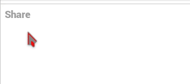

### Mentions

You can mention a person in a post. This is simply done by adding **@** before the channel name you want to mention.  
For example **@dishubuser+1813**.  
!!! The number is different for every user.
If the channel you want to mention allows mentions, the a auto-complete box will show and the mentioned channel will recive a notification.  

---

### Deliverable Mentions

The deliverable mention is done by adding **!** before the channel name, for example **!disroot+516**. Here to the auto-complete box will show.  
The deliverable mention is only used for forums or special channel. This means that when you use the deliverable mention your post will also be posted on that channel.  

---

### Private Mentions

Like already seen in the [Composing](../composing) part, you can choose with who you share in the permission setting. But if you prefer you can also add one or more private mention by adding **@!** before the username, for example **@!dishubuser+1813**. This will override the privacy selector, and only the mentioned channels will have permission for this post.  

---

### Topical Tags (also known as Hashtags)

You can set one or more topical tags. This will help others search for a specific topic. This is easily done by adding **#** before the topic. For example **#tutorial**

---

!!! #### Mentions in comments
!!! You can use mentions in comments.  
!!! But using Deliverable or Private mentions has no effect, except that the mentioned channel may recive notification.

---
