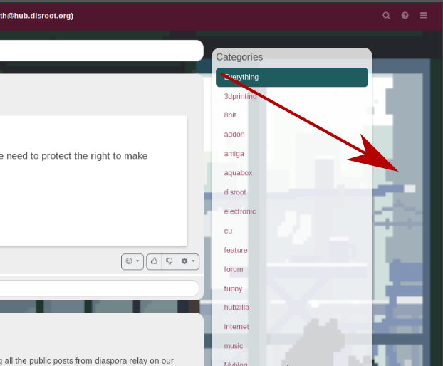
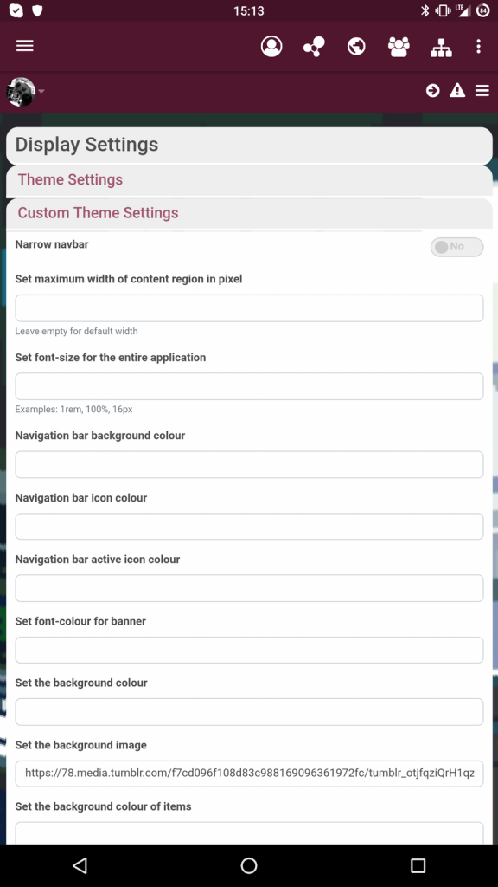

 

# Frequently Asked Questions

## How to change your page's background image?

You can change the background in theme settings, depending on the theme you use. There you can pretty much change any color and number of other settings.

So go to **Settings > display settings > custom theme settings > background image**

## Is it possible to schedule posts?
Activate delayed posting in ** Settings -> Additional Features -> Post Composition Features -> Delayed Posting**

Then you will get a new option **Set publish date** when composing a post (click the clock icon under the post editor).
It needs to be at least 10 minutes into the future in order to trigger delayed delivery.

The post will vanish when you submit it, because it doesn't exist yet. Be aware of this so you don't end up posting the same thing multiple times and have them all show up at once at a future date.
