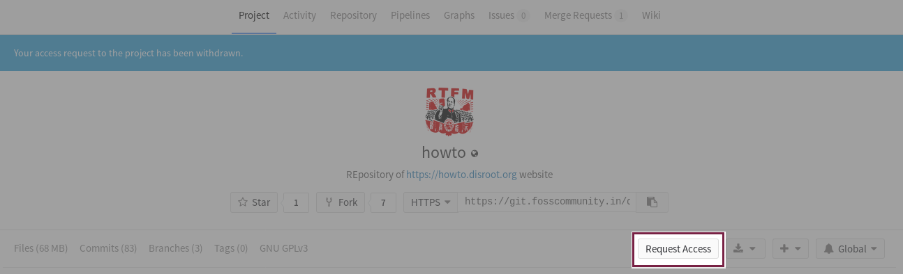
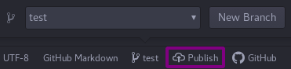
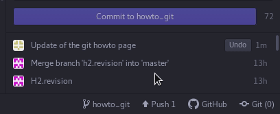

# git Basics

Wir werden in diesem Tutorial nicht alle Aspekte der Arbeit mit git abdecken. Es gibt eine Menge umfangreicher Tutorials und Bücher zu diesem Werkzeug und unser Ziel in diesem Tutorial ist es, Dir einen kurzen und einfachen Einstieg zu bieten, damit Du an Tutorials und Übersetzungen für **Disroot** mitwirken kannst.

# Bevor Du mit der Arbeit beginnst

## git installieren
Da alle Änderungen auf Deinem lokalen Rechner stattfinden, musst Du [git installieren](https://gist.github.com/derhuerst/1b15ff4652a867391f03), sowohl um Deine Änderungen einreichen als auch die Änderungen von anderen synchronisieren zu können. Je nach Betriebssystem können sich die einzelnen Schritte zur Installation von git unterscheiden. Folge daher am besten dem Link oder suche nach einer spezifischen Dokumentation, die zu Deinem Betriebssystem passt.

## Atom installieren
Wenn Du ihn bisher noch nicht hast, wird es jetzt Zeit, [Atom](https://atom.io) zu installieren. **Atom** ist ein funktionsreicher Texteditor mit spezieller git-Integration. Wenn Dein Betriebssystem auf der Installationsseite nicht automatisch erkannt wird oder aufgeführt wird, wenn Du auf die [Atom](https://atom.io)-Website gehst, sieh unter [Other platforms](https://github.com/atom/atom/releases/latest) nach. Arch-Nutzer können **Atom** ganz einfach installieren, indem sie `pacman -S atom` oder einen anderen Paketmanager ihrer Wahl nutzen.

## Einen Account auf einer git-Instanz erstellen
Nach der Installation von **git** und **Atom** benötigst Du einen Account auf der git-Instanz von **Disroot**. Seit kurzem haben wir eine eigene **gitea**-Instanz, bei der Du Dich jedoch nochmal gesondert registrieren musst. Dein **Disroot**-Account ist hier nicht gültig. Zur Erleichterung der Zuordnung wäre es natürlich nicht verkehrt, wenn Du Deinen **Disroot**-Benutzernamen auch auf unserer **git**-Instanz nutzt.

Um einen Account zu erstellen, gehe einfach zu [https://git.disroot.org](https://git.disroot.org) und registriere Dich.

## Den Arbeitsplatz vorbereiten
Git trägt von Natur aus die Zusammenarbeit in seinem Herzen. Als erstes benötigst Du eine Kopie aller Dateien des Projekts auf Deiner lokalen Festplatte. Dieser Vorgang wird "*Klonen eines Repository*" genannt. Alle Veränderungen finden auf Deinem lokalen Rechner statt (die meiste Arbeit wird offline erledigt). Wenn Du der Meinung bist, mit den Änderungen fertig zu sein, kannst Du sie zurück zum Repository auf dem Server senden/synchronisieren (*push*).

### Das **Howto Disroot** Repository klonen
Um das Repository zu klonen, öffne einfach ein Terminal, gehe zu dem Verzeichnis, in welches Du das Repository klonen möchtest und starte das `git clone <url>`-Kommando, wobei grundsätzlich *<url>* die Adresse des Repository ist, das Du klonen möchtest. In unserem Fall wäre das:

`git clone https://git.disroot.org/disroot/howto`

Es wird nun eine 1:1-Kopie des Repository auf Deiner Festplatte erstellt.

Später kannst Du dieses Verzeichnis an jeden Platz auf Deinem Rechner verschieben, wo auch immer Du möchtest.

### Zugang zum Repository
Um Änderungen beim **Disroot** git-Repository einreichen zu können, musst Du einen Zugang beantragen. Dies kannst Du über unsere [git-Projektseite](https://git.disroot.org/disroot/howto) machen.

Wenn ein Administrator Dir Zugang gewährt hat, kannst Du Deine Änderungen auf den Server schieben (*push*).

!! 
!! TIPP: Du kannst auch schon anfangen zu arbeiten, bevor Dir Zugang gewährt wurde. Die Änderungen finden nur auf Deinem lokalen Rechner statt.

# Mit der Arbeit beginnen
Jetzt kannst Du **Atom** starten.

Gehe zum Menüpunkt ***File***, wähle `Open Folder` und suche das Verzeichnis, das Du gerade geklont hast (*howto*).

Die Benutzeroberfläche von **Atom** ist übersichtlich und einfach zu verstehen. Auf der linken Seite findest Du die Ordnerstruktur der Projekts, in der Mitte befindet sich das Fenster, in dem Du die Dateien bearbeitest, und in der unteren Leiste zeigt Dir die Anzahl der geänderten Dateien, die aktuelle "branch" und die schnelle Möglichkeit an, Dateien von git zu ziehen oder zu git zu schieben (*push/pull*).

Du kannst gleichzeitig mehrere Dateien öffnen und in ihnen arbeiten, indem Du mehrere Tabs oder einen Split-Screen öffnest.
Ungespeicherte Dateien mit lokalen Änderungen werden mit einem blauen Punkt markiert (abhängig von dem Theme, das Du nutzt). Um die Änderungen zu speichern, benutze das *File*-Menü oder den Shortcut *Strg+s*.

**Bevor** Du mit der Arbeit beginnen kannst, musst Du noch eine eigene **Branch** erstellen.

## Branches erstellen
Branches sind im Prinzip Dein eigener, privater Arbeitsplatz.

Jedes git-Projekt hat seine eigene **Master**-Branch. Die Master-Branch ist die Hauptkopie des Projekts, die Produktivversion. Diese Branch wird automatisch mit der Website synchronisiert, jede Änderung an dieser Branch wird also sofort auf der Website umgesetzt. Aus diesem Grund sind die Änderungsrechte an der **Master**-Branch auf die Eigentümer des Projekts beschränkt.

Um mit der Arbeit zu beginnen, erstelle Deine eigene Branch. Diese wird im Prinzip ein Klon der **Master**-Branch sein.

In **Atom** klickst DU in der unteren rechten Ecke auf **master** (oder einen anderen Branch-Namen) und wählst ***New Branch***. Überlege Dir einen Name für Deine Branch, irgendetwas Einfaches, anhand dessen die anderen Beteiligten erkennen können, woran Du arbeitest. Wenn Du zum Beispiel an einem Nextcloud How-to arbeiten willst, kannst Du Deine Branch "nextcloud_howto" nennen. Bei der Namensvergabe sind einige Zeichenregeln zu beachten. Nutze keine Sonderzeichen und verbinde die einzelnen Worte mit "\_", dann sollte es keine Probleme geben.

Drücke **Enter** auf Deiner Tastatur, wenn Du soweit bsit.

Jetzt musst Du Deine neue Branch noch veröffentlichen (**publish**), damit sie auch auf dem Server erstellt wird. **Atom** wird Dich nach Deinen Anmeldedaten fragen, gib hier die Daten für unsere git-Instanz ein.

In diesem Menü kannst Du auch zwischen Branches wechseln. Die aktuelle Arbeits-Branch wird Dir in der Fußleiste angezeigt. Wenn Du darauf klickst, werden Dir die anderen lokalen Branches angezeigt.

Wenn Du Deine Branch erstellt und veröffentlicht hast und Deine aktuelle Arbeits-Branch ausgewählt ist, kannst Du neue Dateien erstellen, bestehende bearbeiten, etc.

## Änderungen übergeben
Deine Arbeit, das Erstellen neuer oder Übersetzen bestehender Tutorials, findet nun auf Deinem Computer statt. Abgesehen vom Speichern der Änderungen auf Deinem Speichermedium kannst/solltest Du Deine Änderungen auch übergeben (**commit**).

Das Übergeben der Änderungen synchronisiert die von dir erledigte Arbeit mit Deiner Branch auf dem git-Server. Ein "Commit" ist also ein Satz erstellter oder veränderter Dateien. Wenn die Branch in dem Repository nicht existiert, wird sie erstellt und alle Deine Änderungen und neuen Dateien werden auf den Server hochgeladen. Auf diese Weise kannst Du an verschiedenen Geräten an Deinen Dateien arbeiten oder andere Entwickler können übernehmen und bei der Arbeit an Deiner Branch helfen.

Um Deine Änderungen zu übergeben musst Du:
 - Sicherstellen, dass alle Dateien gespeichert sind (ohne blauen Markierungspunkt)
 - Die geänderten Dateien, die übergeben werden sollen, bereitstellen (**stage**)
 - Eine **Übergabenachricht** schreiben (eine kurze und knackige Zusammenfassung der Änderungen)
 - Den ***commit***-Button klicken

 

Wenn Deine Dateien bereitgestellt sind, ist es Zeit, sie auf den Server zu schieben (**push**):

 - Öffne das ***Push/Pull***-Popup-Fenster
 - Klicke auf ***Push***

 

## Zusammenführung beantragen (Merge request)
Wenn Du denkst, dass Deine Arbeit beendet und bereit für die Veröffentlichung ist, wird es Zeit, sie mit der **Master**-Branch zusammenzuführen.

  **WICHTIG!!!**

Während Du an Deiner Branch arbeitest, kann es parallel zu weiteren Änderungen durch andere Nutzer kommen, insbesondere wenn Du bestehende Dateien bearbeitest. Wenn diese Änderungen anderer Nutzer bereits mit der Masterbranch zusammengeführt wurden, kann es passieren, dass diese Änderungen in Deiner Version noch nicht enthalten sind. Versuchst Du nun, Deine Änderungen der nun veralteten Dateien mit der Masterbranch zusammenführen zu lassen, kann es ziemlich chaotisch werden.

Glücklicherweise ist git in der Lage, Versionen zu vergleichen und Deine Änderungen in die aktualisierten Dateien einzufügen. Dazu musst Du jedoch, bevor Du eine Zusammenführung beantragst (**Create Merge Request**), Deine Arbeitsbranch aktualisieren. Durch diese Vorgehensweise kannst Du den Admins und Dir selbst eine Menge unnötiger Arbeit ersparen:

 - Stelle zunächst sicher, dass alle Änderungen übergeben wurden
 - Öffne ein Terminal (Linux)
 - Wechsle in die **Master Branch**: ***git checkout master***
 - Aktualisiere Deine lokale **Master Branch**: ***git pull***
 - Wechsle zurück in Deine Arbeitsbranch: ***git checkout <Branch_Name>***
 - Aktualisiere die Arbeitsbranch aus der lokalen **Master Branch**: ***git rebase master***
 - Verifiziere alle Änderungen und übergib die Dateien an den Server

Nun kannst Du loslegen mit den finalen Schritten, um Deine Dateien mit der **Master Branch** zusammenzuführen:

- Stelle zunächst sicher, dass alle Änderungen übergeben wurden
- Log Dich in unsere [git-Instanz](https://git.disroot.org) ein
- Wenn Du Änderungen zu unserer Branch geschoben hast, wirst Du in der rechten oberen Ecke einen **"Create Merge Request"**-Button sehen. Klicke ihn an, es öffnet sich ein Formular
- Füge einen Titel hinzu (falls er nicht automatisch eingefügt wurde)
- Füge eine Beschreibung hinzu (falls sie nicht automatisch hinzugefügt wurde)
- Überprüfe, dass die Quelle (**source branch**) diejenige ist, von der aus zusammengeführt werden soll (die Branch, in der Du gearbeitet hast)
- Überprüfe, dass das Ziel (**target branch**) die Branch ist, in der die Änderungen zusammengeführt werden sollen (normalerweise die **Master**-Branch)
- Die Checkbox **Delete source branch when merge request is accepted** auszuwählen ist eine gute Idee, wenn Du mit Deiner Arbeit an Deiner Branch vollständig fertig bist

Wenn Du eine Zusammenführungsanfrage erstellt hast, wird sie durch die **Disroot**-Admins überprüft und, wenn alles in Ordnung ist, können sie Deine Übergabe genehmigen. Das heißt, dass Deine Änderungen mit der **Master**-Branch zusammengeführt werden und ab sofort auf der Website sichtbar sind.

Wenn es irgendwelche Probleme gibt, können die Admins Dich bitten, etwas nachzuarbeiten. Wenn Du Deine Korrekturen erledigt hast und die Dokumentation den **Disroot**-Richtlinien entspricht, wird Die Übergabe Deiner Änderungen stattfinden. Es ist nicht nötig, dass Du eine neue Zusammenführungsanfrage erstellst.

## Änderungen vom Server ziehen
Wenn Du Deine lokale **Master**-Branch und Deine lokalen Arbeitsbranches aktuell halten möchtest (was DU definitiv tun solltest, da es ansonsten ein ziemlich großes Durcheinander geben kann), muss Du, am besten regelmäßig, Änderungen vom Server ziehen.

Jedes Mal, wenn Änderungen von einem Beteiligten mit der **Master**-Branch zusammengeführt werden, sollte jeder die Änderungen auch in seine lokalen Branches ziehen. Dann kannst Du auch ganz einfach sehen, welche Änderungen aktuell durchgeführt wurden und welchen EInfluss sie eventuell auf Deine Arbeit haben. In der **Master**-Branch halten wir eine Datei vor, die **CHANGELOG** genannt wird und in der alle wichtigen Änderungen an den How-to's festhalten.

Das Ziehen von Änderungen sollte regelmäßig stattfinden (insbesondere, bevor Du anfängst, an einer neuen Branch zu arbeiten).

 - Öffne das ***Push/Pull*** Popup-Fenster
 - Klicke auf ***Pull***

## Vorlage für die How-to's
Du kannst Dir [hier](de/template.txt) den Inhalt kopieren und Deine eigene How-to-Datei erstellen.
