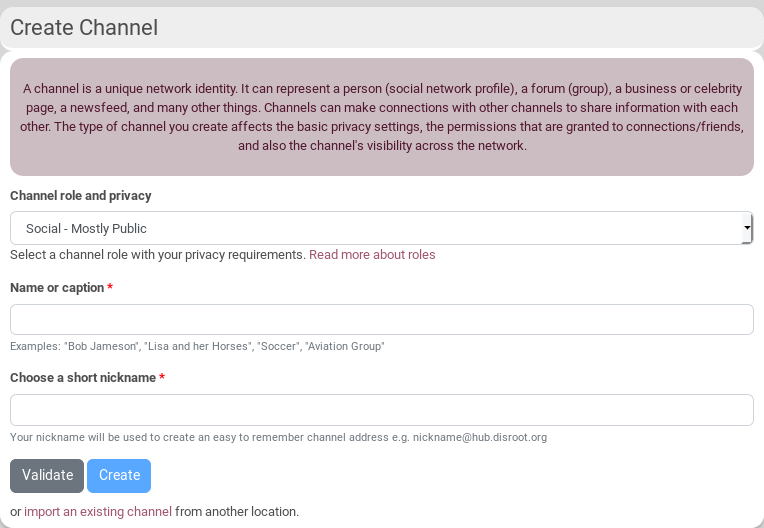
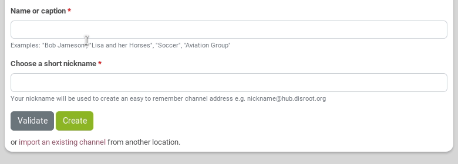
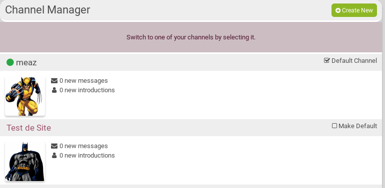
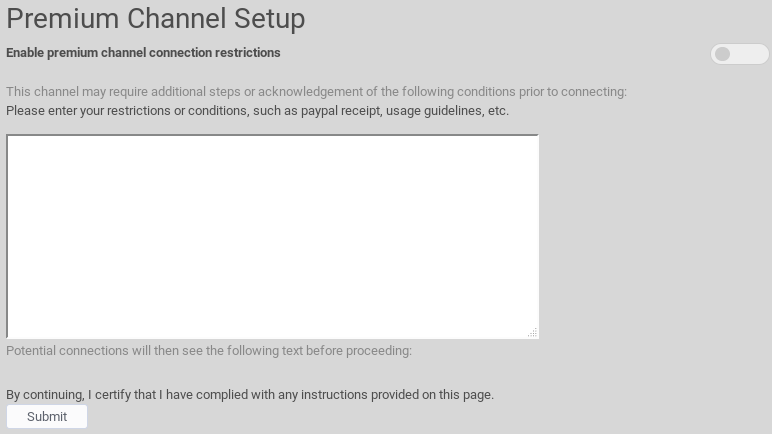

# How to create my first channel?

When you log in for the first time after registering, you must create a channel.

So you will be presented with the "Add a channel" screen.

First, you have to **choose a channel role and privacy** (you can change it later though). For example, you can choose **Social, Mostly Public**. According to what you choose, the default permission will change. For example, *Can comment on or like my posts* is public by default for **Social, Federation** and for your connections only in **Social, Mostly public**.

#### [See the permission page to understand channel roles better](../../permissions)...

Then, you have to choose a **Name or caption**. Normally, your first channel will be one that represents you - so using your own name (or pseudonym) as the channel name is a good idea. The channel name should be thought of as a title, or brief description of your channel. This is how people with know and find your channel.

The **choose a short nickname** box is similar to a **username** field. It is used to create a channel address, which other people will use to connect to you, and you will use to log in to other sites. This will look like an email address, and takes the form **nickname@hub.disroot.org**. It is automatically generated according to your **Name and caption**, checking if the username already exists and being transliterated (so that it federates well). Basically you can use only the same characters as email addresses. If the username suggested fits you, click on **Create** to create your channel.

If you don't like the nickname chosen for you and want to change it, the **Create** button becomes blue and you can't click on it: that means you need to click on **Validate** to check if you can use the username you chose. If that's ok, the **Create** button becomes green and you can click on it to create your channel.

After setting your Role, name (real or not) and your nickname, you will be redirected on the profile page of your new channel (or something else if your site admin decided otherwise).

# How to create another channel?
You can also create an other channel, as you can have as many channels as you want.

To do so, click on your avatar on the nav bar, and choose **Channel manager**. You then can click on **+ Create New**.

## How to switch between channels?
Click on your avatar in the nav bar and select your channel.

## How to make one of your channels your default one?
Click on your avatar on the nav bar, and choose **Channel manager**. You then can click on **Make default**.

# How to make your channel a "Premium Channel"
Some channels are designated **Premium Channels** and may require some action before a connection can be established with it. The Connect button for these channels will open a page which lists in detail what terms the channel owner has set. If the terms are accepted, thSe connection will then proceed normally. In some cases, such as with celebrities and world-reknowned publishers, this may involve payment. If the channel does not agree to the terms, the connection will not proceed, or it may proceed but with reduced permissions allowed on interactions with that channel.

Here is an example of such a message:

To set a premium channel, go to your channel **Settings**, then on the same left side bar select **Premium Channel Settings**

Enable the premium channel restriction, enter your message and click on *Submit*.
