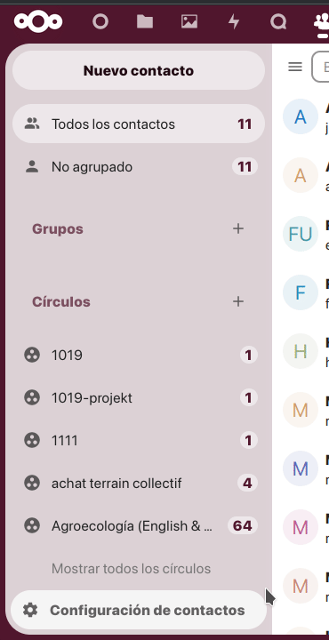
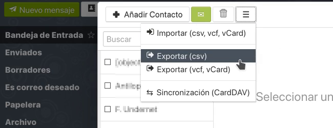

# Cómo respaldar tus contactos e importarlos en Roundcube
Aunque no debería haber ningún problema al cambiar de clientes web de correo, es altamente recomendable que hagamos un respaldo de nuestra libreta de direcciones.

La forma sugerida, más sencilla y más rápida es _exportar_ los contactos desde la aplicación **Contactos** en la nube.

## Exportando contactos desde la nube
1. Iniciamos sesión en nuestra nube de **Disroot** y seleccionamos la aplicación **Contactos**;
2. vamos al menú de **Configuraciones** abajo a la izquierda;
3. hacemos clic sobre el menú de tres botones a la derecha de la libreta de direcciones que queremos exportar y seleccionamos **Descargar**.

  

Se nos preguntará dónde queremos guardar el archivo en nuestra computadora. Ahora ya tenemos un respaldo de los contactos.

## Exportando contactos desde SnappyMail
El proceso de exportar nuestros contactos desde SnappyMail es bastante simple.

1. Iniciamos sesión en **SnappyMail** [(https://mail.disroot.org)](https://mail.disroot.org);
2. vamos a **Contactos**;

  

3. hacemos clic en el botón con tres barras y seleccionamos **Exportar (csv)** o **Exportar (vcf, vCard)**.

  

Exportar los contactos tomará un momento, dependiendo del tamaño de nuestra libreta de direcciones. Cuando esté lista, se nos pedirá guardar el archivo (contacts.csv o .vcf) en nuestro equipo. Tengamos cuidado de guardarlo en un lugar seguro que podamos recordar luego.

## Importando contactos en Roundcube
Para importar la libreta previamente guardada:

1. accedemos al correo web [(https://webmail.disroot.org)](https://webmail.disroot.org);
2. seleccionamos la pestaña **Contactos** y luego
3. hacemos clic en el botón **Importar** a la derecha en la barra superior;
4. seleccionamos el archivo desde nuestra máquina, hacemos clic en **Importar**, se nos pedirá confirmar si el formato de la información a importar es correcto, nuevamente **Importar**, y una vez importados los contactos, **Cerrar**.

  

Para conocer más sobre los **Contactos** en **Roundcube**, pueden leer [este tutorial](../../01.Roundcube/04.contacts/)
