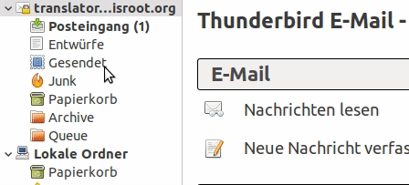
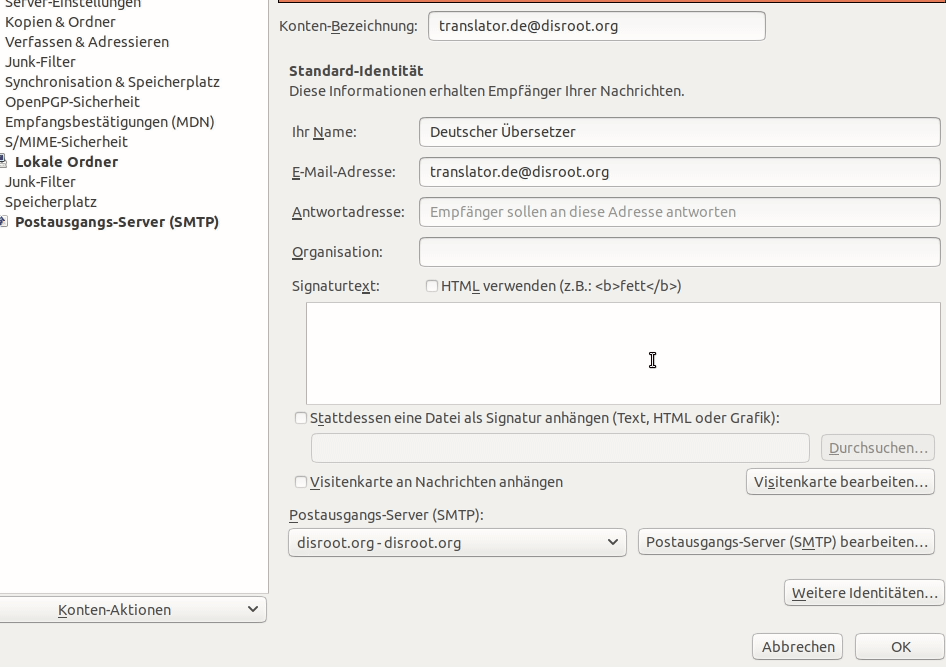
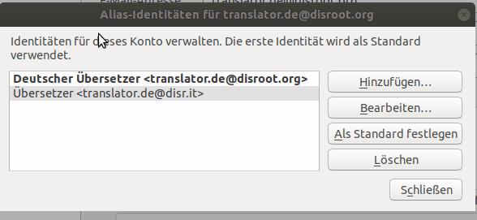
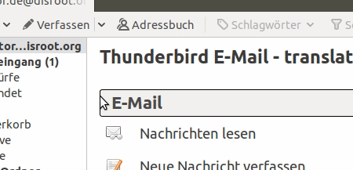

# Alias in Thunderbird einrichten

Als erstes startest Du **Thunderbird** und gehst mit einem Rechtsklick auf Dein Email-Konto in die Konto-Einstellungen.

Unten rechts im Einstellungsfenster findest Du einen *"Weitere Identitäten..."*-Button. In der Identitätsverwaltung kannst Du eine Identität hinzufügen, indem Du auf den *"Hinzufügen..."*-Button klickst und die Eingabemaske ausfüllst.

# Standard setzen
Wenn Du Dein neues Email-Alias als Standard setzen möchtest, wähle das Alias aus und klicke auf *"Als Standard festlegen"*.

# Email senden
Um eine Email mit Deinem neuen Alias zu senden, klicke beim Erstellen der Email auf das *"Von"*-Feld und wähle aus dem Dropdown-Menü das Alias, das Du nutzen möchtest.

