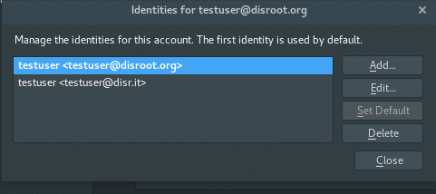

# Configuration des alias sur Thunderbird
Tout d'abord, lancez thunderbird et accédez aux paramètres du compte en cliquant avec le bouton droit de la souris sur votre compte.

En bas à droite de la fenêtre des paramètres, vous avez le bouton de paramètres **"Gérer les identités..."**.

Une fois dans le Gestionnaire d'identité, vous pouvez ajouter un nouvel alias en appuyant sur le bouton **"Ajouter..."** et en remplissant le formulaire:

# Définir par défaut
Si vous souhaitez définir un nouvel alias de courriel comme celui par défaut, sélectionnez simplement l'alias de courriel et cliquez sur le bouton **"Définir par défaut"**.

# Envoyer un courriel
Pour envoyer un email avec votre nouvel alias, cliquez simplement sur le champ **"Formulaire"** et sélectionnez l'alias que vous voulez utiliser dans le menu déroulant, lors de la composition de votre mail.

