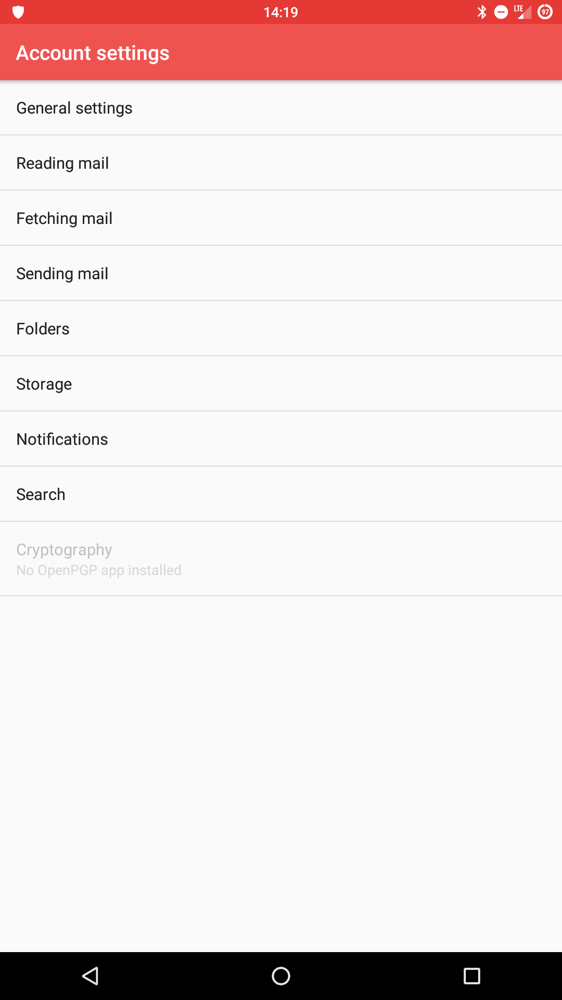
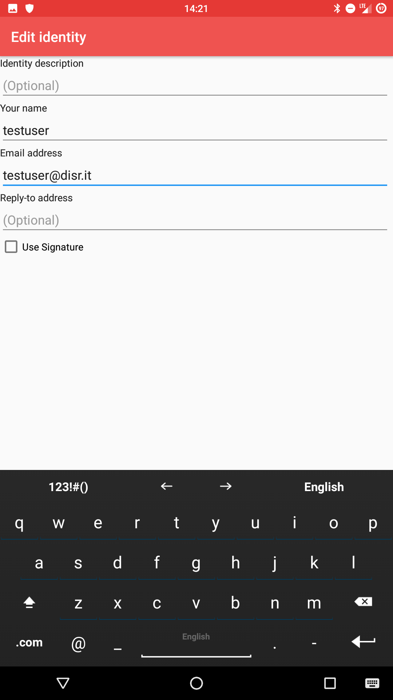

# Configuration
Tout d'abord, ouvrez K9 et accédez aux paramètres de vos comptes

Dans Paramètres, allez dans l'onglet **"Envoi de courrier", tapez sur **"Gérer les identités"**.

Sélectionnez **"Nouvelle identité"** en tapant sur l'icône "trois points" en haut à droite.
*(Chaque utilisateur Disroot a par défaut un alias username@disr.it qu'il peut utiliser)*

Et remplissez le formulaire en fournissant la nouvelle adresse alias.

# Définir par défaut
Pour changer l'identité par défaut, tout en restant dans les paramètres **"Gérer les identités"**, il suffit de toucher et maintenir enfoncé l'alias que vous voulez définir et sélectionnez l'option **"Déplacer en haut / Définir par défaut"**.

# Envoyer un email
Pour envoyer des emails avec votre nouvel alias, tapez simplement sur le champ **"Formulaire"** et sélectionnez l'alias que vous souhaitez utiliser dans le menu déroulant, lors de la composition de votre courrier.
