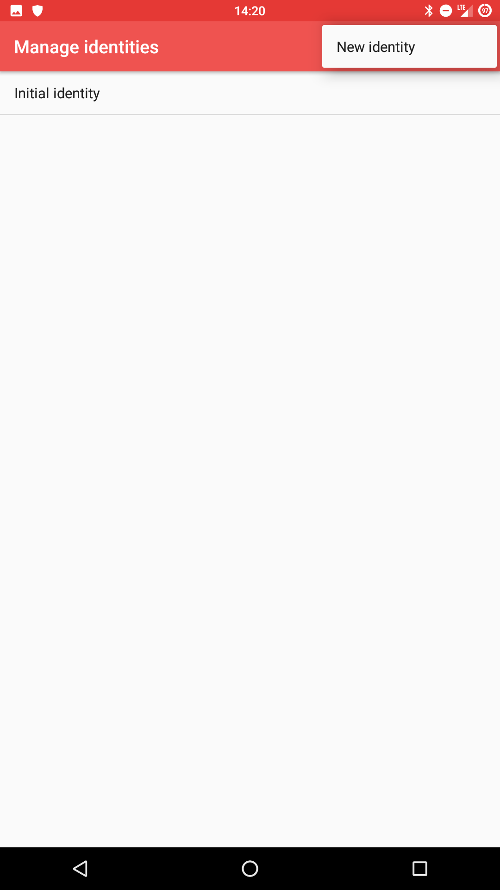
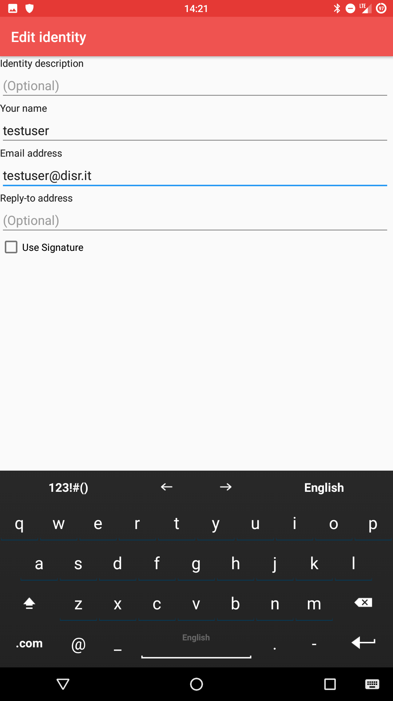
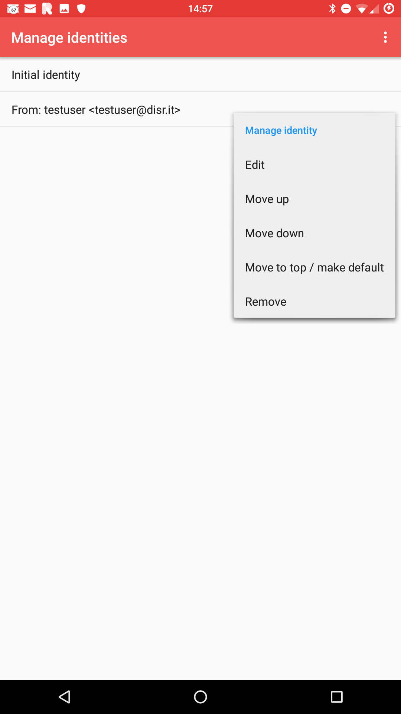

# Imposta alias su K9

Innanzitutto, apri **K9** e vai alle impostazioni del tuo account 

Quando sei in Impostazioni, vai alla scheda **"Invio di posta"**, tocca **"Gestisci identità"**

Seleziona **"Nuova identità"** toccando l'icona "tre punti" in alto a destra.

*(Ogni* **Disroot** *l'utente ha un* nome utente@disr.it *alias da utilizzare per impostazione predefinita)* 

E compila il modulo fornendo il nuovo indirizzo alias. 

# Imposta default
Per modificare l'identità predefinita, mentre sei ancora nelle impostazioni **"Gestisci identità"**, tocca e tieni premuto l'alias che desideri impostare e seleziona l'opzione **"Sposta in alto/Rendi predefinito"**. 

# Invia una email
Per inviare e-mail con il tuo nuovo alias, tocca il campo **"Da"** e seleziona l'alias che desideri utilizzare dal menu a discesa, durante la composizione della posta. 
