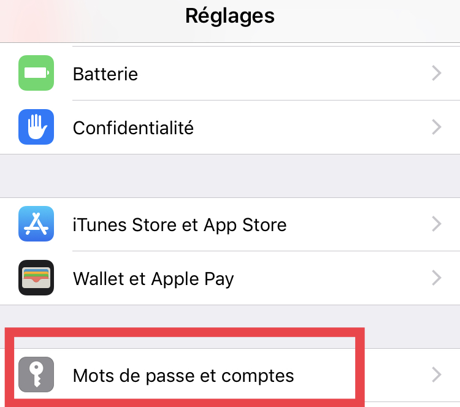
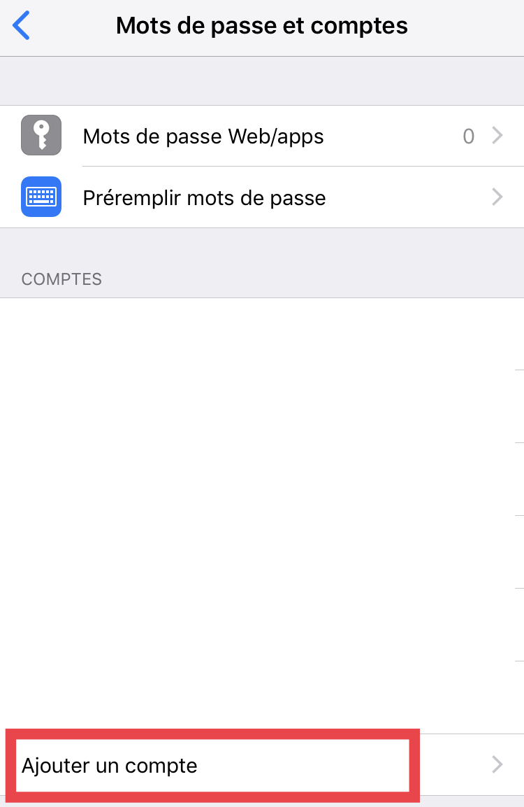
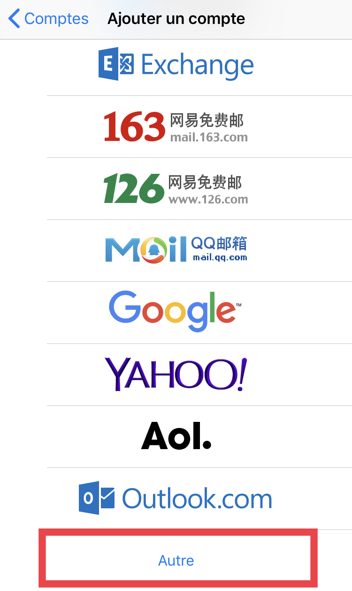
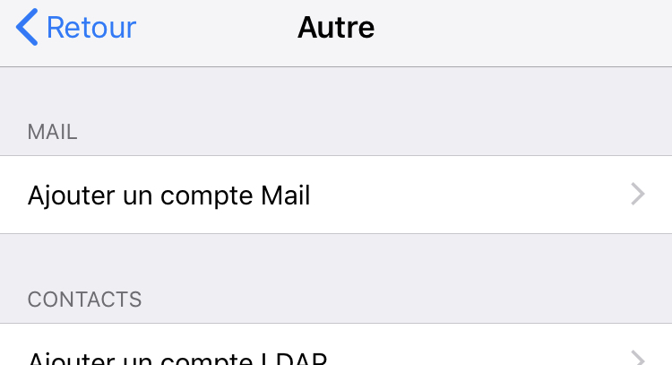
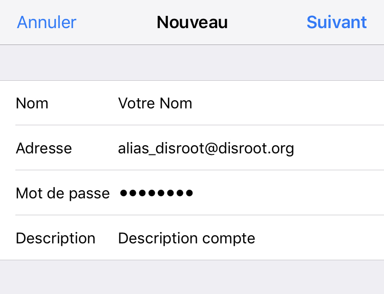
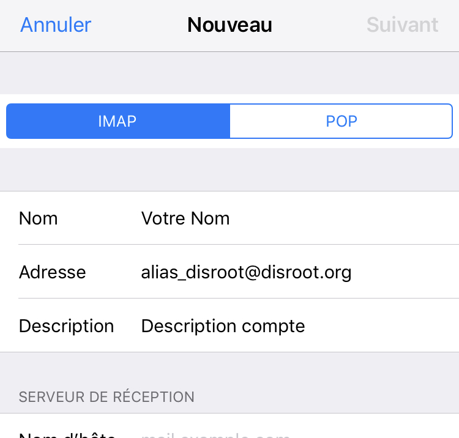
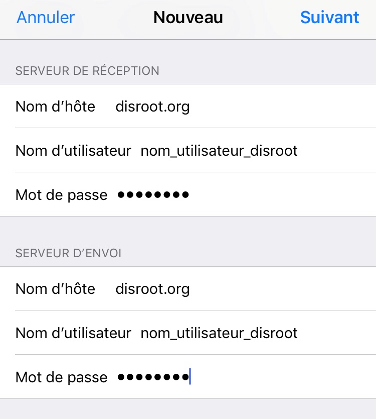
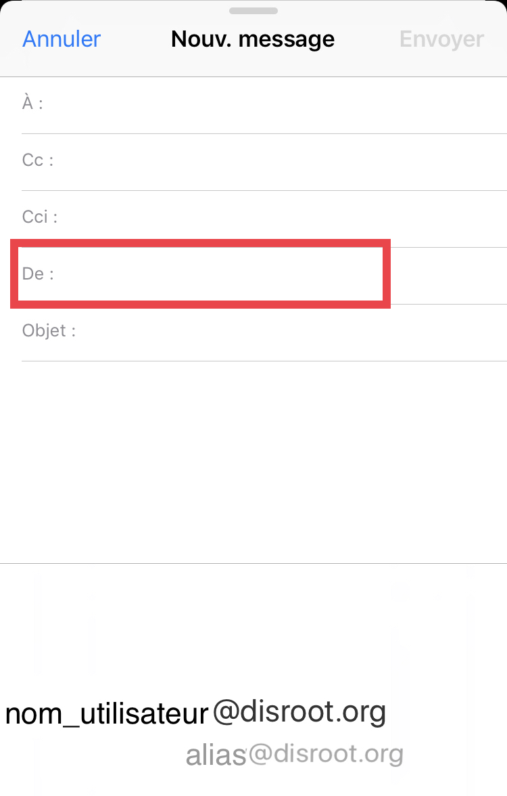

# Configurer un alias sur Mail iOS

**Version Courte**

Ajoutez un nouveau compte mail et utilisez votre alias comme adresse et mot de passe régulier pour le mot de passe.
Sur l'écran d'après, celui de configuration des comptes IMAP et SMTP, utilisez votre compte réel disroot pour les nom d'utilisateur et mot de passe.
Terminé.

**Version Longue**

Tout d'abord, ouvrez l'application Paramètres de votre appareil Apple.
Dans les paramètres, allez dans la section "Mots de Passes et Comptes".

choisissez l'option "Ajouter un compte", 

puis "Autre".

Sélectionnez ensuite "Ajouter un compte mail".

Sur la page "Nouveau", remplissez les détails de votre nouveau compte, en utilisant votre alias@disroot.org comme adresse, votre mot de passe diroot, et remplissez la description du compte. Cliquez sur "Suivant".

Sur l'écran d'après, les infos dans le haut de la page peuvent être laissées telles qu'elles sont.

Dans les sections de "Serveur de Réception" ainsi que dans la section "Serveur d'envoi", renseignez là les informations de votre compte réel disroot, pas l'alias. 
Nom d'hôte : disroot.org
Nom d'utilisateur: vraicomptedisroot
Mot de passe : mot de passe disroot.

## Attention : remplissez tout, même quand c'est écrit "optionel".

Cliquez sur "Suivant". Et c'est terminé.
Vous pouvez utilisez votre alias dans vos emails. Il suffit de le sélectionner quand vous créez un nouvel email en changeant le "De" de l'email.

