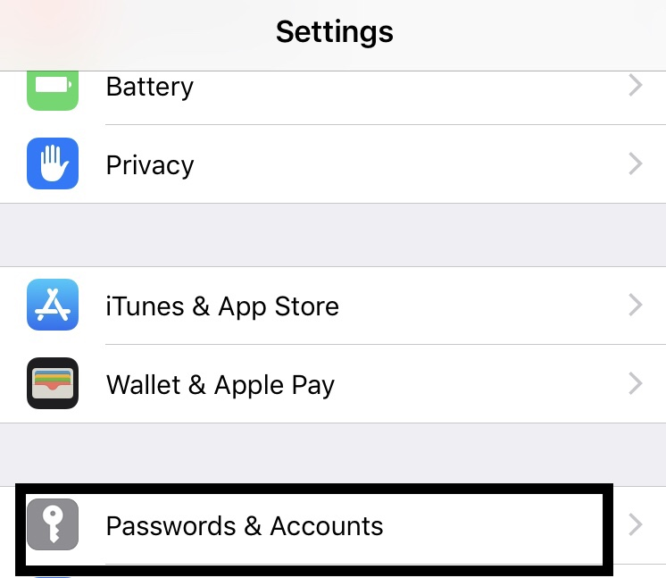
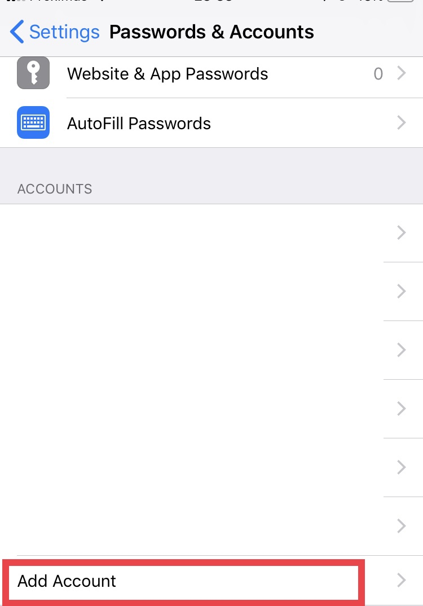
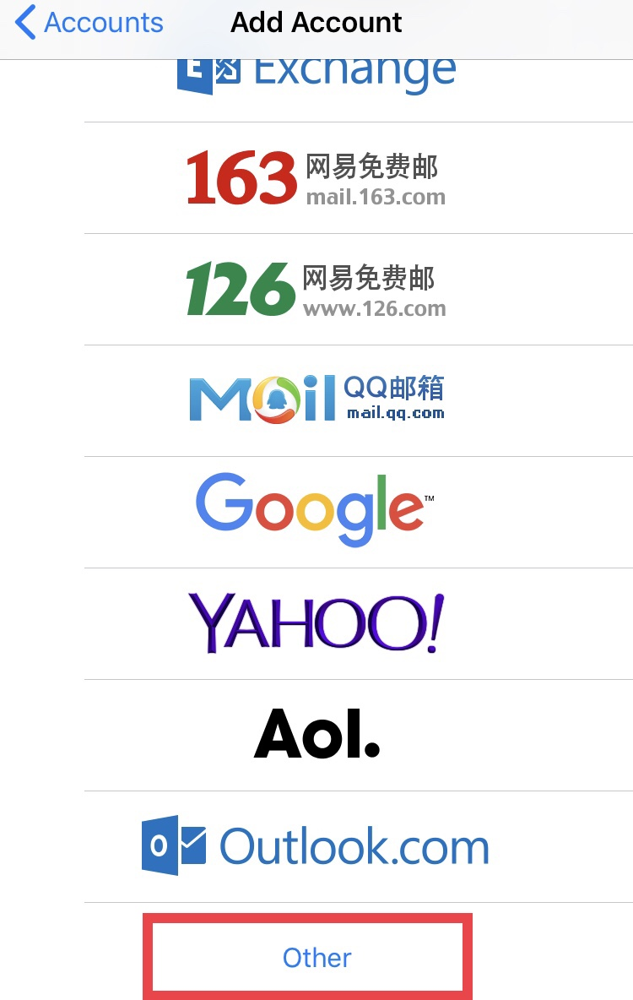
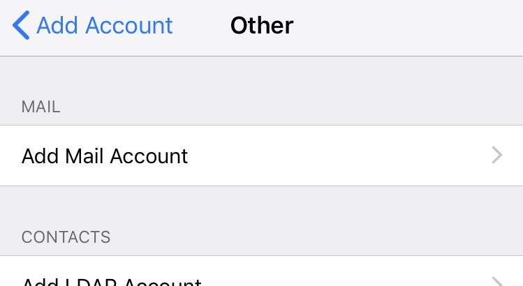
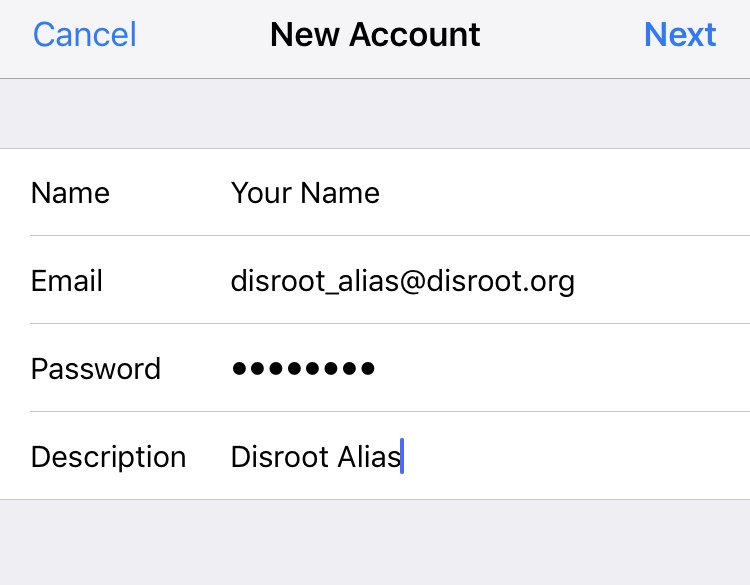
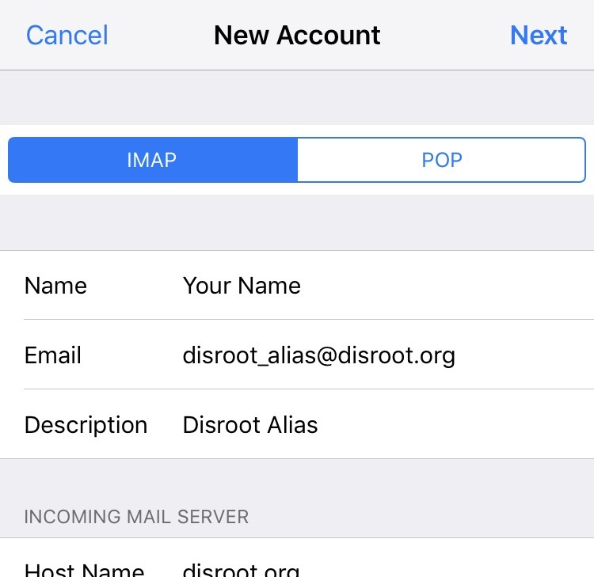
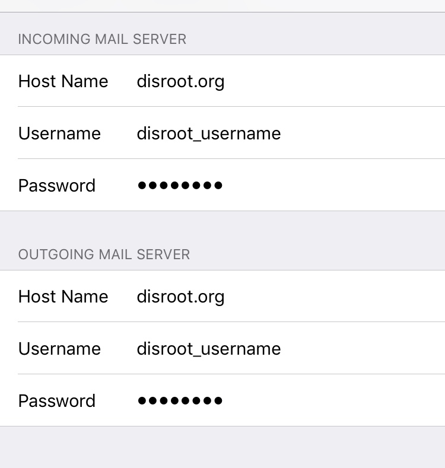
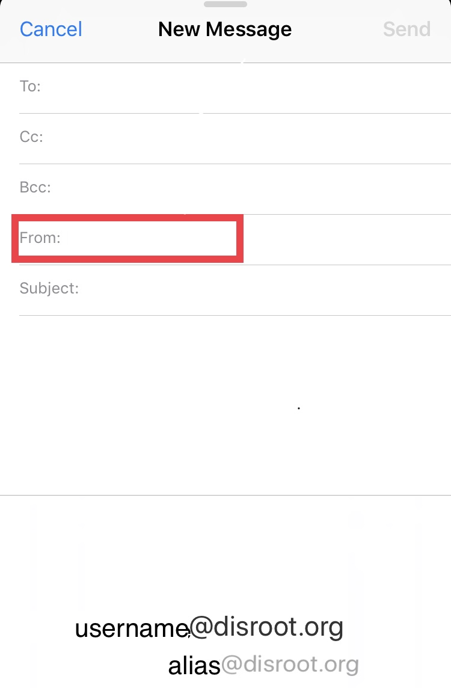

# Imposta alias su Mail iOS

Innanzitutto, apri **Impostazioni** e vai alla sezione **Password e account** 

Una volta in **Impostazioni**, seleziona **Aggiungi un nuovo account**... 

... poi **Altro**...

... e infine, scegli **Aggiungi account di posta**.

 

Nella schermata **Nuovo account**, inserisci i dettagli del tuo account alias (nome, nome utente, password e descrizione dell'account), quindi fai clic su **Avanti**. 

La schermata successiva richiederà di inserire i dettagli dei server **IMAP** e **SMTP**. Lascia i primi campi come appaiono. 

In **Server di posta in entrata** e in **Server di posta in uscita**, inserisci il nome utente del tuo account di base (non l'alias). 

!! ATTENZIONE:

!! Sia per **IMAP** che per **SMTP**, tutti i dettagli devono essere compilati (anche se dice "facoltativo"). 
Poi clicca su **Prossimo**.

D'ora in poi, quando invii un'email, puoi selezionare il tuo alias toccando il campo "*Da*" e scegliendolo. 

