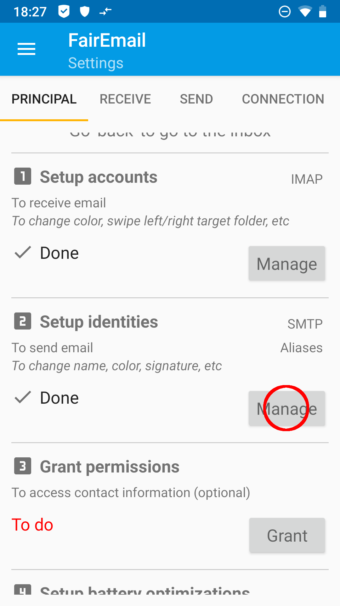
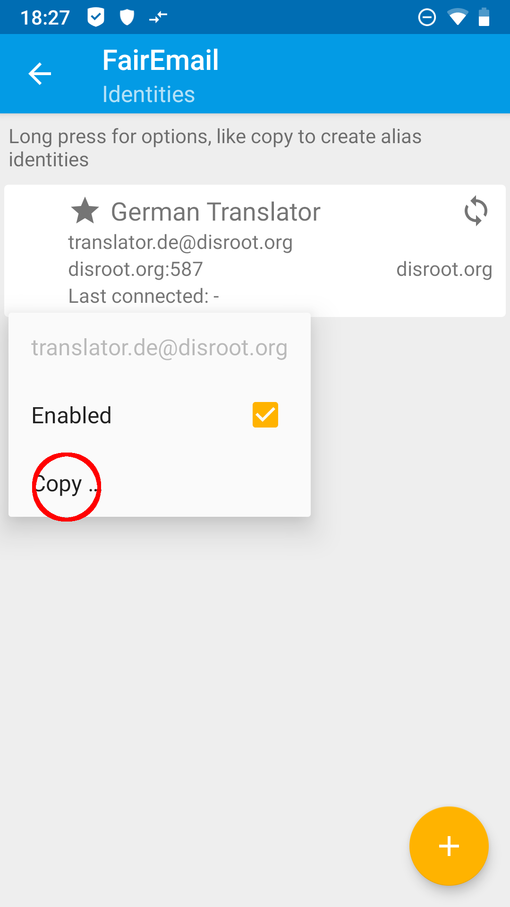
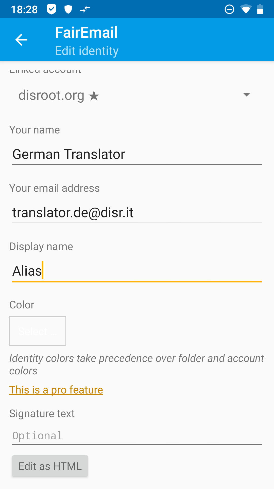
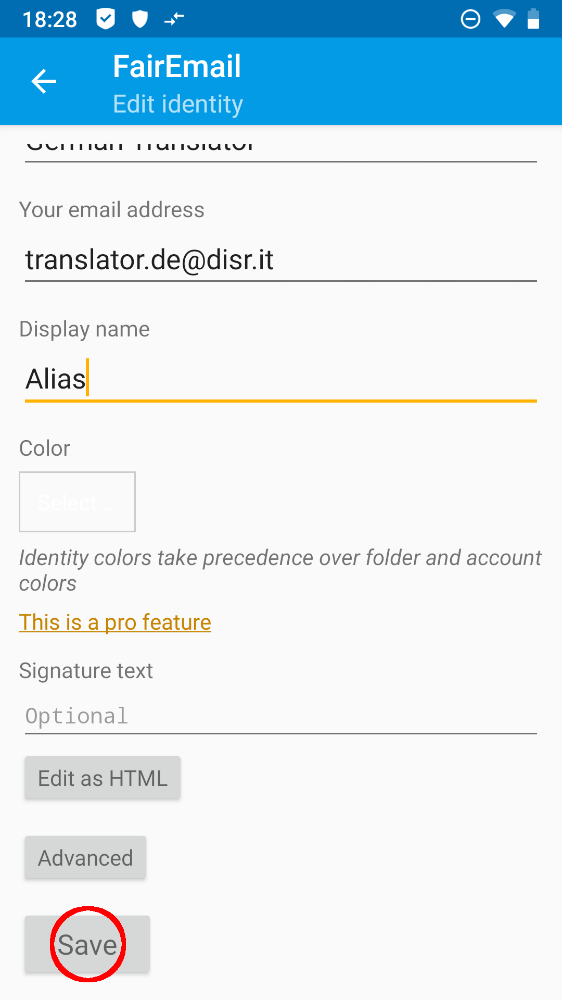
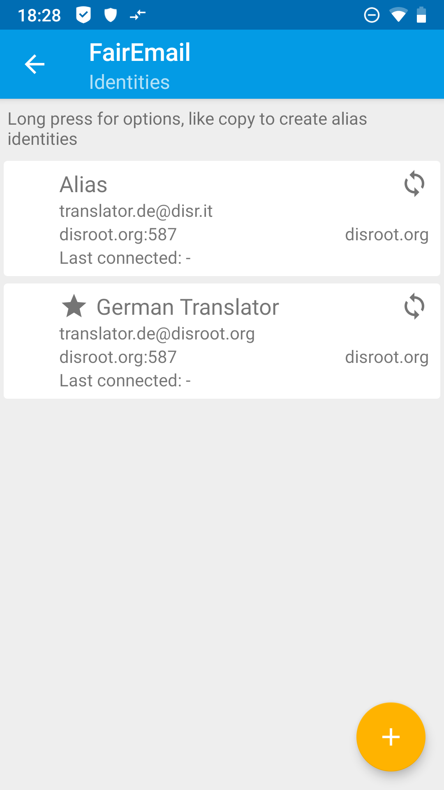
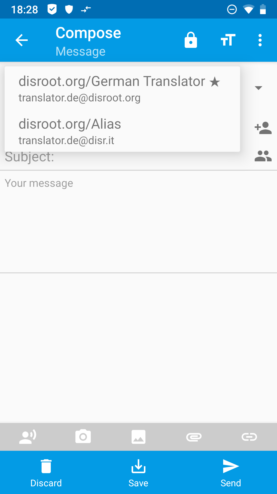

# Alias sur FairEmail

Tout d'abord, vous ouvrez **FairEmail** et allez dans "Créer une identité" dans les paramètres principaux, point 2, en tapant sur le bouton "Gérer" (3 points en haut à gauche '>' Paramètres '>' onglet "paramètres principaux").

Dans les paramètres, vous taperez et maintiendrez votre **Disroot**-Compte jusqu'à ce qu'un menu s'ouvre. Dans ce menu, tu choisiras *Copier...*.

Dans le dialogue de saisie suivant, on vous présente une identité, qui est connectée à votre compte **Disroot** existant. Remplissez vos données ou modifiez les informations remplies automatiquement comme vous le souhaitez.

*(Chaque* **Disroot** *utilisateur a un* username@disr.it *alias à utiliser par défaut)*.

Terminez votre saisie en tapant sur le bouton *Save* en bas du menu. Votre ALias est maintenant configuré.

 

# Créer un email
Pour envoyer un email avec votre nouvel alias, tapez sur le champ *From:* et choisissez l'alias que vous voulez utiliser dans le menu déroulant qui apparaît.

