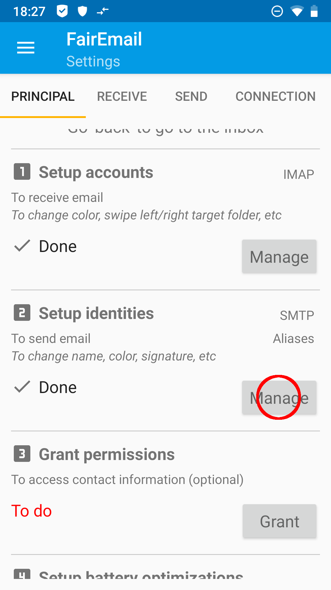
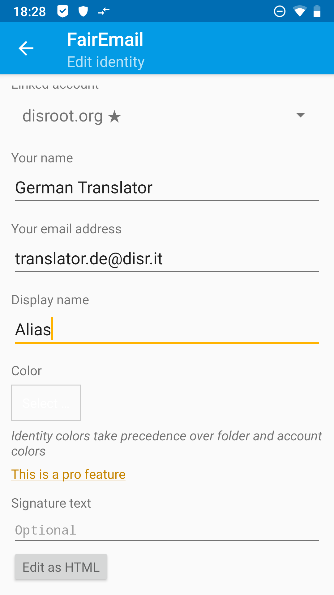
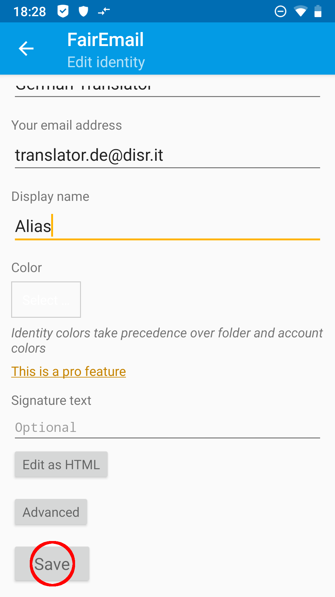

# Alias su FairEmail

Per prima cosa, apri **FairEmail** e vai su "Crea Identità" nelle impostazioni principali, punto 2, toccando il pulsante "Gestisci" (3 punti in alto a sinistra '>' Impostazioni '>' scheda "impostazioni principali ")

Nelle impostazioni tocca e tieni premuto il tuo **Disroot**-Account finché non si apre un menu. In questo menu sceglierai *Copia...* 

Nella seguente finestra di dialogo di input ti viene presentata un'identità, che è collegata al tuo account **Disroot** esistente. Inserisci i tuoi dati o modifica le informazioni compilate automaticamente come desideri.

*(Ogni* **Disroot** *l'utente ha un* nome utente@disr.it *alias da utilizzare per impostazione predefinita)* 

Completa il tuo input toccando toccando il pulsante *Salva* nella parte inferiore del menu. Il tuo ALias è ora impostato

 

# Crea e-mail
Per inviare un'e-mail con il tuo nuovo alias, tocca il campo *Da:* e scegli l'alias che desideri utilizzare dal menu a discesa visualizzato 

